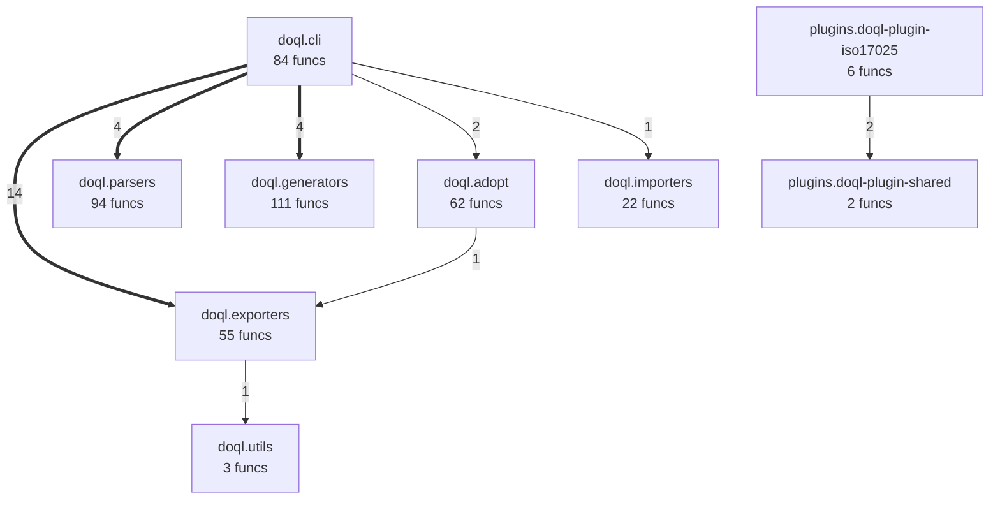
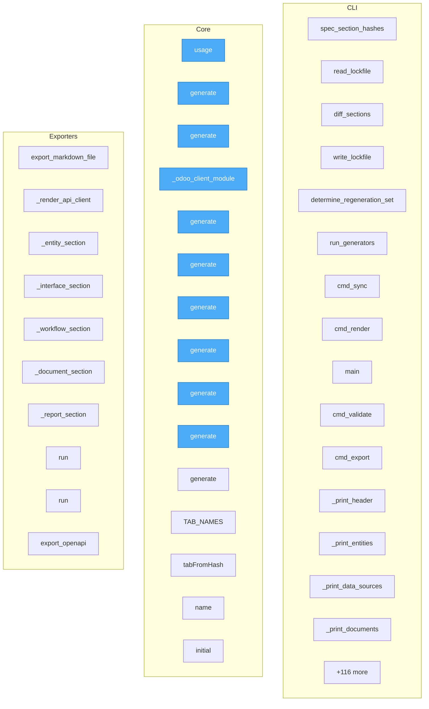

# Rodzina OQL — paczka kompletna

Declarative OQL — build complete applications from a single .doql file

## Metadata

- **name**: `doql`
- **version**: `0.1.2`
- **python_requires**: `>=3.10`
- **license**: Apache-2.0
- **ai_model**: `openrouter/qwen/qwen3-coder-next`
- **ecosystem**: SUMD + DOQL + testql + taskfile
- **generated_from**: pyproject.toml, Taskfile.yml, testql(3), app.doql.less, app.doql.css, pyqual.yaml, goal.yaml, .env.example, src(4 mod), project/(12 analysis files)

## Intent

Declarative OQL — build complete applications from a single .doql file

## Architecture

```
SUMD (description) → DOQL/source (code) → taskfile (automation) → testql (verification)
```

### DOQL Application Declaration (`app.doql.less`, `app.doql.css`)

```less markpact:file path=app.doql.less
// LESS format — define @variables here as needed

app {
  name: doql;
  version: 0.1.2;
}

interface[type="cli"] {
  framework: click;
}
interface[type="cli"] page[name="doql"] {

}

workflow[name="install"] {
  trigger: manual;
  step-1: run cmd=pip install -e .[dev];
}

workflow[name="quality"] {
  trigger: manual;
  step-1: run cmd=pyqual run;
}

workflow[name="quality:fix"] {
  trigger: manual;
  step-1: run cmd=pyqual run --fix;
}

workflow[name="quality:report"] {
  trigger: manual;
  step-1: run cmd=pyqual report;
}

workflow[name="build"] {
  trigger: manual;
  step-1: run cmd=python -m build;
}

workflow[name="clean"] {
  trigger: manual;
  step-1: run cmd=rm -rf build/ dist/ *.egg-info;
}

workflow[name="structure"] {
  trigger: manual;
  step-1: run cmd=echo "📁 Analyzing project structure..."
python3 -m doql.cli adopt {{.PWD}} --output app.doql.css --force
echo "🎨 Exporting to LESS format..."
doql export --format less -o {{.DOQL_OUTPUT}}
echo "✅ Structure generated: app.doql.css + {{.DOQL_OUTPUT}}";
}

workflow[name="doql:adopt"] {
  trigger: manual;
  step-1: run cmd=python3 -m doql.cli adopt {{.PWD}} --output app.doql.css --force;
  step-2: run cmd=echo "✅ Captured in app.doql.css";
}

workflow[name="doql:export"] {
  trigger: manual;
  step-1: run cmd=if [ ! -f "app.doql.css" ]; then
  echo "❌ app.doql.css not found. Run: task structure"
  exit 1
fi;
  step-2: run cmd=doql export --format less -o {{.DOQL_OUTPUT}};
  step-3: run cmd=echo "✅ Exported to {{.DOQL_OUTPUT}}";
}

workflow[name="doql:validate"] {
  trigger: manual;
  step-1: run cmd=if [ ! -f "{{.DOQL_OUTPUT}}" ]; then
  echo "❌ {{.DOQL_OUTPUT}} not found. Run: task doql:adopt"
  exit 1
fi;
  step-2: run cmd=python3 -m doql.cli validate;
}

workflow[name="doql:doctor"] {
  trigger: manual;
  step-1: run cmd=python3 -m doql.cli doctor {{.PWD}};
}

workflow[name="doql:build"] {
  trigger: manual;
  step-1: run cmd=if [ ! -f "{{.DOQL_OUTPUT}}" ]; then
  echo "❌ {{.DOQL_OUTPUT}} not found. Run: task doql:adopt"
  exit 1
fi;
  step-2: run cmd=# Regenerate LESS from CSS if CSS exists
if [ -f "app.doql.css" ]; then
  doql export --format less -o {{.DOQL_OUTPUT}}
fi;
  step-3: run cmd=python3 -m doql.cli build app.doql.css --out build/;
}

workflow[name="help"] {
  trigger: manual;
  step-1: run cmd=task --list;
}

deploy {
  target: docker;
}

environment[name="local"] {
  runtime: docker-compose;
  env_file: .env;
}
```

```css markpact:file path=app.doql.css
app {
  name: "doql";
  version: "0.1.2";
}

interface[type="cli"] {
  framework: click;
}
interface[type="cli"] page[name="doql"] {

}

workflow[name="install"] {
  trigger: "manual";
  step-1: run cmd=pip install -e .[dev];
}

workflow[name="quality"] {
  trigger: "manual";
  step-1: run cmd=pyqual run;
}

workflow[name="quality:fix"] {
  trigger: "manual";
  step-1: run cmd=pyqual run --fix;
}

workflow[name="quality:report"] {
  trigger: "manual";
  step-1: run cmd=pyqual report;
}

workflow[name="build"] {
  trigger: "manual";
  step-1: run cmd=python -m build;
}

workflow[name="clean"] {
  trigger: "manual";
  step-1: run cmd=rm -rf build/ dist/ *.egg-info;
}

workflow[name="structure"] {
  trigger: "manual";
  step-1: run cmd=echo "📁 Analyzing project structure..."
python3 -m doql.cli adopt {{.PWD}} --output app.doql.css --force
echo "🎨 Exporting to LESS format..."
doql export --format less -o {{.DOQL_OUTPUT}}
echo "✅ Structure generated: app.doql.css + {{.DOQL_OUTPUT}}";
}

workflow[name="doql:adopt"] {
  trigger: "manual";
  step-1: run cmd=python3 -m doql.cli adopt {{.PWD}} --output app.doql.css --force;
  step-2: run cmd=echo "✅ Captured in app.doql.css";
}

workflow[name="doql:export"] {
  trigger: "manual";
  step-1: run cmd=if [ ! -f "app.doql.css" ]; then
  echo "❌ app.doql.css not found. Run: task structure"
  exit 1
fi;
  step-2: run cmd=doql export --format less -o {{.DOQL_OUTPUT}};
  step-3: run cmd=echo "✅ Exported to {{.DOQL_OUTPUT}}";
}

workflow[name="doql:validate"] {
  trigger: "manual";
  step-1: run cmd=if [ ! -f "{{.DOQL_OUTPUT}}" ]; then
  echo "❌ {{.DOQL_OUTPUT}} not found. Run: task doql:adopt"
  exit 1
fi;
  step-2: run cmd=python3 -m doql.cli validate;
}

workflow[name="doql:doctor"] {
  trigger: "manual";
  step-1: run cmd=python3 -m doql.cli doctor {{.PWD}};
}

workflow[name="doql:build"] {
  trigger: "manual";
  step-1: run cmd=if [ ! -f "{{.DOQL_OUTPUT}}" ]; then
  echo "❌ {{.DOQL_OUTPUT}} not found. Run: task doql:adopt"
  exit 1
fi;
  step-2: run cmd=# Regenerate LESS from CSS if CSS exists
if [ -f "app.doql.css" ]; then
  doql export --format less -o {{.DOQL_OUTPUT}}
fi;
  step-3: run cmd=python3 -m doql.cli build app.doql.css --out build/;
}

workflow[name="help"] {
  trigger: "manual";
  step-1: run cmd=task --list;
}

deploy {
  target: docker;
}

environment[name="local"] {
  runtime: docker-compose;
  env_file: ".env";
}
```

### Source Modules

- `doql.cli`
- `doql.lsp_server`
- `doql.parser`
- `doql.plugins`

## Interfaces

### CLI Entry Points

- `doql`
- `doql-lsp`

### testql Scenarios

#### `testql-scenarios/generated-api-integration.testql.toon.yaml`

```toon markpact:file path=testql-scenarios/generated-api-integration.testql.toon.yaml
# SCENARIO: API Integration Tests
# TYPE: api
# GENERATED: true

CONFIG[3]{key, value}:
  base_url, http://localhost:8101
  timeout_ms, 30000
  retry_count, 3

API[4]{method, endpoint, expected_status}:
  GET, /health, 200
  GET, /api/v1/status, 200
  POST, /api/v1/test, 201
  GET, /api/v1/docs, 200

ASSERT[2]{field, operator, expected}:
  status, ==, ok
  response_time, <, 1000
```

#### `testql-scenarios/generated-api-smoke.testql.toon.yaml`

```toon markpact:file path=testql-scenarios/generated-api-smoke.testql.toon.yaml
# SCENARIO: Auto-generated API Smoke Tests
# TYPE: api
# GENERATED: true
# DETECTORS: ConfigEndpointDetector

CONFIG[4]{key, value}:
  base_url, http://localhost:8101
  timeout_ms, 10000
  retry_count, 3
  detected_frameworks, ConfigEndpointDetector

ASSERT[2]{field, operator, expected}:
  status, <, 500
  response_time, <, 2000

# Summary by Framework:
#   docker: 1 endpoints
```

#### `testql-scenarios/generated-from-pytests.testql.toon.yaml`

```toon markpact:file path=testql-scenarios/generated-from-pytests.testql.toon.yaml
# SCENARIO: Auto-generated from Python Tests
# TYPE: integration
# GENERATED: true

LOG[8]{message}:
  "Test: test_fastapi_dependency_alone_does_not_create_api_interface"
  "Test: test_fastapi_with_main_py_creates_api"
  "Test: test_api_entry_point_in_scripts_creates_api"
  "Test: test_api_boot_and_health"
  "Test: test_fastapi_dependency_alone_does_not_create_api_interface"
  "Test: test_fastapi_with_main_py_creates_api"
  "Test: test_api_entry_point_in_scripts_creates_api"
  "Test: test_api_boot_and_health"
```

## Workflows

### Taskfile Tasks (`Taskfile.yml`)

```yaml markpact:file path=Taskfile.yml
# Taskfile.yml — doql project runner
# https://taskfile.dev

version: "3"

vars:
  APP_NAME: doql
  DOQL_OUTPUT: app.doql.less

env:
  PYTHONPATH: "{{.PWD}}"

tasks:
  # ─────────────────────────────────────────────────────────────────────────────
  # Development
  # ─────────────────────────────────────────────────────────────────────────────

  install:
    desc: Install Python dependencies (editable)
    cmds:
      - pip install -e .[dev]

  quality:
    desc: Run pyqual quality pipeline
    cmds:
      - pyqual run

  quality:fix:
    desc: Run pyqual with auto-fix
    cmds:
      - pyqual run --fix

  quality:report:
    desc: Generate pyqual quality report
    cmds:
      - pyqual report

  build:
    desc: Build wheel + sdist
    cmds:
      - python -m build

  clean:
    desc: Remove build artefacts
    cmds:
      - rm -rf build/ dist/ *.egg-info

  all:
    desc: Run install, quality check
    cmds:
      - task: install
      - task: quality

  # ─────────────────────────────────────────────────────────────────────────────
  # Doql Self-Integration (doql analyzing itself)
  # ─────────────────────────────────────────────────────────────────────────────

  structure:
    desc: Generate project structure (app.doql.css + app.doql.less)
    cmds:
      - |
        echo "📁 Analyzing project structure..."
        python3 -m doql.cli adopt {{.PWD}} --output app.doql.css --force
        echo "🎨 Exporting to LESS format..."
        doql export --format less -o {{.DOQL_OUTPUT}}
        echo "✅ Structure generated: app.doql.css + {{.DOQL_OUTPUT}}"

  doql:adopt:
    desc: Reverse-engineer doql project structure (CSS only)
    cmds:
      - python3 -m doql.cli adopt {{.PWD}} --output app.doql.css --force
      - echo "✅ Captured in app.doql.css"

  doql:export:
    desc: Export to LESS format
    cmds:
      - |
        if [ ! -f "app.doql.css" ]; then
          echo "❌ app.doql.css not found. Run: task structure"
          exit 1
        fi
      - doql export --format less -o {{.DOQL_OUTPUT}}
      - echo "✅ Exported to {{.DOQL_OUTPUT}}"

  doql:validate:
    desc: Validate app.doql.less syntax
    cmds:
      - |
        if [ ! -f "{{.DOQL_OUTPUT}}" ]; then
          echo "❌ {{.DOQL_OUTPUT}} not found. Run: task doql:adopt"
          exit 1
        fi
      - python3 -m doql.cli validate

  doql:doctor:
    desc: Run doql health checks
    cmds:
      - python3 -m doql.cli doctor {{.PWD}}

  doql:build:
    desc: Generate code from app.doql.less
    cmds:
      - |
        if [ ! -f "{{.DOQL_OUTPUT}}" ]; then
          echo "❌ {{.DOQL_OUTPUT}} not found. Run: task doql:adopt"
          exit 1
        fi
      - |
        # Regenerate LESS from CSS if CSS exists
        if [ -f "app.doql.css" ]; then
          doql export --format less -o {{.DOQL_OUTPUT}}
        fi
      - python3 -m doql.cli build app.doql.css --out build/

  analyze:
    desc: Full doql analysis (adopt + validate + doctor)
    cmds:
      - task: doql:adopt
      - task: doql:validate
      - task: doql:doctor

  # ─────────────────────────────────────────────────────────────────────────────
  # Utility
  # ─────────────────────────────────────────────────────────────────────────────

  help:
    desc: Show available tasks
    cmds:
      - task --list
```

## Quality Pipeline (`pyqual.yaml`)

```yaml markpact:file path=pyqual.yaml
pipeline:
  name: doql-quality

  metrics:
    cc_max: 15
    vallm_pass_min: 55   # current: 58% - 3 vallm errors
    # coverage disabled - pytest_cov reports null (no data collected)

  stages:
    - name: analyze
      tool: code2llm-filtered

    - name: validate
      tool: vallm-filtered

    - name: prefact
      tool: prefact
      optional: true
      when: any_stage_fail
      timeout: 900

    - name: fix
      tool: llx-fix
      optional: true
      when: any_stage_fail
      timeout: 1800

    - name: security
      tool: bandit
      optional: true
      timeout: 120

    - name: test
      tool: pytest
      timeout: 600

    - name: push
      tool: git-push
      optional: true
      timeout: 120

  loop:
    max_iterations: 3
    on_fail: report
    ticket_backends:
      - markdown

  env:
    LLM_MODEL: openrouter/qwen/qwen3-coder-next
```

## Configuration

```yaml
project:
  name: doql
  version: 0.1.2
  env: local
```

## Dependencies

### Runtime

```text markpact:deps python
click>=8.1
pydantic>=2.0
pyyaml>=6.0
jinja2>=3.1
rich>=13.0
httpx>=0.25
goal>=2.1.0
costs>=0.1.20
pfix>=0.1.60
tomli>=2.0; python_version < '3.11'
testql>=0.1.1
```

### Development

```text markpact:deps python scope=dev
pytest>=7.4
pytest-asyncio
ruff
mypy
goal>=2.1.0
costs>=0.1.20
pfix>=0.1.60
```

## Deployment

```bash markpact:run
pip install doql

# development install
pip install -e .[dev]
```

## Environment Variables (`.env.example`)

| Variable | Default | Description |
|----------|---------|-------------|
| `OPENROUTER_API_KEY` | `*(not set)*` | Required: OpenRouter API key (https://openrouter.ai/keys) |
| `LLM_MODEL` | `openrouter/qwen/qwen3-coder-next` | Model (default: openrouter/qwen/qwen3-coder-next) |
| `PFIX_AUTO_APPLY` | `true` | true = apply fixes without asking |
| `PFIX_AUTO_INSTALL_DEPS` | `true` | true = auto pip/uv install |
| `PFIX_AUTO_RESTART` | `false` | true = os.execv restart after fix |
| `PFIX_MAX_RETRIES` | `3` |  |
| `PFIX_DRY_RUN` | `false` |  |
| `PFIX_ENABLED` | `true` |  |
| `PFIX_GIT_COMMIT` | `false` | true = auto-commit fixes |
| `PFIX_GIT_PREFIX` | `pfix:` | commit message prefix |
| `PFIX_CREATE_BACKUPS` | `false` | false = disable .pfix_backups/ directory |

## Release Management (`goal.yaml`)

- **versioning**: `semver`
- **commits**: `conventional` scope=`doql`
- **changelog**: `keep-a-changelog`
- **build strategies**: `python`, `nodejs`, `rust`
- **version files**: `VERSION`, `pyproject.toml:version`, `doql/__init__.py:__version__`

## Code Analysis

### `project/analysis.toon.yaml`

```toon markpact:file path=project/analysis.toon.yaml
# code2llm | 125f 14282L | python:117,shell:3,javascript:3,typescript:1 | 2026-04-18
# CC̄=3.7 | critical:3/515 | dups:0 | cycles:0

HEALTH[3]:
  🟡 CC    _extract_python_cli_workflows CC=24 (limit:15)
  🟡 CC    scan_entities CC=16 (limit:15)
  🟡 CC    _map_workflow CC=16 (limit:15)

REFACTOR[1]:
  1. split 3 high-CC methods  (CC>15)

PIPELINES[140]:
  [1] Src [generate]: generate → _tenant_module
      PURITY: 100% pure
  [2] Src [generate]: generate
      PURITY: 100% pure
  [3] Src [generate]: generate → _audit_log_module
      PURITY: 100% pure
  [4] Src [generate]: generate → _odoo_client_module
      PURITY: 100% pure
  [5] Src [generate]: generate → generate_readme
      PURITY: 100% pure

LAYERS:
  doql/                           CC̄=4.0    ←in:4  →out:4
  │ !! workspace                  538L  1C   23m  CC=10     ←0
  │ mobile_gen                 462L  0C    8m  CC=5      ←1
  │ !! css_mappers                399L  0C   19m  CC=16     ←1
  │ lsp_server                 364L  0C   13m  CC=14     ←0
  │ integrations_gen           336L  0C   11m  CC=8      ←0
  │ interfaces                 324L  0C   14m  CC=11     ←1
  │ doctor                     321L  2C   12m  CC=13     ←0
  │ infra_gen                  321L  0C    5m  CC=8      ←0
  │ workflow_gen               315L  0C    7m  CC=11     ←0
  │ renderers                  296L  0C   17m  CC=10     ←1
  │ !! workflows                  275L  0C   10m  CC=24     ←1
  │ css_transformers           268L  0C    8m  CC=12     ←1
  │ yaml_importer              267L  0C   22m  CC=3      ←1
  │ registry                   267L  0C   24m  CC=6      ←1
  │ models                     219L  20C    0m  CC=0.0    ←0
  │ desktop_gen                209L  0C    7m  CC=6      ←1
  │ extractors                 205L  0C   14m  CC=6      ←3
  │ __init__                   200L  0C    8m  CC=6      ←0
  │ document_gen               182L  0C    4m  CC=6      ←0
  │ !! entities                   182L  0C    7m  CC=16     ←1
  │ __init__                   178L  0C    5m  CC=3      ←1
  │ validators                 169L  0C   10m  CC=6      ←0
  │ i18n_gen                   168L  0C    3m  CC=6      ←0
  │ pages                      163L  0C    3m  CC=13     ←1
  │ main                       159L  0C    2m  CC=1      ←0
  │ run                        157L  0C    4m  CC=12     ←0
  │ alembic                    154L  0C    3m  CC=12     ←1
  │ auth                       154L  0C    1m  CC=7      ←1
  │ __init__                   153L  0C    5m  CC=6      ←4
  │ publish                    151L  0C    5m  CC=8      ←0
  │ css_parser                 144L  0C    6m  CC=7      ←2
  │ report_gen                 142L  0C    2m  CC=9      ←0
  │ config                     122L  0C    6m  CC=1      ←1
  │ sections                   121L  0C    8m  CC=9      ←2
  │ css_tokenizer              120L  0C    2m  CC=14     ←1
  │ sync                       119L  0C    3m  CC=11     ←0
  │ plan                       115L  0C   10m  CC=4      ←0
  │ routes                     115L  0C    7m  CC=2      ←1
  │ ci_gen                     112L  0C    2m  CC=1      ←0
  │ pwa                        109L  0C    3m  CC=1      ←1
  │ __init__                   107L  0C    9m  CC=5      ←3
  │ deploy                     107L  0C    8m  CC=5      ←1
  │ writers                    101L  0C   11m  CC=5      ←1
  │ plugins                    101L  1C    4m  CC=8      ←0
  │ utils                      100L  0C    8m  CC=5      ←5
  │ adopt                       93L  0C    5m  CC=7      ←0
  │ lockfile                    88L  0C    4m  CC=12     ←2
  │ environments                86L  0C    6m  CC=7      ←1
  │ common                      84L  0C    5m  CC=6      ←5
  │ schemas                     83L  0C    5m  CC=10     ←1
  │ models                      82L  0C    2m  CC=10     ←1
  │ components                  76L  0C    1m  CC=2      ←1
  │ format_convert              75L  0C    2m  CC=9      ←1
  │ main                        74L  0C    2m  CC=2      ←1
  │ parser                      74L  0C    0m  CC=0.0    ←0
  │ css_utils                   72L  2C    4m  CC=4      ←3
  │ metadata                    68L  0C    4m  CC=6      ←1
  │ codegen                     67L  0C    2m  CC=2      ←0
  │ export                      66L  0C    1m  CC=14     ←0
  │ context                     66L  1C    4m  CC=5      ←6
  │ databases                   58L  0C    2m  CC=14     ←1
  │ __init__                    58L  0C    1m  CC=1      ←1
  │ core                        57L  0C    3m  CC=1      ←1
  │ __init__                    53L  0C    0m  CC=0.0    ←0
  │ blocks                      50L  0C    2m  CC=4      ←1
  │ deploy                      48L  0C    2m  CC=6      ←0
  │ validate                    45L  0C    1m  CC=12     ←0
  │ import_cmd                  45L  0C    1m  CC=7      ←0
  │ init                        43L  0C    1m  CC=8      ←0
  │ router                      43L  0C    1m  CC=3      ←1
  │ database                    41L  0C    1m  CC=1      ←1
  │ __init__                    40L  0C    2m  CC=1      ←1
  │ helpers                     39L  0C    3m  CC=8      ←1
  │ naming                      37L  0C    2m  CC=1      ←0
  │ yaml_exporter               36L  0C    3m  CC=1      ←2
  │ integrations                35L  0C    1m  CC=13     ←1
  │ generate                    34L  0C    1m  CC=9      ←0
  │ query                       31L  0C    1m  CC=7      ←0
  │ roles                       28L  0C    1m  CC=11     ←1
  │ render                      26L  0C    1m  CC=4      ←0
  │ export_ts_sdk               26L  0C    1m  CC=2      ←1
  │ export_postman              25L  0C    1m  CC=2      ←1
  │ docs_gen                    24L  0C    1m  CC=3      ←1
  │ quadlet                     22L  0C    1m  CC=2      ←0
  │ docs                        21L  0C    1m  CC=3      ←0
  │ kiosk                       20L  0C    1m  CC=2      ←0
  │ deploy                      20L  0C    1m  CC=2      ←0
  │ clean                       20L  0C    1m  CC=9      ←1
  │ __init__                    19L  0C    0m  CC=0.0    ←0
  │ css_exporter                16L  0C    0m  CC=0.0    ←0
  │ emitter                     13L  0C    1m  CC=1      ←1
  │ markdown_exporter           12L  0C    0m  CC=0.0    ←0
  │ __init__                    10L  0C    0m  CC=0.0    ←0
  │ __main__                     9L  0C    0m  CC=0.0    ←0
  │ common                       9L  0C    0m  CC=0.0    ←0
  │ __init__                     7L  0C    0m  CC=0.0    ←0
  │ __init__                     6L  0C    0m  CC=0.0    ←0
  │ __init__                     5L  0C    0m  CC=0.0    ←0
  │ __init__                     1L  0C    0m  CC=0.0    ←0
  │ __init__                     1L  0C    0m  CC=0.0    ←0
  │
  playground/                     CC̄=2.2    ←in:0  →out:0
  │ app.js                     212L  0C    9m  CC=5      ←0
  │ pyodide-bridge.js          146L  0C   15m  CC=7      ←0
  │ renderers.js                93L  0C   10m  CC=7      ←0
  │ serve.sh                    15L  0C    0m  CC=0.0    ←0
  │
  vscode-doql/                    CC̄=1.5    ←in:0  →out:0
  │ extension.ts                51L  0C    4m  CC=2      ←0
  │
  plugins/                        CC̄=1.3    ←in:0  →out:0
  │ __init__                   427L  0C    6m  CC=2      ←0
  │ __init__                   357L  0C    6m  CC=2      ←0
  │ certificate                135L  0C    1m  CC=1      ←0
  │ device_registry            130L  0C    1m  CC=1      ←1
  │ uncertainty                126L  0C    1m  CC=1      ←0
  │ metrics                    100L  0C    1m  CC=1      ←1
  │ traceability                93L  0C    1m  CC=1      ←0
  │ __init__                    84L  0C    2m  CC=2      ←0
  │ tenant                      83L  0C    1m  CC=1      ←1
  │ migration                   81L  0C    1m  CC=1      ←1
  │ drift_monitor               78L  0C    1m  CC=1      ←0
  │ migration                   74L  0C    1m  CC=1      ←0
  │ ota                         72L  0C    1m  CC=1      ←1
  │ __init__                    39L  0C    1m  CC=1      ←0
  │ readme                      37L  0C    1m  CC=3      ←1
  │ base                        29L  0C    1m  CC=3      ←1
  │ __init__                    11L  0C    0m  CC=0.0    ←0
  │
  ./                              CC̄=0.0    ←in:0  →out:0
  │ doql.sh                    195L  0C    1m  CC=0.0    ←0
  │ project.sh                  35L  0C    0m  CC=0.0    ←0
  │ tree.sh                      1L  0C    0m  CC=0.0    ←0
  │

COUPLING:
                                                    doql.cli                doql.exporters                          doql               doql.generators                  doql.parsers                    doql.adopt  plugins.doql-plugin-iso17025    plugins.doql-plugin-shared                doql.importers                    doql.utils
                      doql.cli                            ──                            14                             4                             4                                                           2                                                                                         1                                !! fan-out
                doql.exporters                           ←14                            ──                                                                                                                      ←1                                                                                                                       1  hub
                          doql                            ←4                                                          ──                                                           4                                                                                                                                                      
               doql.generators                            ←4                                                                                        ──                                                                                                                                                                                    
                  doql.parsers                                                                                        ←4                                                          ──                                                                                                                                                      
                    doql.adopt                            ←2                             1                                                                                                                      ──                                                                                                                        
  plugins.doql-plugin-iso17025                                                                                                                                                                                                                ──                             2                                                            
    plugins.doql-plugin-shared                                                                                                                                                                                                                ←2                            ──                                                            
                doql.importers                            ←1                                                                                                                                                                                                                                              ──                              
                    doql.utils                                                          ←1                                                                                                                                                                                                                                              ──
  CYCLES: none
  HUB: doql.exporters/ (fan-in=15)
  SMELL: doql.cli/ fan-out=25 → split needed

EXTERNAL:
  validation: run `vallm batch .` → validation.toon
  duplication: run `redup scan .` → duplication.toon
```

### `project/project.toon.yaml`

```toon markpact:file path=project/project.toon.yaml
# doql | 514 func | 107f | 17352L | python | 2026-04-18

HEALTH:
  CC̄=3.6  critical=31 (limit:10)  dup=0  cycles=0

ALERTS[20]:
  !!! high_fan_out     _convert_indent_to_braces = 24 (limit:10)
  !!! high_fan_out     _discover_local = 20 (limit:10)
  !!! high_fan_out     _map_workflow = 20 (limit:10)
  !!  high_fan_out     _diagnostics_for = 17 (limit:10)
  !!  high_fan_out     cmd_export = 16 (limit:10)
  !!  high_fan_out     cmd_doctor = 16 (limit:10)
  !!  high_fan_out     _extract_entities_from_python = 16 (limit:10)
  !!  high_fan_out     _extract_page_from_format2 = 16 (limit:10)
  !!  high_fan_out     cmd_run = 15 (limit:10)
  !   cc_exceeded      _map_workflow = 16 (limit:15)

MODULES[125] (top by size):
  M[doql/cli/commands/workspace.py] 538L C:1 F:23 CC↑10 D:0 (python)
  M[doql/generators/mobile_gen.py] 462L C:0 F:8 CC↑5 D:1 (python)
  M[plugins/doql-plugin-gxp/doql_plugin_gxp/__init__.py] 427L C:0 F:6 CC↑2 D:0 (python)
  M[doql/parsers/css_mappers.py] 399L C:0 F:19 CC↑16 D:1 (python)
  M[doql/lsp_server.py] 364L C:0 F:13 CC↑14 D:0 (python)
  M[plugins/doql-plugin-erp/doql_plugin_erp/__init__.py] 357L C:0 F:6 CC↑2 D:0 (python)
  M[doql/generators/integrations_gen.py] 336L C:0 F:11 CC↑8 D:0 (python)
  M[doql/adopt/scanner/interfaces.py] 324L C:0 F:14 CC↑11 D:1 (python)
  M[doql/cli/commands/doctor.py] 321L C:2 F:12 CC↑13 D:0 (python)
  M[doql/generators/infra_gen.py] 321L C:0 F:5 CC↑8 D:0 (python)
  M[doql/generators/workflow_gen.py] 315L C:0 F:7 CC↑11 D:0 (python)
  M[doql/exporters/css/renderers.py] 296L C:0 F:17 CC↑10 D:1 (python)
  M[doql/parsers/css_transformers.py] 268L C:0 F:8 CC↑12 D:1 (python)
  M[doql/parsers/registry.py] 267L C:0 F:24 CC↑6 D:1 (python)
  M[doql/importers/yaml_importer.py] 267L C:0 F:22 CC↑3 D:1 (python)
  LANGS: python:117/shell:4/javascript:3/typescript:1

HOTSPOTS[10]:
  ★ _convert_indent_to_braces fan=24  // Convert indent-based SASS blocks to brace-delimited CSS.
  ★ _discover_local fan=20  // Walk `root` up to `max_depth` levels, collect projects with manifests.
  ★ _map_workflow fan=20  // Map CSS block to Workflow definition.
  ★ _diagnostics_for fan=17  // Parse, validate and return LSP diagnostics.
  ★ cmd_export fan=16  // Export with 16 outputs

REFACTOR[5]:
  [1] H/H Split god module doql/cli/commands/workspace.py (538L, 1 classes)
  [2] M/L Split _map_workflow (CC=16 → target CC<10)
  [3] M/M Reduce _convert_indent_to_braces fan-out (currently 24)
  [4] M/M Reduce _discover_local fan-out (currently 20)
  [5] M/M Reduce _map_workflow fan-out (currently 20)

EVOLUTION:
  2026-04-18 CC̄=3.6 crit=31 17352L // Automated analysis
```

### `project/evolution.toon.yaml`

```toon markpact:file path=project/evolution.toon.yaml
# code2llm/evolution | 514 func | 107f | 2026-04-18

NEXT[2] (ranked by impact):
  [1] !! SPLIT           doql/cli/commands/workspace.py
      WHY: 538L, 1 classes, max CC=10
      EFFORT: ~4h  IMPACT: 5380

  [2] !  SPLIT-FUNC      _map_workflow  CC=16  fan=20
      WHY: CC=16 exceeds 15
      EFFORT: ~1h  IMPACT: 320


RISKS[1]:
  ⚠ Splitting doql/cli/commands/workspace.py may break 23 import paths

METRICS-TARGET:
  CC̄:          3.6 → ≤2.5
  max-CC:      16 → ≤8
  god-modules: 1 → 0
  high-CC(≥15): 1 → ≤0
  hub-types:   0 → ≤0

PATTERNS (language parser shared logic):
  _extract_declarations() in base.py — unified extraction for:
    - TypeScript: interfaces, types, classes, functions, arrow funcs
    - PHP: namespaces, traits, classes, functions, includes
    - Ruby: modules, classes, methods, requires
    - C++: classes, structs, functions, #includes
    - C#: classes, interfaces, methods, usings
    - Java: classes, interfaces, methods, imports
    - Go: packages, functions, structs
    - Rust: modules, functions, traits, use statements

  Shared regex patterns per language:
    - import: language-specific import/require/using patterns
    - class: class/struct/trait declarations with inheritance
    - function: function/method signatures with visibility
    - brace_tracking: for C-family languages ({ })
    - end_keyword_tracking: for Ruby (module/class/def...end)

  Benefits:
    - Consistent extraction logic across all languages
    - Reduced code duplication (~70% reduction in parser LOC)
    - Easier maintenance: fix once, apply everywhere
    - Standardized FunctionInfo/ClassInfo models

HISTORY:
  prev CC̄=3.7 → now CC̄=3.6
```

### `project/map.toon.yaml`

```toon markpact:file path=project/map.toon.yaml
# doql | 173f 22897L | python:136,css:15,less:11,shell:6,javascript:4,typescript:1 | 2026-04-18
# stats: 583 func | 38 cls | 173 mod | CC̄=4.0 | critical:42 | cycles:0
# alerts[5]: CC test_build_produces_expected_targets=33; CC check_api=25; CC _extract_python_cli_workflows=24; CC check_desktop=17; CC test_api_boot_and_health=17
# hotspots[5]: check_api fan=26; test_api_boot_and_health fan=26; _extract_python_cli_workflows fan=21; main fan=21; cmd_build fan=20
# evolution: baseline
# Keys: M=modules, D=details, i=imports, e=exports, c=classes, f=functions, m=methods
M[173]:
  app.doql.css,493
  app.doql.less,477
  doql/__init__.py,8
  doql/adopt/__init__.py,11
  doql/adopt/emitter.py,14
  doql/adopt/scanner/__init__.py,59
  doql/adopt/scanner/databases.py,59
  doql/adopt/scanner/deploy.py,108
  doql/adopt/scanner/entities.py,183
  doql/adopt/scanner/environments.py,87
  doql/adopt/scanner/integrations.py,36
  doql/adopt/scanner/interfaces.py,325
  doql/adopt/scanner/metadata.py,69
  doql/adopt/scanner/roles.py,29
  doql/adopt/scanner/utils.py,101
  doql/adopt/scanner/workflows.py,276
  doql/adopt/scanner.py,46
  doql/cli/__init__.py,20
  doql/cli/__main__.py,10
  doql/cli/build.py,195
  doql/cli/commands/__init__.py,54
  doql/cli/commands/adopt.py,94
  doql/cli/commands/deploy.py,49
  doql/cli/commands/docs.py,22
  doql/cli/commands/doctor.py,322
  doql/cli/commands/export.py,67
  doql/cli/commands/generate.py,35
  doql/cli/commands/import_cmd.py,46
  doql/cli/commands/init.py,44
  doql/cli/commands/kiosk.py,21
  doql/cli/commands/plan.py,116
  doql/cli/commands/publish.py,152
  doql/cli/commands/quadlet.py,23
  doql/cli/commands/query.py,32
  doql/cli/commands/render.py,27
  doql/cli/commands/run.py,158
  doql/cli/commands/validate.py,46
  doql/cli/commands/workspace.py,539
  doql/cli/context.py,67
  doql/cli/lockfile.py,89
  doql/cli/main.py,160
  doql/cli/sync.py,120
  doql/cli.py,63
  doql/exporters/__init__.py,2
  doql/exporters/css/__init__.py,108
  doql/exporters/css/format_convert.py,76
  doql/exporters/css/helpers.py,40
  doql/exporters/css/renderers.py,297
  doql/exporters/css_exporter.py,17
  doql/exporters/markdown/__init__.py,41
  doql/exporters/markdown/sections.py,122
  doql/exporters/markdown/writers.py,102
  doql/exporters/markdown_exporter.py,13
  doql/exporters/yaml_exporter.py,37
  doql/generators/__init__.py,6
  doql/generators/api_gen/__init__.py,179
  doql/generators/api_gen/alembic.py,155
  doql/generators/api_gen/auth.py,155
  doql/generators/api_gen/common.py,85
  doql/generators/api_gen/database.py,42
  doql/generators/api_gen/main.py,75
  doql/generators/api_gen/models.py,83
  doql/generators/api_gen/routes.py,116
  doql/generators/api_gen/schemas.py,84
  doql/generators/api_gen.py,26
  doql/generators/ci_gen.py,113
  doql/generators/deploy.py,21
  doql/generators/desktop_gen.py,210
  doql/generators/docs_gen.py,25
  doql/generators/document_gen.py,183
  doql/generators/export_postman.py,26
  doql/generators/export_ts_sdk.py,27
  doql/generators/i18n_gen.py,169
  doql/generators/infra_gen.py,322
  doql/generators/integrations_gen.py,337
  doql/generators/mobile_gen.py,463
  doql/generators/report_gen.py,143
  doql/generators/utils/codegen.py,68
  doql/generators/web_gen/__init__.py,201
  doql/generators/web_gen/common.py,10
  doql/generators/web_gen/components.py,77
  doql/generators/web_gen/config.py,123
  doql/generators/web_gen/core.py,58
  doql/generators/web_gen/pages.py,164
  doql/generators/web_gen/pwa.py,110
  doql/generators/web_gen/router.py,44
  doql/generators/web_gen.py,35
  doql/generators/workflow_gen.py,316
  doql/importers/__init__.py,2
  doql/importers/yaml_importer.py,268
  doql/lsp_server.py,365
  doql/parser.py,75
  doql/parsers/__init__.py,154
  doql/parsers/blocks.py,51
  doql/parsers/css_mappers.py,400
  doql/parsers/css_parser.py,145
  doql/parsers/css_tokenizer.py,121
  doql/parsers/css_transformers.py,269
  doql/parsers/css_utils.py,73
  doql/parsers/extractors.py,206
  doql/parsers/models.py,220
  doql/parsers/registry.py,268
  doql/parsers/validators.py,170
  doql/plugins.py,102
  doql/utils/__init__.py,7
  doql/utils/clean.py,21
  doql/utils/naming.py,38
  doql.sh,196
  examples/asset-management/app.doql.css,229
  examples/asset-management/app.doql.less,235
  examples/asset-management.doql.css,531
  examples/blog-cms/app.doql.less,146
  examples/blog-cms.doql.css,138
  examples/calibration-lab/app.doql.less,318
  examples/calibration-lab.doql.css,174
  examples/crm-contacts/app.doql.less,171
  examples/crm-contacts.doql.css,125
  examples/document-generator/app.doql.less,321
  examples/document-generator.doql.css,107
  examples/e-commerce-shop/app.doql.less,130
  examples/e-commerce-shop.doql.css,177
  examples/iot-fleet/app.doql.less,329
  examples/iot-fleet.doql.css,166
  examples/kiosk-station/app.doql.css,75
  examples/kiosk-station/app.doql.less,73
  examples/kiosk-station.doql.css,384
  examples/notes-app/app.doql.less,73
  examples/notes-app.doql.css,71
  examples/todo-pwa/app.doql.css,27
  examples/todo-pwa/app.doql.less,29
  examples/todo-pwa.doql.css,37
  playground/app.js,213
  playground/doql_build.py,141
  playground/pyodide-bridge.js,147
  playground/renderers.js,94
  playground/serve.sh,16
  playground/style.css,238
  plugins/doql-plugin-erp/doql_plugin_erp/__init__.py,358
  plugins/doql-plugin-fleet/doql_plugin_fleet/__init__.py,85
  plugins/doql-plugin-fleet/doql_plugin_fleet/device_registry.py,131
  plugins/doql-plugin-fleet/doql_plugin_fleet/metrics.py,101
  plugins/doql-plugin-fleet/doql_plugin_fleet/migration.py,82
  plugins/doql-plugin-fleet/doql_plugin_fleet/ota.py,73
  plugins/doql-plugin-fleet/doql_plugin_fleet/tenant.py,84
  plugins/doql-plugin-gxp/doql_plugin_gxp/__init__.py,428
  plugins/doql-plugin-iso17025/doql_plugin_iso17025/__init__.py,40
  plugins/doql-plugin-iso17025/doql_plugin_iso17025/certificate.py,136
  plugins/doql-plugin-iso17025/doql_plugin_iso17025/drift_monitor.py,79
  plugins/doql-plugin-iso17025/doql_plugin_iso17025/migration.py,75
  plugins/doql-plugin-iso17025/doql_plugin_iso17025/traceability.py,94
  plugins/doql-plugin-iso17025/doql_plugin_iso17025/uncertainty.py,127
  plugins/doql-plugin-shared/doql_plugin_shared/__init__.py,12
  plugins/doql-plugin-shared/doql_plugin_shared/base.py,30
  plugins/doql-plugin-shared/doql_plugin_shared/readme.py,38
  project.sh,35
  tests/__init__.py,1
  tests/env_manager.py,468
  tests/playground_e2e.py,124
  tests/runtime_all_examples.sh,116
  tests/runtime_deploy.sh,66
  tests/runtime_smoke.py,92
  tests/test_adopt.py,366
  tests/test_css_parser.py,172
  tests/test_exporters.py,418
  tests/test_generators.py,122
  tests/test_lsp.py,60
  tests/test_parser.py,172
  tests/test_plugins.py,119
  tests/test_runtime.py,237
  tests/test_workspace.py,170
  tree.sh,2
  vscode-doql/src/extension.ts,52
  vscode-doql/test/vscode-doql.test.js,8
D:
  doql/__init__.py:
  doql/adopt/__init__.py:
  doql/adopt/emitter.py:
    e: emit_css
    emit_css(spec;output)
  doql/adopt/scanner/__init__.py:
    e: scan_project
    scan_project(root)
  doql/adopt/scanner/databases.py:
    e: _db_name,scan_databases
    _db_name(svc_name;db_type)
    scan_databases(root;spec)
  doql/adopt/scanner/deploy.py:
    e: _detect_deployment_indicators,_determine_deploy_target,_apply_deploy_config_flags,_is_database_service,_extract_container_config,_extract_containers_from_compose,_detect_rootless,scan_deploy
    _detect_deployment_indicators(root)
    _determine_deploy_target(indicators;deploy;root)
    _apply_deploy_config_flags(indicators;deploy)
    _is_database_service(image)
    _extract_container_config(svc_name;svc)
    _extract_containers_from_compose(compose;deploy)
    _detect_rootless(spec)
    scan_deploy(root;spec)
  doql/adopt/scanner/entities.py:
    e: _is_dto_name,scan_entities,_extract_entities_from_python,_extract_annotation_fields,_extract_sqlalchemy_fields,_extract_fields,_extract_entities_from_sql
    _is_dto_name(name)
    scan_entities(root;spec)
    _extract_entities_from_python(path;spec;seen)
    _extract_annotation_fields(stripped;entity)
    _extract_sqlalchemy_fields(stripped;entity)
    _extract_fields(text;start;entity)
    _extract_entities_from_sql(path;spec;seen)
  doql/adopt/scanner/environments.py:
    e: _detect_local_env,_extract_env_refs,_detect_env_files,_assign_ssh_host,_detect_compose_envs,scan_environments
    _detect_local_env(root;spec)
    _extract_env_refs(env_path;spec)
    _detect_env_files(root;spec)
    _assign_ssh_host(env;name;env_refs)
    _detect_compose_envs(root;spec)
    scan_environments(root;spec)
  doql/adopt/scanner/integrations.py:
    e: scan_integrations
    scan_integrations(root;spec)
  doql/adopt/scanner/interfaces.py:
    e: scan_interfaces,_detect_framework_from_pyproject,_detect_framework_from_main_py,_find_api_main_file,_has_api_entry_point,_detect_api_auth,_detect_api_port,_scan_python_api,_scan_python_cli,_detect_web_framework,_extract_web_pages,_scan_web_frontend,_scan_mobile,_scan_desktop
    scan_interfaces(root;spec)
    _detect_framework_from_pyproject(pyproj)
    _detect_framework_from_main_py(main_py)
    _find_api_main_file(root)
    _has_api_entry_point(pyproj)
    _detect_api_auth(spec)
    _detect_api_port(spec)
    _scan_python_api(root;spec)
    _scan_python_cli(root;spec)
    _detect_web_framework(root)
    _extract_web_pages(root)
    _scan_web_frontend(root;spec)
    _scan_mobile(root;spec)
    _scan_desktop(root;spec)
  doql/adopt/scanner/metadata.py:
    e: scan_metadata,_parse_pyproject,_parse_package_json,_parse_goal_yaml
    scan_metadata(root;spec)
    _parse_pyproject(path;spec)
    _parse_package_json(path;spec)
    _parse_goal_yaml(path;spec)
  doql/adopt/scanner/roles.py:
    e: scan_roles
    scan_roles(root;spec)
  doql/adopt/scanner/utils.py:
    e: load_yaml,find_compose,find_dockerfiles,camel_to_kebab,snake_to_pascal,normalize_python_type,normalize_sqlalchemy_type,normalize_sql_type
    load_yaml(path)
    find_compose(root)
    find_dockerfiles(root)
    camel_to_kebab(name)
    snake_to_pascal(name)
    normalize_python_type(t)
    normalize_sqlalchemy_type(t)
    normalize_sql_type(t)
  doql/adopt/scanner/workflows.py:
    e: scan_workflows,_is_valid_target,_build_steps_from_body,_create_workflow,_extract_makefile_workflows,_parse_makefile_deps,_build_taskfile_steps,_extract_taskfile_schedule,_extract_taskfile_workflows,_extract_python_cli_workflows
    scan_workflows(root;spec)
    _is_valid_target(name;deps_raw;seen)
    _build_steps_from_body(body;deps_raw)
    _create_workflow(name;steps)
    _extract_makefile_workflows(path;spec)
    _parse_makefile_deps(deps_raw)
    _build_taskfile_steps(task)
    _extract_taskfile_schedule(task)
    _extract_taskfile_workflows(path;spec)
    _extract_python_cli_workflows(root;spec)
  doql/adopt/scanner.py:
  doql/cli/__init__.py:
  doql/cli/__main__.py:
  doql/cli/build.py:
    e: should_generate_interface,run_core_generators,run_document_generators,_run_conditional_generator,run_report_generators,run_i18n_generators,run_integration_generators,run_workflow_generators,run_ci_generator,run_plugins,cmd_build,_merge_no_overwrite
    should_generate_interface(name;spec)
    run_core_generators(spec;env_vars;ctx;no_overwrite)
    run_document_generators(spec;env_vars;ctx)
    _run_conditional_generator(ctx;condition;label;output_path;generate_fn;spec;env_vars)
    run_report_generators(spec;env_vars;ctx)
    run_i18n_generators(spec;env_vars;ctx)
    run_integration_generators(spec;env_vars;ctx)
    run_workflow_generators(spec;env_vars;ctx)
    run_ci_generator(spec;env_vars;ctx)
    run_plugins(spec;env_vars;ctx)
    cmd_build(args)
    _merge_no_overwrite(src;dst)
  doql/cli/commands/__init__.py:
  doql/cli/commands/adopt.py:
    e: _print_item,_print_scan_summary,_cleanup_empty_output,_validate_output_written,cmd_adopt
    _print_item(label;count;items;display_names)
    _print_scan_summary(spec)
    _cleanup_empty_output(output)
    _validate_output_written(output)
    cmd_adopt(args)
  doql/cli/commands/deploy.py:
    e: _run_directive,cmd_deploy
    _run_directive(label;command)
    cmd_deploy(args)
  doql/cli/commands/docs.py:
    e: cmd_docs
    cmd_docs(args)
  doql/cli/commands/doctor.py:
    e: Check,DoctorReport,_check_parse,_check_env,_check_files,_check_databases,_check_interfaces,_check_tools,_check_deploy,_check_environments,_check_remote,cmd_doctor,_print_report
    Check:
    DoctorReport: add(3),ok(0),warnings(0),failures(0)
    _check_parse(root;doql_file;report)
    _check_env(root;spec;report)
    _check_files(root;spec;report)
    _check_databases(spec;report)
    _check_interfaces(spec;report)
    _check_tools(spec;report)
    _check_deploy(spec;report)
    _check_environments(spec;report)
    _check_remote(spec;env_name;report)
    cmd_doctor(args)
    _print_report(report)
  doql/cli/commands/export.py:
    e: cmd_export
    cmd_export(args)
  doql/cli/commands/generate.py:
    e: cmd_generate
    cmd_generate(args)
  doql/cli/commands/import_cmd.py:
    e: cmd_import
    cmd_import(args)
  doql/cli/commands/init.py:
    e: cmd_init
    cmd_init(args)
  doql/cli/commands/kiosk.py:
    e: cmd_kiosk
    cmd_kiosk(args)
  doql/cli/commands/plan.py:
    e: _print_header,_print_entities,_print_data_sources,_print_documents,_print_api_clients,_print_interfaces,_print_workflows,_print_summary,_print_file_counts,cmd_plan
    _print_header(spec)
    _print_entities(spec)
    _print_data_sources(spec)
    _print_documents(spec)
    _print_api_clients(spec)
    _print_interfaces(spec)
    _print_workflows(spec)
    _print_summary(spec)
    _print_file_counts(spec)
    cmd_plan(args)
  doql/cli/commands/publish.py:
    e: _publish_pypi,_publish_npm,_publish_docker,_publish_github,cmd_publish
    _publish_pypi(root;dry_run)
    _publish_npm(root;dry_run)
    _publish_docker(root;spec;dry_run)
    _publish_github(root;spec;dry_run)
    cmd_publish(args)
  doql/cli/commands/quadlet.py:
    e: cmd_quadlet
    cmd_quadlet(args)
  doql/cli/commands/query.py:
    e: cmd_query
    cmd_query(args)
  doql/cli/commands/render.py:
    e: cmd_render
    cmd_render(args)
  doql/cli/commands/run.py:
    e: _build_into,_workspace_for_file,cmd_run,_run_target
    _build_into(doql_file;workspace)
    _workspace_for_file(doql_file)
    cmd_run(args)
    _run_target(build_dir;target;port)
  doql/cli/commands/validate.py:
    e: cmd_validate
    cmd_validate(args)
  doql/cli/commands/workspace.py:
    e: DoqlProject,_is_project,_parse_doql,_discover_local,_print,_filter_projects,_print_project_table,_cmd_list,_analyze_workflow_issues,_analyze_content_issues,_analyze_content_recs,_analyze_project,_output_csv,_output_table,_cmd_analyze,_cmd_validate,_cmd_fix,_select_run_projects,_execute_single_project,_print_dry_run_commands,_print_run_summary,_cmd_run,cmd_workspace,register_parser
    DoqlProject:  # Minimal project descriptor (used when taskfile is not instal
    _is_project(d)
    _parse_doql(content)
    _discover_local(root;max_depth)
    _print(msg)
    _filter_projects(projects;doql_only;has_workflow)
    _print_project_table(projects;root)
    _cmd_list(args)
    _analyze_workflow_issues(content)
    _analyze_content_issues(content)
    _analyze_content_recs(content;project)
    _analyze_project(project)
    _output_csv(rows;output_path)
    _output_table(rows)
    _cmd_analyze(args)
    _cmd_validate(args)
    _cmd_fix(args)
    _select_run_projects(root;max_depth;name_pattern)
    _execute_single_project(project;action;timeout;index;total)
    _print_dry_run_commands(projects;action)
    _print_run_summary(success;total)
    _cmd_run(args)
    cmd_workspace(args)
    register_parser(sub)
  doql/cli/context.py:
    e: BuildContext,build_context,load_spec,scaffold_from_template,estimate_file_count
    BuildContext:  # Build context for doql commands.
    build_context(args)
    load_spec(ctx)
    scaffold_from_template(template;target)
    estimate_file_count(iface)
  doql/cli/lockfile.py:
    e: spec_section_hashes,read_lockfile,diff_sections,write_lockfile
    spec_section_hashes(spec;ctx)
    read_lockfile(ctx)
    diff_sections(old_hashes;new_hashes)
    write_lockfile(spec;ctx)
  doql/cli/main.py:
    e: create_parser,main
    create_parser()
    main()
  doql/cli/sync.py:
    e: determine_regeneration_set,run_generators,cmd_sync
    determine_regeneration_set(diff_result;spec)
    run_generators(regen;spec;env_vars;ctx)
    cmd_sync(args)
  doql/cli.py:
  doql/exporters/__init__.py:
  doql/exporters/css/__init__.py:
    e: _render_data_layer,_render_documentation_layer,_render_infrastructure_layer,_render_integration_layer,_render_css,export_css,export_less,export_sass,export_css_file
    _render_data_layer(spec)
    _render_documentation_layer(spec)
    _render_infrastructure_layer(spec)
    _render_integration_layer(spec)
    _render_css(spec)
    export_css(spec;out)
    export_less(spec;out)
    export_sass(spec;out)
    export_css_file(spec;path;fmt)
  doql/exporters/css/format_convert.py:
    e: _css_to_less,_css_to_sass
    _css_to_less(css_text)
    _css_to_sass(css_text)
  doql/exporters/css/helpers.py:
    e: _indent,_prop,_field_line
    _indent(lines;level)
    _prop(key;value;quote_str)
    _field_line(f)
  doql/exporters/css/renderers.py:
    e: _render_app,_render_entity,_render_data_source,_render_template,_render_document,_render_report,_render_database,_render_api_client,_render_webhook,_build_interface_props,_build_page_props,_render_interface,_render_integration,_render_workflow,_render_role,_render_deploy,_render_environment
    _render_app(spec)
    _render_entity(e)
    _render_data_source(ds)
    _render_template(t)
    _render_document(d)
    _render_report(r)
    _render_database(db)
    _render_api_client(ac)
    _render_webhook(wh)
    _build_interface_props(iface)
    _build_page_props(p)
    _render_interface(iface)
    _render_integration(integ)
    _render_workflow(w)
    _render_role(role)
    _render_deploy(deploy)
    _render_environment(env)
  doql/exporters/css_exporter.py:
  doql/exporters/markdown/__init__.py:
    e: export_markdown,export_markdown_file
    export_markdown(spec;out)
    export_markdown_file(spec;path)
  doql/exporters/markdown/sections.py:
    e: _h,_field_type_str,_entity_section,_interface_section,_workflow_section,_config_section,_document_section,_report_section
    _h(level;text)
    _field_type_str(f)
    _entity_section(e)
    _interface_section(iface)
    _workflow_section(w)
    _config_section(name;title_prefix;fields)
    _document_section(d)
    _report_section(r)
  doql/exporters/markdown/writers.py:
    e: _write_header,_write_data_sources,_write_section,_write_entities,_write_interfaces,_write_documents,_write_reports,_write_workflows,_write_roles,_write_integrations,_write_deployment
    _write_header(spec;out)
    _write_data_sources(spec;out)
    _write_section(spec;out;attr_name;title;formatter)
    _write_entities(spec;out)
    _write_interfaces(spec;out)
    _write_documents(spec;out)
    _write_reports(spec;out)
    _write_workflows(spec;out)
    _write_roles(spec;out)
    _write_integrations(spec;out)
    _write_deployment(spec;out)
  doql/exporters/markdown_exporter.py:
  doql/exporters/yaml_exporter.py:
    e: spec_to_dict,export_yaml,export_yaml_file
    spec_to_dict(spec)
    export_yaml(spec;out)
    export_yaml_file(spec;path)
  doql/generators/__init__.py:
  doql/generators/api_gen/__init__.py:
    e: _write_api_files,_write_alembic_files,_write_api_readme,generate,export_openapi
    _write_api_files(out;spec;env_vars;has_auth)
    _write_alembic_files(out;spec)
    _write_api_readme(out;spec)
    generate(spec;env_vars;out)
    export_openapi(spec;out)
  doql/generators/api_gen/alembic.py:
    e: gen_alembic_ini,gen_alembic_env,gen_initial_migration
    gen_alembic_ini()
    gen_alembic_env()
    gen_initial_migration(spec)
  doql/generators/api_gen/auth.py:
    e: gen_auth
    gen_auth(spec)
  doql/generators/api_gen/common.py:
    e: sa_type,py_type,py_default,safe_name,snake
    sa_type(f)
    py_type(f)
    py_default(f)
    safe_name(name)
    snake(name)
  doql/generators/api_gen/database.py:
    e: gen_database
    gen_database(spec;env_vars)
  doql/generators/api_gen/main.py:
    e: gen_main,gen_requirements
    gen_main(spec)
    gen_requirements(has_auth)
  doql/generators/api_gen/models.py:
    e: gen_models,_gen_column_def
    gen_models(spec)
    _gen_column_def(f;known_entities)
  doql/generators/api_gen/routes.py:
    e: gen_routes,_gen_entity_routes,_gen_list_route,_gen_get_route,_gen_create_route,_gen_update_route,_gen_delete_route
    gen_routes(spec)
    _gen_entity_routes(ent)
    _gen_list_route(name;plural)
    _gen_get_route(name;lower;plural)
    _gen_create_route(name;lower;plural)
    _gen_update_route(name;lower;plural)
    _gen_delete_route(name;lower;plural)
  doql/generators/api_gen/schemas.py:
    e: gen_schemas,_gen_entity_schemas,_gen_create_schema,_gen_response_schema,_gen_update_schema
    gen_schemas(spec)
    _gen_entity_schemas(ent)
    _gen_create_schema(ent)
    _gen_response_schema(ent)
    _gen_update_schema(ent)
  doql/generators/api_gen.py:
  doql/generators/ci_gen.py:
    e: _gen_github_action,generate
    _gen_github_action(spec)
    generate(spec;env_vars;out)
  doql/generators/deploy.py:
    e: run
    run(ctx;target_env)
  doql/generators/desktop_gen.py:
    e: _make_solid_png,_gen_cargo_toml,_gen_tauri_conf,_gen_main_rs,_gen_build_rs,_gen_package_json,generate
    _make_solid_png(width;height;rgb)
    _gen_cargo_toml(spec)
    _gen_tauri_conf(spec)
    _gen_main_rs(spec)
    _gen_build_rs()
    _gen_package_json(spec)
    generate(spec;env_vars;out)
  doql/generators/docs_gen.py:
    e: generate
    generate(spec;out)
  doql/generators/document_gen.py:
    e: _find_template,_gen_render_script,_gen_preview_html,generate
    _find_template(spec;name)
    _gen_render_script(doc;spec)
    _gen_preview_html(doc;spec;project_root)
    generate(spec;env_vars;out;project_root)
  doql/generators/export_postman.py:
    e: run
    run(spec;out)
  doql/generators/export_ts_sdk.py:
    e: run
    run(spec;out)
  doql/generators/i18n_gen.py:
    e: _humanize,_gen_translations,generate
    _humanize(name)
    _gen_translations(spec;lang)
    generate(spec;env_vars;out)
  doql/generators/infra_gen.py:
    e: _slug,_gen_docker_compose,_gen_quadlet,_gen_kiosk,generate
    _slug(name)
    _gen_docker_compose(spec;env_vars;out)
    _gen_quadlet(spec;env_vars;out)
    _gen_kiosk(spec;env_vars;out)
    generate(spec;env_vars;out)
  doql/generators/integrations_gen.py:
    e: _gen_email_service,_gen_slack_service,_gen_storage_service,_gen_notifications,_gen_api_client,_gen_webhook_dispatcher,_setup_services_dir,_generate_integration_services,_generate_api_clients,_generate_webhooks,generate
    _gen_email_service()
    _gen_slack_service()
    _gen_storage_service()
    _gen_notifications(integrations)
    _gen_api_client(client)
    _gen_webhook_dispatcher(webhooks)
    _setup_services_dir(out)
    _generate_integration_services(integrations;services_dir;generated)
    _generate_api_clients(spec;services_dir;generated)
    _generate_webhooks(spec;services_dir;generated)
    generate(spec;env_vars;out)
  doql/generators/mobile_gen.py:
    e: _slug,_gen_manifest,_gen_service_worker,_gen_index_html,_gen_app_js,_gen_style_css,_gen_icons,generate
    _slug(name)
    _gen_manifest(spec)
    _gen_service_worker(spec)
    _gen_index_html(spec)
    _gen_app_js(spec)
    _gen_style_css()
    _gen_icons(out;spec)
    generate(spec;env_vars;out)
  doql/generators/report_gen.py:
    e: _gen_report_script,generate
    _gen_report_script(rpt;spec)
    generate(spec;env_vars;out)
  doql/generators/utils/codegen.py:
    e: write_code_block,generate_file_from_template
    write_code_block(content;path)
    generate_file_from_template(template_name;variables;output_path)
  doql/generators/web_gen/__init__.py:
    e: _setup_web_directories,_write_config_files,_write_core_files,_write_component_files,_write_page_files,_write_pwa_files,_write_readme,generate
    _setup_web_directories(out)
    _write_config_files(out;spec)
    _write_core_files(src;spec)
    _write_component_files(components;spec;web_pages)
    _write_page_files(pages;spec)
    _write_pwa_files(out;src;spec)
    _write_readme(out;spec;is_pwa)
    generate(spec;env_vars;out)
  doql/generators/web_gen/common.py:
  doql/generators/web_gen/components.py:
    e: _gen_layout
    _gen_layout(spec;pages;entities)
  doql/generators/web_gen/config.py:
    e: _gen_package_json,_gen_vite_config,_gen_tailwind_config,_gen_postcss_config,_gen_tsconfig,_gen_index_html
    _gen_package_json(spec)
    _gen_vite_config()
    _gen_tailwind_config()
    _gen_postcss_config()
    _gen_tsconfig()
    _gen_index_html(spec)
  doql/generators/web_gen/core.py:
    e: _gen_main_tsx,_gen_index_css,_gen_api_ts
    _gen_main_tsx()
    _gen_index_css()
    _gen_api_ts()
  doql/generators/web_gen/pages.py:
    e: _gen_dashboard,_field_input,_gen_entity_page
    _gen_dashboard(spec)
    _field_input(f)
    _gen_entity_page(ent)
  doql/generators/web_gen/pwa.py:
    e: _gen_manifest,_gen_service_worker,_gen_sw_register
    _gen_manifest(spec)
    _gen_service_worker(spec)
    _gen_sw_register()
  doql/generators/web_gen/router.py:
    e: _gen_app
    _gen_app(spec)
  doql/generators/web_gen.py:
  doql/generators/workflow_gen.py:
    e: _gen_engine,_step_fn_name,_gen_workflow_module,_gen_scheduler,_gen_init,_gen_routes,generate
    _gen_engine()
    _step_fn_name(action)
    _gen_workflow_module(wf;spec)
    _gen_scheduler(spec)
    _gen_init(spec)
    _gen_routes(spec)
    generate(spec;env_vars;out)
  doql/importers/__init__.py:
  doql/importers/yaml_importer.py:
    e: _get,_build_entity_field,_build_entity,_build_data_source,_build_template,_build_document,_build_report,_build_database,_build_api_client,_build_webhook,_build_page,_build_interface,_build_integration,_build_workflow_step,_build_workflow,_build_role,_build_deploy,_import_metadata,_import_collection,import_yaml,import_yaml_text,import_yaml_file
    _get(d;key;default)
    _build_entity_field(data)
    _build_entity(data)
    _build_data_source(data)
    _build_template(data)
    _build_document(data)
    _build_report(data)
    _build_database(data)
    _build_api_client(data)
    _build_webhook(data)
    _build_page(data)
    _build_interface(data)
    _build_integration(data)
    _build_workflow_step(data)
    _build_workflow(data)
    _build_role(data)
    _build_deploy(data)
    _import_metadata(data;spec)
    _import_collection(data;spec;key;builder)
    import_yaml(data)
    import_yaml_text(text)
    import_yaml_file(path)
  doql/lsp_server.py:
    e: _parse_doc,_find_line_col,_diagnostics_for,_word_at,_on_text_document_event,did_open,did_change,did_save,completion,hover,definition,document_symbols,main
    _parse_doc(source)
    _find_line_col(source;needle)
    _diagnostics_for(source;uri)
    _word_at(source;position)
    _on_text_document_event(ls;uri)
    did_open(ls;params)
    did_change(ls;params)
    did_save(ls;params)
    completion(ls;params)
    hover(ls;params)
    definition(ls;params)
    document_symbols(ls;params)
    main()
  doql/parser.py:
  doql/parsers/__init__.py:
    e: _is_css_format,detect_doql_file,parse_file,parse_text,parse_env
    _is_css_format(path)
    detect_doql_file(root)
    parse_file(path)
    parse_text(text)
    parse_env(path)
  doql/parsers/blocks.py:
    e: split_blocks,apply_block
    split_blocks(text)
    apply_block(spec;keyword;header;body)
  doql/parsers/css_mappers.py:
    e: _map_entity,_add_entity_field,_map_data_source,_map_config_block,_map_template,_map_document,_map_report,_find_or_create_interface,_handle_interface_chain,_apply_interface_properties,_apply_nested_interface_children,_map_interface,_add_interface_page,_map_integration,_map_workflow,_map_role,_map_deploy,_map_database,_map_environment
    _map_entity(spec;sel;block)
    _add_entity_field(entity;name;type_str)
    _map_data_source(spec;sel;block)
    _map_config_block(spec;sel;block;model_class;list_attr;defaults;list_fields)
    _map_template(spec;sel;block)
    _map_document(spec;sel;block)
    _map_report(spec;sel;block)
    _find_or_create_interface(spec;name)
    _handle_interface_chain(iface;sel;block)
    _apply_interface_properties(iface;block)
    _apply_nested_interface_children(iface;block)
    _map_interface(spec;sel;block)
    _add_interface_page(iface;sel;block)
    _map_integration(spec;sel;block)
    _map_workflow(spec;sel;block)
    _map_role(spec;sel;block)
    _map_deploy(spec;sel;block)
    _map_database(spec;sel;block)
    _map_environment(spec;sel;block)
  doql/parsers/css_parser.py:
    e: _parse_selector,_map_to_spec,_apply_css_block,parse_css_file,parse_css_text,_detect_format
    _parse_selector(selector)
    _map_to_spec(blocks)
    _apply_css_block(spec;sel;block)
    parse_css_file(path)
    parse_css_text(text;format)
    _detect_format(path)
  doql/parsers/css_tokenizer.py:
    e: _tokenise_css,_parse_declarations
    _tokenise_css(text)
    _parse_declarations(body)
  doql/parsers/css_transformers.py:
    e: _resolve_vars,_resolve_less_vars,_resolve_sass_vars,_extract_mixins,_expand_includes,_is_selector_line,_convert_indent_to_braces,_sass_to_css
    _resolve_vars(text;prefix)
    _resolve_less_vars(text)
    _resolve_sass_vars(text)
    _extract_mixins(lines)
    _expand_includes(lines;mixins)
    _is_selector_line(stripped)
    _convert_indent_to_braces(lines)
    _sass_to_css(text)
  doql/parsers/css_utils.py:
    e: CssBlock,ParsedSelector,_strip_comments,_strip_quotes,_parse_list,_parse_selector
    CssBlock:  # Single CSS-like rule: selector + key-value declarations.
    ParsedSelector:  # Decomposed CSS selector.
    _strip_comments(text)
    _strip_quotes(val)
    _parse_list(val)
    _parse_selector(selector)
  doql/parsers/extractors.py:
    e: extract_val,extract_list,extract_yaml_list,_extract_page_from_format1,_extract_page_from_format2,extract_pages,_should_skip_line,_is_valid_field_name,_parse_field_flags,_parse_field_ref,_parse_field_default,_parse_field_type,extract_entity_fields,collect_env_refs
    extract_val(body;key)
    extract_list(body;key)
    extract_yaml_list(body;key)
    _extract_page_from_format1(body)
    _extract_page_from_format2(body)
    extract_pages(body)
    _should_skip_line(line)
    _is_valid_field_name(name)
    _parse_field_flags(ftype_raw)
    _parse_field_ref(ftype_raw)
    _parse_field_default(ftype_raw)
    _parse_field_type(ftype_raw)
    extract_entity_fields(body)
    collect_env_refs(text)
  doql/parsers/models.py:
    e: DoqlParseError,ValidationIssue,EntityField,Entity,DataSource,Template,Document,Report,Database,ApiClient,Webhook,Page,Interface,Integration,WorkflowStep,Workflow,Role,Deploy,Environment,DoqlSpec
    DoqlParseError:  # Raised when a .doql file cannot be parsed.
    ValidationIssue:
    EntityField:
    Entity:
    DataSource:
    Template:
    Document:
    Report:
    Database:
    ApiClient:
    Webhook:
    Page:
    Interface:
    Integration:
    WorkflowStep:
    Workflow:
    Role:
    Deploy:
    Environment:
    DoqlSpec:
  doql/parsers/registry.py:
    e: register,get_handler,list_registered,_handle_app,_handle_version,_handle_domain,_handle_languages,_handle_entity,_handle_data,_handle_template,_handle_document,_handle_report,_handle_database,_handle_api_client,_handle_webhook,_handle_interface,_handle_integration,_handle_workflow,_handle_roles,_handle_role,_handle_import_block,_handle_scenarios,_handle_tests,_handle_deploy
    register(keyword)
    get_handler(keyword)
    list_registered()
    _handle_app(spec;header;body)
    _handle_version(spec;header;body)
    _handle_domain(spec;header;body)
    _handle_languages(spec;header;body)
    _handle_entity(spec;header;body)
    _handle_data(spec;header;body)
    _handle_template(spec;header;body)
    _handle_document(spec;header;body)
    _handle_report(spec;header;body)
    _handle_database(spec;header;body)
    _handle_api_client(spec;header;body)
    _handle_webhook(spec;header;body)
    _handle_interface(spec;header;body)
    _handle_integration(spec;header;body)
    _handle_workflow(spec;header;body)
    _handle_roles(spec;header;body)
    _handle_role(spec;header;body)
    _handle_import_block(spec;body;target_attr)
    _handle_scenarios(spec;header;body)
    _handle_tests(spec;header;body)
    _handle_deploy(spec;header;body)
  doql/parsers/validators.py:
    e: _validate_app_name,_validate_env_refs,_validate_data_source_files,_validate_file_refs,_validate_document_templates,_validate_template_files,_validate_document_partials,_validate_entity_refs,_validate_interfaces,validate
    _validate_app_name(spec)
    _validate_env_refs(spec;env_vars)
    _validate_data_source_files(spec;project_root)
    _validate_file_refs(items;project_root;item_type;name_attr;file_attr;error_msg)
    _validate_document_templates(spec;project_root)
    _validate_template_files(spec;project_root)
    _validate_document_partials(spec)
    _validate_entity_refs(spec)
    _validate_interfaces(spec)
    validate(spec;env_vars;project_root)
  doql/plugins.py:
    e: Plugin,_discover_entry_points,_discover_local,discover_plugins,run_plugins
    Plugin:
    _discover_entry_points()
    _discover_local(project_root)
    discover_plugins(project_root)
    run_plugins(spec;env_vars;build_dir;project_root)
  doql/utils/__init__.py:
  doql/utils/clean.py:
    e: _clean
    _clean(obj)
  doql/utils/naming.py:
    e: snake,kebab
    snake(name)
    kebab(name)
  playground/doql_build.py:
    e: _collect_parse_errors,_build_env,_validate,_spec_summary,_try_generate,build
    _collect_parse_errors(spec;diags)
    _build_env(spec)
    _validate(spec;env;diags)
    _spec_summary(spec)
    _try_generate(spec;result)
    build(source)
  plugins/doql-plugin-erp/doql_plugin_erp/__init__.py:
    e: _odoo_client_module,_mapping_module,_sync_module,_webhook_module,_readme,generate
    _odoo_client_module()
    _mapping_module()
    _sync_module()
    _webhook_module()
    _readme(spec)
    generate(spec;env_vars;out;project_root)
  plugins/doql-plugin-fleet/doql_plugin_fleet/__init__.py:
    e: _readme,generate
    _readme(spec)
    generate(spec;env_vars;out;project_root)
  plugins/doql-plugin-fleet/doql_plugin_fleet/device_registry.py:
    e: _device_registry_module
    _device_registry_module()
  plugins/doql-plugin-fleet/doql_plugin_fleet/metrics.py:
    e: _metrics_module
    _metrics_module()
  plugins/doql-plugin-fleet/doql_plugin_fleet/migration.py:
    e: _migration_module
    _migration_module()
  plugins/doql-plugin-fleet/doql_plugin_fleet/ota.py:
    e: _ota_module
    _ota_module()
  plugins/doql-plugin-fleet/doql_plugin_fleet/tenant.py:
    e: _tenant_module
    _tenant_module()
  plugins/doql-plugin-gxp/doql_plugin_gxp/__init__.py:
    e: _audit_log_module,_e_signature_module,_audit_middleware,_migration_audit,_readme,generate
    _audit_log_module()
    _e_signature_module()
    _audit_middleware()
    _migration_audit()
    _readme(spec)
    generate(spec;env_vars;out;project_root)
  plugins/doql-plugin-iso17025/doql_plugin_iso17025/__init__.py:
    e: generate
    generate(spec;env_vars;out;project_root)
  plugins/doql-plugin-iso17025/doql_plugin_iso17025/certificate.py:
    e: generate
    generate()
  plugins/doql-plugin-iso17025/doql_plugin_iso17025/drift_monitor.py:
    e: generate
    generate()
  plugins/doql-plugin-iso17025/doql_plugin_iso17025/migration.py:
    e: generate
    generate()
  plugins/doql-plugin-iso17025/doql_plugin_iso17025/traceability.py:
    e: generate
    generate()
  plugins/doql-plugin-iso17025/doql_plugin_iso17025/uncertainty.py:
    e: generate
    generate()
  plugins/doql-plugin-shared/doql_plugin_shared/__init__.py:
  plugins/doql-plugin-shared/doql_plugin_shared/base.py:
    e: plugin_generate
    plugin_generate(out;modules;readme_content)
  plugins/doql-plugin-shared/doql_plugin_shared/readme.py:
    e: generate_readme
    generate_readme(plugin_name;modules;description;usage_extra)
  tests/__init__.py:
  tests/env_manager.py:
    e: CheckResult,TargetReport,ExampleReport,_find_free_port,_has_module,_run,check_api,check_web,check_mobile,check_desktop,check_infra,process_example,render_text,render_json,main
    CheckResult: icon(0)
    TargetReport: ok(0)
    ExampleReport: ok(0)
    _find_free_port()
    _has_module(name)
    _run(cmd;cwd;timeout)
    check_api(api_dir)
    check_web(web_dir)
    check_mobile(mob_dir)
    check_desktop(desk_dir)
    check_infra(infra_dir)
    process_example(doql_dir)
    render_text(reports)
    render_json(reports)
    main(argv)
  tests/playground_e2e.py:
    e: _QuietHandler,serve,main
    _QuietHandler: log_message(0)
    serve()
    main()
  tests/runtime_smoke.py:
    e: step,main
    step(client;name;response;expected)
    main()
  tests/test_adopt.py:
    e: _write,_pyproject,test_jwt_secret_does_not_crash_renderer,test_pydantic_dtos_are_excluded_from_entities,test_generic_db_service_name_is_normalised,test_fastapi_dependency_alone_does_not_create_api_interface,test_fastapi_with_main_py_creates_api,test_api_entry_point_in_scripts_creates_api,_make_args,test_cmd_adopt_returns_zero_on_success,test_cmd_adopt_returns_nonzero_on_render_failure,test_cmd_adopt_refuses_to_overwrite_without_force,test_cmd_adopt_rejects_non_directory,test_makefile_targets_become_workflows,test_makefile_workflows_round_trip_to_css,test_taskfile_yml_tasks_become_workflows,test_dependency_only_targets_emit_depend_steps,test_empty_target_without_deps_is_skipped,test_makefile_variable_assignments_are_not_workflows,test_workflows_are_deduplicated_across_makefile_and_taskfile
    _write(root;rel;body)
    _pyproject(name;deps)
    test_jwt_secret_does_not_crash_renderer(tmp_path)
    test_pydantic_dtos_are_excluded_from_entities(tmp_path)
    test_generic_db_service_name_is_normalised(tmp_path)
    test_fastapi_dependency_alone_does_not_create_api_interface(tmp_path)
    test_fastapi_with_main_py_creates_api(tmp_path)
    test_api_entry_point_in_scripts_creates_api(tmp_path)
    _make_args(target;output;force)
    test_cmd_adopt_returns_zero_on_success(tmp_path)
    test_cmd_adopt_returns_nonzero_on_render_failure(tmp_path;monkeypatch)
    test_cmd_adopt_refuses_to_overwrite_without_force(tmp_path)
    test_cmd_adopt_rejects_non_directory(tmp_path;capsys)
    test_makefile_targets_become_workflows(tmp_path)
    test_makefile_workflows_round_trip_to_css(tmp_path)
    test_taskfile_yml_tasks_become_workflows(tmp_path)
    test_dependency_only_targets_emit_depend_steps(tmp_path)
    test_empty_target_without_deps_is_skipped(tmp_path)
    test_makefile_variable_assignments_are_not_workflows(tmp_path)
    test_workflows_are_deduplicated_across_makefile_and_taskfile(tmp_path)
  tests/test_css_parser.py:
    e: test_css_parse_minimal,test_css_parse_entity,test_css_parse_interface,test_css_parse_role,test_css_parse_deploy,test_less_variable_expansion,test_sass_basic_parsing,test_parses_css_example_file,test_detect_doql_file_prefers_less,test_detect_doql_file_prefers_sass,test_detect_doql_file_falls_back_to_classic,test_iot_fleet_less_has_entities,test_notes_app_sass_has_all_interfaces
    test_css_parse_minimal()
    test_css_parse_entity()
    test_css_parse_interface()
    test_css_parse_role()
    test_css_parse_deploy()
    test_less_variable_expansion()
    test_sass_basic_parsing()
    test_parses_css_example_file(example;fmt)
    test_detect_doql_file_prefers_less(tmp_path)
    test_detect_doql_file_prefers_sass(tmp_path)
    test_detect_doql_file_falls_back_to_classic(tmp_path)
    test_iot_fleet_less_has_entities()
    test_notes_app_sass_has_all_interfaces()
  tests/test_exporters.py:
    e: sample_spec,TestYamlExporter,TestMarkdownExporter,TestCssExporter,TestYamlImporter,test_yaml_roundtrip_real_example,test_css_export_real_example,test_markdown_export_real_example
    TestYamlExporter: test_export_basic_fields(1),test_export_entities(1),test_export_interfaces(1),test_export_workflows(1),test_export_roles(1),test_export_deploy(1),test_clean_removes_empty_and_none(0)
    TestMarkdownExporter: test_export_has_title(1),test_export_has_entities(1),test_export_has_interfaces(1),test_export_has_workflows(1),test_export_has_roles(1),test_export_has_deploy(1),test_export_minimal_spec(0)
    TestCssExporter: test_export_app_block(1),test_export_entity_block(1),test_export_interface_and_pages(1),test_export_workflow(1),test_export_roles(1),test_export_deploy_no_duplicate(1),test_export_less_format(1),test_export_sass_format(1)
    TestYamlImporter: test_roundtrip_yaml(1),test_import_entities(0),test_import_interfaces_with_pages(0),test_import_workflows(0),test_import_roles(0),test_import_deploy(0),test_import_from_dict(0),test_invalid_yaml_root(0)
    sample_spec()
    test_yaml_roundtrip_real_example(example)
    test_css_export_real_example(example)
    test_markdown_export_real_example(example)
  tests/test_generators.py:
    e: _run_doql,_compile_all_py,test_build_example,test_init_and_build_template,test_sync_no_changes_is_noop,test_list_templates_includes_all
    _run_doql()
    _compile_all_py(root)
    test_build_example(example;tmp_path)
    test_init_and_build_template(template;tmp_path)
    test_sync_no_changes_is_noop(tmp_path)
    test_list_templates_includes_all()
  tests/test_lsp.py:
    e: test_parse_doc_handles_valid_input,test_parse_doc_returns_none_on_crash,test_find_line_col_finds_needle,test_word_at_extracts_word,test_diagnostics_on_asset_management_example,test_keyword_completion_includes_common_top_level
    test_parse_doc_handles_valid_input()
    test_parse_doc_returns_none_on_crash()
    test_find_line_col_finds_needle()
    test_word_at_extracts_word()
    test_diagnostics_on_asset_management_example()
    test_keyword_completion_includes_common_top_level()
  tests/test_parser.py:
    e: test_parse_text_minimal,test_parse_text_full_entity,test_parse_text_languages_list,test_parse_text_workflow_with_schedule_and_inline_comment,test_parse_text_recovers_from_broken_block,test_parse_errors_is_a_list,test_parses_example_file,test_asset_management_entities,test_validate_detects_missing_env_ref,test_validation_issue_has_line_field,test_validate_detects_dangling_entity_ref,test_calibration_lab_has_no_dangling_refs
    test_parse_text_minimal()
    test_parse_text_full_entity()
    test_parse_text_languages_list()
    test_parse_text_workflow_with_schedule_and_inline_comment()
    test_parse_text_recovers_from_broken_block()
    test_parse_errors_is_a_list()
    test_parses_example_file(example)
    test_asset_management_entities()
    test_validate_detects_missing_env_ref()
    test_validation_issue_has_line_field()
    test_validate_detects_dangling_entity_ref()
    test_calibration_lab_has_no_dangling_refs()
  tests/test_plugins.py:
    e: test_entrypoint_discovery_finds_all_four,test_doql_plugins_module_import,_run_plugin_and_import,test_iso17025_uncertainty_budget_numerical,test_iso17025_drift_monitor_detects_stable,test_iso17025_drift_monitor_flags_excessive_drift,test_fleet_ota_canary_advances_on_success,test_gxp_audit_log_hash_is_deterministic
    test_entrypoint_discovery_finds_all_four()
    test_doql_plugins_module_import()
    _run_plugin_and_import(plugin_name;subpath;symbol)
    test_iso17025_uncertainty_budget_numerical()
    test_iso17025_drift_monitor_detects_stable()
    test_iso17025_drift_monitor_flags_excessive_drift()
    test_fleet_ota_canary_advances_on_success()
    test_gxp_audit_log_hash_is_deterministic()
  tests/test_runtime.py:
    e: _free_port,_has_module,test_api_boot_and_health,test_build_produces_expected_targets
    _free_port()
    _has_module(name)
    test_api_boot_and_health(example;tmp_path)
    test_build_produces_expected_targets(example;tmp_path)
  tests/test_workspace.py:
    e: _make_doql_project,TestParseDoql,TestDiscoverLocal,TestProjectMarkers
    TestParseDoql: test_extracts_workflows(0),test_extracts_entities(0),test_extracts_databases(0),test_extracts_interfaces(0)
    TestDiscoverLocal: test_discovers_doql_projects(1),test_extracts_doql_metadata(1),test_respects_max_depth(1),test_excludes_logs_and_venv(1),test_does_not_dive_into_project(1)
    TestProjectMarkers: test_markers_do_not_include_doql_css(0),test_excluded_contains_logs(0)
    _make_doql_project(tmp_path;name;app_name;app_version;workflows;entities;databases;with_taskfile)
```

### `project/duplication.toon.yaml`

```toon markpact:file path=project/duplication.toon.yaml
# redup/duplication | 12 groups | 122f 13823L | 2026-04-18

SUMMARY:
  files_scanned: 122
  total_lines:   13823
  dup_groups:    12
  dup_fragments: 54
  saved_lines:   757
  scan_ms:       5254

HOTSPOTS[7] (files with most duplication):
  plugins/doql-plugin-gxp/doql_plugin_gxp/__init__.py  dup=382L  groups=2  frags=5  (2.8%)
  plugins/doql-plugin-erp/doql_plugin_erp/__init__.py  dup=317L  groups=2  frags=5  (2.3%)
  doql/generators/mobile_gen.py  dup=148L  groups=1  frags=1  (1.1%)
  plugins/doql-plugin-iso17025/doql_plugin_iso17025/certificate.py  dup=129L  groups=1  frags=1  (0.9%)
  plugins/doql-plugin-fleet/doql_plugin_fleet/device_registry.py  dup=124L  groups=1  frags=1  (0.9%)
  plugins/doql-plugin-iso17025/doql_plugin_iso17025/uncertainty.py  dup=120L  groups=1  frags=1  (0.9%)
  doql/generators/integrations_gen.py  dup=113L  groups=1  frags=3  (0.8%)

DUPLICATES[12] (ranked by impact):
  [ea3eb19d82437e63] !! STRU  gen_alembic_ini  L=40 N=13 saved=480 sim=1.00
      doql/generators/api_gen/alembic.py:13-52  (gen_alembic_ini)
      doql/generators/web_gen/config.py:46-60  (_gen_vite_config)
      doql/generators/web_gen/config.py:63-72  (_gen_tailwind_config)
      doql/generators/web_gen/config.py:75-84  (_gen_postcss_config)
      doql/generators/web_gen/core.py:7-23  (_gen_main_tsx)
      doql/generators/web_gen/core.py:26-32  (_gen_index_css)
      doql/generators/web_gen/core.py:35-57  (_gen_api_ts)
      doql/generators/web_gen/pwa.py:95-109  (_gen_sw_register)
      plugins/doql-plugin-iso17025/doql_plugin_iso17025/certificate.py:7-135  (generate)
      plugins/doql-plugin-iso17025/doql_plugin_iso17025/drift_monitor.py:7-78  (generate)
      plugins/doql-plugin-iso17025/doql_plugin_iso17025/migration.py:7-74  (generate)
      plugins/doql-plugin-iso17025/doql_plugin_iso17025/traceability.py:7-93  (generate)
      plugins/doql-plugin-iso17025/doql_plugin_iso17025/uncertainty.py:7-126  (generate)
  [0b19fbe92436de71] !! STRU  _readme  L=58 N=3 saved=116 sim=1.00
      plugins/doql-plugin-erp/doql_plugin_erp/__init__.py:284-341  (_readme)
      plugins/doql-plugin-fleet/doql_plugin_fleet/__init__.py:24-66  (_readme)
      plugins/doql-plugin-gxp/doql_plugin_gxp/__init__.py:369-410  (_readme)
  [8d8164856e051e29] !! STRU  _gen_build_rs  L=6 N=19 saved=108 sim=1.00
      doql/generators/desktop_gen.py:127-132  (_gen_build_rs)
      doql/generators/integrations_gen.py:20-55  (_gen_email_service)
      doql/generators/integrations_gen.py:58-87  (_gen_slack_service)
      doql/generators/integrations_gen.py:90-136  (_gen_storage_service)
      doql/generators/mobile_gen.py:250-397  (_gen_style_css)
      doql/generators/workflow_gen.py:19-120  (_gen_engine)
      plugins/doql-plugin-erp/doql_plugin_erp/__init__.py:17-96  (_odoo_client_module)
      plugins/doql-plugin-erp/doql_plugin_erp/__init__.py:99-158  (_mapping_module)
      plugins/doql-plugin-erp/doql_plugin_erp/__init__.py:161-226  (_sync_module)
      plugins/doql-plugin-erp/doql_plugin_erp/__init__.py:229-281  (_webhook_module)
      plugins/doql-plugin-fleet/doql_plugin_fleet/device_registry.py:7-130  (_device_registry_module)
      plugins/doql-plugin-fleet/doql_plugin_fleet/metrics.py:7-100  (_metrics_module)
      plugins/doql-plugin-fleet/doql_plugin_fleet/migration.py:7-81  (_migration_module)
      plugins/doql-plugin-fleet/doql_plugin_fleet/ota.py:7-72  (_ota_module)
      plugins/doql-plugin-fleet/doql_plugin_fleet/tenant.py:7-83  (_tenant_module)
      plugins/doql-plugin-gxp/doql_plugin_gxp/__init__.py:21-130  (_audit_log_module)
      plugins/doql-plugin-gxp/doql_plugin_gxp/__init__.py:133-251  (_e_signature_module)
      plugins/doql-plugin-gxp/doql_plugin_gxp/__init__.py:254-312  (_audit_middleware)
      plugins/doql-plugin-gxp/doql_plugin_gxp/__init__.py:315-366  (_migration_audit)
  [dcc2f8e70f6321a7]   STRU  _render_data_layer  L=10 N=2 saved=10 sim=1.00
      doql/exporters/css/__init__.py:23-32  (_render_data_layer)
      doql/exporters/css/__init__.py:45-54  (_render_infrastructure_layer)
  [5f48ca70777b1005]   STRU  _map_template  L=10 N=2 saved=10 sim=1.00
      doql/parsers/css_mappers.py:141-150  (_map_template)
      doql/parsers/css_mappers.py:153-162  (_map_document)
  [30f08c1670d767e9]   STRU  _document_section  L=7 N=2 saved=7 sim=1.00
      doql/exporters/markdown/sections.py:106-112  (_document_section)
      doql/exporters/markdown/sections.py:115-121  (_report_section)
  [9c0032ea2b7c1d5e]   STRU  run_report_generators  L=3 N=3 saved=6 sim=1.00
      doql/cli/build.py:86-88  (run_report_generators)
      doql/cli/build.py:91-93  (run_i18n_generators)
      doql/cli/build.py:102-104  (run_workflow_generators)
  [785017c94366e6c6]   STRU  _validate_document_templates  L=6 N=2 saved=6 sim=1.00
      doql/parsers/validators.py:91-96  (_validate_document_templates)
      doql/parsers/validators.py:99-104  (_validate_template_files)
  [4e86b74b44179336]   STRU  export_markdown_file  L=4 N=2 saved=4 sim=1.00
      doql/exporters/markdown/__init__.py:37-40  (export_markdown_file)
      doql/exporters/yaml_exporter.py:33-36  (export_yaml_file)
  [1d3025851fd7ce65]   STRU  _parse_field_ref  L=4 N=2 saved=4 sim=1.00
      doql/parsers/extractors.py:158-161  (_parse_field_ref)
      doql/parsers/extractors.py:164-167  (_parse_field_default)
  [563e71404cb3cb69]   STRU  export_less  L=3 N=2 saved=3 sim=1.00
      doql/exporters/css/__init__.py:93-95  (export_less)
      doql/exporters/css/__init__.py:98-100  (export_sass)
  [b1191467b99382f4]   STRU  _resolve_less_vars  L=3 N=2 saved=3 sim=1.00
      doql/parsers/css_transformers.py:45-47  (_resolve_less_vars)
      doql/parsers/css_transformers.py:50-52  (_resolve_sass_vars)

REFACTOR[12] (ranked by priority):
  [1] ◐ extract_function   → utils/gen_alembic_ini.py
      WHY: 13 occurrences of 40-line block across 9 files — saves 480 lines
      FILES: doql/generators/api_gen/alembic.py, doql/generators/web_gen/config.py, doql/generators/web_gen/core.py, doql/generators/web_gen/pwa.py, plugins/doql-plugin-iso17025/doql_plugin_iso17025/certificate.py +4 more
  [2] ◐ extract_module     → plugins/utils/_readme.py
      WHY: 3 occurrences of 58-line block across 3 files — saves 116 lines
      FILES: plugins/doql-plugin-erp/doql_plugin_erp/__init__.py, plugins/doql-plugin-fleet/doql_plugin_fleet/__init__.py, plugins/doql-plugin-gxp/doql_plugin_gxp/__init__.py
  [3] ○ extract_function   → utils/_gen_build_rs.py
      WHY: 19 occurrences of 6-line block across 11 files — saves 108 lines
      FILES: doql/generators/desktop_gen.py, doql/generators/integrations_gen.py, doql/generators/mobile_gen.py, doql/generators/workflow_gen.py, plugins/doql-plugin-erp/doql_plugin_erp/__init__.py +6 more
  [4] ○ extract_function   → doql/exporters/css/utils/_render_data_layer.py
      WHY: 2 occurrences of 10-line block across 1 files — saves 10 lines
      FILES: doql/exporters/css/__init__.py
  [5] ○ extract_function   → doql/parsers/utils/_map_template.py
      WHY: 2 occurrences of 10-line block across 1 files — saves 10 lines
      FILES: doql/parsers/css_mappers.py
  [6] ○ extract_function   → doql/exporters/markdown/utils/_document_section.py
      WHY: 2 occurrences of 7-line block across 1 files — saves 7 lines
      FILES: doql/exporters/markdown/sections.py
  [7] ○ extract_function   → doql/cli/utils/run_report_generators.py
      WHY: 3 occurrences of 3-line block across 1 files — saves 6 lines
      FILES: doql/cli/build.py
  [8] ○ extract_function   → doql/parsers/utils/_validate_document_templates.py
      WHY: 2 occurrences of 6-line block across 1 files — saves 6 lines
      FILES: doql/parsers/validators.py
  [9] ○ extract_function   → doql/exporters/utils/export_markdown_file.py
      WHY: 2 occurrences of 4-line block across 2 files — saves 4 lines
      FILES: doql/exporters/markdown/__init__.py, doql/exporters/yaml_exporter.py
  [10] ○ extract_function   → doql/parsers/utils/_parse_field_ref.py
      WHY: 2 occurrences of 4-line block across 1 files — saves 4 lines
      FILES: doql/parsers/extractors.py
  [11] ○ extract_function   → doql/exporters/css/utils/export_less.py
      WHY: 2 occurrences of 3-line block across 1 files — saves 3 lines
      FILES: doql/exporters/css/__init__.py
  [12] ○ extract_function   → doql/parsers/utils/_resolve_less_vars.py
      WHY: 2 occurrences of 3-line block across 1 files — saves 3 lines
      FILES: doql/parsers/css_transformers.py

QUICK_WINS[6] (low risk, high savings — do first):
  [3] extract_function   saved=108L  → utils/_gen_build_rs.py
      FILES: desktop_gen.py, integrations_gen.py, mobile_gen.py +8
  [4] extract_function   saved=10L  → doql/exporters/css/utils/_render_data_layer.py
      FILES: __init__.py
  [5] extract_function   saved=10L  → doql/parsers/utils/_map_template.py
      FILES: css_mappers.py
  [6] extract_function   saved=7L  → doql/exporters/markdown/utils/_document_section.py
      FILES: sections.py
  [7] extract_function   saved=6L  → doql/cli/utils/run_report_generators.py
      FILES: build.py
  [8] extract_function   saved=6L  → doql/parsers/utils/_validate_document_templates.py
      FILES: validators.py

DEPENDENCY_RISK[2] (duplicates spanning multiple packages):
  gen_alembic_ini  packages=2  files=9
      doql/generators/api_gen/alembic.py
      doql/generators/web_gen/config.py
      doql/generators/web_gen/core.py
      doql/generators/web_gen/pwa.py
      +5 more
  _gen_build_rs  packages=2  files=11
      doql/generators/desktop_gen.py
      doql/generators/integrations_gen.py
      doql/generators/mobile_gen.py
      doql/generators/workflow_gen.py
      +7 more

EFFORT_ESTIMATE (total ≈ 62.8h):
  hard   gen_alembic_ini                     saved=480L  ~2880min
  hard   _readme                             saved=116L  ~348min
  hard   _gen_build_rs                       saved=108L  ~432min
  easy   _render_data_layer                  saved=10L  ~20min
  easy   _map_template                       saved=10L  ~20min
  easy   _document_section                   saved=7L  ~14min
  easy   run_report_generators               saved=6L  ~12min
  easy   _validate_document_templates        saved=6L  ~12min
  easy   export_markdown_file                saved=4L  ~8min
  easy   _parse_field_ref                    saved=4L  ~8min
  ... +2 more (~12min)

METRICS-TARGET:
  dup_groups:  12 → 0
  saved_lines: 757 lines recoverable
```

### `project/validation.toon.yaml`

```toon markpact:file path=project/validation.toon.yaml
# vallm batch | 302f | 176✓ 12⚠ 3✗ | 2026-04-18

SUMMARY:
  scanned: 302  passed: 176 (58.3%)  warnings: 12  errors: 3  unsupported: 122

WARNINGS[12]{path,score}:
  vscode-doql/src/extension.ts,0.78
    issues[2]{rule,severity,message,line}:
      js.import.resolvable,warning,Module 'vscode' not found,2
      js.import.resolvable,warning,Module 'vscode-languageclient/node' not found,3
  plugins/doql-plugin-gxp/doql_plugin_gxp/__init__.py,0.93
    issues[2]{rule,severity,message,line}:
      complexity.lizard_length,warning,_audit_log_module: 110 lines exceeds limit 100,21
      complexity.lizard_length,warning,_e_signature_module: 119 lines exceeds limit 100,133
  tests/env_manager.py,0.93
    issues[4]{rule,severity,message,line}:
      complexity.cyclomatic,warning,check_api has cyclomatic complexity 25 (max: 15),113
      complexity.cyclomatic,warning,check_desktop has cyclomatic complexity 17 (max: 15),268
      complexity.lizard_cc,warning,check_api: CC=26 exceeds limit 15,113
      complexity.lizard_cc,warning,check_desktop: CC=17 exceeds limit 15,268
  tests/test_runtime.py,0.96
    issues[2]{rule,severity,message,line}:
      complexity.cyclomatic,warning,test_api_boot_and_health has cyclomatic complexity 17 (max: 15),66
      complexity.cyclomatic,warning,test_build_produces_expected_targets has cyclomatic complexity 33 (max: 15),169
  doql/adopt/scanner/entities.py,0.97
    issues[2]{rule,severity,message,line}:
      complexity.cyclomatic,warning,scan_entities has cyclomatic complexity 16 (max: 15),36
      complexity.lizard_cc,warning,scan_entities: CC=16 exceeds limit 15,36
  doql/generators/mobile_gen.py,0.97
    issues[1]{rule,severity,message,line}:
      complexity.lizard_length,warning,_gen_style_css: 148 lines exceeds limit 100,250
  doql/generators/workflow_gen.py,0.97
    issues[1]{rule,severity,message,line}:
      complexity.lizard_length,warning,_gen_engine: 102 lines exceeds limit 100,19
  doql/parsers/css_mappers.py,0.97
    issues[2]{rule,severity,message,line}:
      complexity.cyclomatic,warning,_map_workflow has cyclomatic complexity 16 (max: 15),279
      complexity.lizard_cc,warning,_map_workflow: CC=16 exceeds limit 15,279
  plugins/doql-plugin-fleet/doql_plugin_fleet/device_registry.py,0.97
    issues[1]{rule,severity,message,line}:
      complexity.lizard_length,warning,_device_registry_module: 124 lines exceeds limit 100,7
  plugins/doql-plugin-iso17025/doql_plugin_iso17025/certificate.py,0.97
    issues[1]{rule,severity,message,line}:
      complexity.lizard_length,warning,generate: 128 lines exceeds limit 100,7
  plugins/doql-plugin-iso17025/doql_plugin_iso17025/uncertainty.py,0.97
    issues[1]{rule,severity,message,line}:
      complexity.lizard_length,warning,generate: 119 lines exceeds limit 100,7
  tests/test_exporters.py,0.98
    issues[1]{rule,severity,message,line}:
      complexity.maintainability,warning,Low maintainability index: 16.5 (threshold: 20),

ERRORS[3]{path,score}:
  doql/adopt/scanner/interfaces.py,0.88
    issues[2]{rule,severity,message,line}:
      python.import.resolvable,error,Module 'tomli' not found,80
      python.import.resolvable,error,Module 'tomli' not found,159
  tests/test_lsp.py,0.91
    issues[1]{rule,severity,message,line}:
      python.import.resolvable,error,Module 'lsprotocol' not found,39
  doql/adopt/scanner/metadata.py,0.93
    issues[1]{rule,severity,message,line}:
      python.import.resolvable,error,Module 'tomli' not found,36

UNSUPPORTED[4]{bucket,count}:
  *.md,41
  *.txt,1
  *.yml,16
  other,64
```

### `project/compact_flow.mmd`



### `project/calls.mmd`

```mermaid markpact:file path=project/calls.mmd
flowchart LR
    subgraph doql__adopt
        doql__adopt__scanner__metadata___parse_package_json["_parse_package_json"]
        doql__adopt__scanner__interfaces___find_api_main_file["_find_api_main_file"]
        doql__adopt__scanner__interfaces___detect_web_framework["_detect_web_framework"]
        doql__adopt__scanner__interfaces___scan_python_cli["_scan_python_cli"]
        doql__adopt__scanner__environments___extract_env_refs["_extract_env_refs"]
        doql__adopt__scanner__entities___extract_entities_from_sql["_extract_entities_from_sql"]
        doql__adopt__scanner__workflows___extract_makefile_workflows["_extract_makefile_workflows"]
        doql__adopt__scanner__deploy___detect_rootless["_detect_rootless"]
        doql__adopt__scanner__workflows___build_taskfile_steps["_build_taskfile_steps"]
        doql__adopt__scanner__deploy___detect_deployment_indicators["_detect_deployment_indicators"]
        doql__adopt__scanner__entities___extract_sqlalchemy_fields["_extract_sqlalchemy_fields"]
        doql__adopt__scanner__workflows___parse_makefile_deps["_parse_makefile_deps"]
        doql__adopt__emitter__emit_css["emit_css"]
        doql__adopt__scanner__workflows___is_valid_target["_is_valid_target"]
        doql__adopt__scanner__interfaces___detect_framework_from_pyproject["_detect_framework_from_pyproje"]
        doql__adopt__scanner__interfaces___detect_api_auth["_detect_api_auth"]
        doql__adopt__scanner__roles__scan_roles["scan_roles"]
        doql__adopt__scanner__deploy___extract_containers_from_compose["_extract_containers_from_compo"]
        doql__adopt__scanner__workflows__scan_workflows["scan_workflows"]
        doql__adopt__scanner__workflows___extract_taskfile_schedule["_extract_taskfile_schedule"]
        doql__adopt__scanner__interfaces___scan_python_api["_scan_python_api"]
        doql__adopt__scanner__deploy___determine_deploy_target["_determine_deploy_target"]
        doql__adopt__scanner__environments__scan_environments["scan_environments"]
        doql__adopt__scanner__environments___detect_env_files["_detect_env_files"]
        doql__adopt__scanner__utils__load_yaml["load_yaml"]
        doql__adopt__scanner__entities___extract_entities_from_python["_extract_entities_from_python"]
        doql__adopt__scanner__utils__find_compose["find_compose"]
        doql__adopt__scanner__workflows___extract_taskfile_workflows["_extract_taskfile_workflows"]
        doql__adopt__scanner__interfaces___has_api_entry_point["_has_api_entry_point"]
        doql__adopt__scanner__environments___detect_compose_envs["_detect_compose_envs"]
        doql__adopt__scanner__scan_project["scan_project"]
        doql__adopt__scanner__deploy___is_database_service["_is_database_service"]
        doql__adopt__scanner__interfaces___scan_mobile["_scan_mobile"]
        doql__adopt__scanner__environments___assign_ssh_host["_assign_ssh_host"]
        doql__adopt__scanner__interfaces___scan_desktop["_scan_desktop"]
        doql__adopt__scanner__metadata___parse_goal_yaml["_parse_goal_yaml"]
        doql__adopt__scanner__interfaces___scan_web_frontend["_scan_web_frontend"]
        doql__adopt__scanner__utils__normalize_python_type["normalize_python_type"]
        doql__adopt__scanner__metadata__scan_metadata["scan_metadata"]
        doql__adopt__scanner__entities__scan_entities["scan_entities"]
        doql__adopt__scanner__interfaces___extract_web_pages["_extract_web_pages"]
        doql__adopt__scanner__workflows___create_workflow["_create_workflow"]
        doql__adopt__scanner__interfaces__scan_interfaces["scan_interfaces"]
        doql__adopt__scanner__workflows___build_steps_from_body["_build_steps_from_body"]
        doql__adopt__scanner__interfaces___detect_framework_from_main_py["_detect_framework_from_main_py"]
        doql__adopt__scanner__deploy__scan_deploy["scan_deploy"]
        doql__adopt__scanner__utils__camel_to_kebab["camel_to_kebab"]
        doql__adopt__scanner__utils__find_dockerfiles["find_dockerfiles"]
        doql__adopt__scanner__utils__normalize_sqlalchemy_type["normalize_sqlalchemy_type"]
        doql__adopt__scanner__deploy___apply_deploy_config_flags["_apply_deploy_config_flags"]
        doql__adopt__scanner__metadata___parse_pyproject["_parse_pyproject"]
        doql__adopt__scanner__entities___extract_fields["_extract_fields"]
        doql__adopt__scanner__environments___detect_local_env["_detect_local_env"]
        doql__adopt__scanner__deploy___extract_container_config["_extract_container_config"]
        doql__adopt__scanner__integrations__scan_integrations["scan_integrations"]
        doql__adopt__scanner__entities___extract_annotation_fields["_extract_annotation_fields"]
        doql__adopt__scanner__databases__scan_databases["scan_databases"]
    end
    subgraph doql__cli
        doql__cli__commands__workspace___print["_print"]
        doql__cli__commands__plan___print_summary["_print_summary"]
        doql__cli__commands__doctor___check_files["_check_files"]
        doql__cli__commands__run___workspace_for_file["_workspace_for_file"]
        doql__cli__commands__workspace___print_run_summary["_print_run_summary"]
        doql__cli__commands__workspace___output_table["_output_table"]
        doql__cli__commands__plan___print_documents["_print_documents"]
        doql__cli__commands__workspace___output_csv["_output_csv"]
        doql__cli__commands__adopt___print_item["_print_item"]
        doql__cli__commands__workspace___print_project_table["_print_project_table"]
        doql__cli__commands__workspace___cmd_run["_cmd_run"]
        doql__cli__commands__init__cmd_init["cmd_init"]
        doql__cli__commands__workspace___print_dry_run_commands["_print_dry_run_commands"]
        doql__cli__commands__plan___print_header["_print_header"]
        doql__cli__commands__doctor___check_interfaces["_check_interfaces"]
        doql__cli__commands__plan___print_interfaces["_print_interfaces"]
        doql__cli__commands__plan___print_data_sources["_print_data_sources"]
        doql__cli__context__estimate_file_count["estimate_file_count"]
        doql__cli__sync__cmd_sync["cmd_sync"]
        doql__cli__commands__doctor___check_databases["_check_databases"]
        doql__cli__context__load_spec["load_spec"]
        doql__cli__commands__workspace___select_run_projects["_select_run_projects"]
        doql__cli__lockfile__write_lockfile["write_lockfile"]
        doql__cli__commands__doctor__cmd_doctor["cmd_doctor"]
        doql__cli__context__scaffold_from_template["scaffold_from_template"]
        doql__cli__commands__workspace___cmd_analyze["_cmd_analyze"]
        doql__cli__commands__publish__cmd_publish["cmd_publish"]
        doql__cli__main__create_parser["create_parser"]
        doql__cli__commands__export__cmd_export["cmd_export"]
        doql__cli__lockfile__read_lockfile["read_lockfile"]
        doql__cli__commands__plan___print_api_clients["_print_api_clients"]
        doql__cli__commands__doctor___check_env["_check_env"]
        doql__cli__commands__plan___print_workflows["_print_workflows"]
        doql__cli__main__main["main"]
        doql__cli__commands__deploy___run_directive["_run_directive"]
        doql__cli__commands__adopt__cmd_adopt["cmd_adopt"]
        doql__cli__commands__docs__cmd_docs["cmd_docs"]
        doql__cli__commands__workspace___discover_local["_discover_local"]
        doql__cli__commands__run___build_into["_build_into"]
        doql__cli__commands__publish___publish_pypi["_publish_pypi"]
        doql__cli__lockfile__diff_sections["diff_sections"]
        doql__cli__commands__adopt___print_scan_summary["_print_scan_summary"]
        doql__cli__commands__workspace___cmd_fix["_cmd_fix"]
        doql__cli__commands__plan___print_file_counts["_print_file_counts"]
        doql__cli__commands__workspace___is_project["_is_project"]
        doql__cli__commands__adopt___validate_output_written["_validate_output_written"]
        doql__cli__context__build_context["build_context"]
        doql__cli__commands__import_cmd__cmd_import["cmd_import"]
        doql__cli__sync__run_generators["run_generators"]
        doql__cli__commands__workspace___cmd_list["_cmd_list"]
        doql__cli__commands__workspace__cmd_workspace["cmd_workspace"]
        doql__cli__commands__doctor___check_parse["_check_parse"]
        doql__cli__commands__run__cmd_run["cmd_run"]
        doql__cli__commands__workspace___analyze_project["_analyze_project"]
        doql__cli__commands__workspace___cmd_validate["_cmd_validate"]
        doql__cli__commands__plan___print_entities["_print_entities"]
        doql__cli__lockfile__spec_section_hashes["spec_section_hashes"]
        doql__cli__commands__plan__cmd_plan["cmd_plan"]
        doql__cli__commands__workspace___filter_projects["_filter_projects"]
        doql__cli__commands__deploy__cmd_deploy["cmd_deploy"]
        doql__cli__sync__determine_regeneration_set["determine_regeneration_set"]
        doql__cli__commands__workspace___execute_single_project["_execute_single_project"]
        doql__cli__commands__validate__cmd_validate["cmd_validate"]
    end
    subgraph doql__exporters
        doql__exporters__markdown__export_markdown["export_markdown"]
        doql__exporters__markdown__writers___write_data_sources["_write_data_sources"]
        doql__exporters__markdown__writers___write_integrations["_write_integrations"]
        doql__exporters__css__renderers___render_document["_render_document"]
        doql__exporters__markdown__sections___document_section["_document_section"]
        doql__exporters__css__export_less["export_less"]
        doql__exporters__css__helpers___field_line["_field_line"]
        doql__exporters__css__renderers___build_page_props["_build_page_props"]
        doql__exporters__css__export_sass["export_sass"]
        doql__exporters__css__renderers___render_entity["_render_entity"]
        doql__exporters__markdown__sections___entity_section["_entity_section"]
        doql__exporters__markdown__sections___workflow_section["_workflow_section"]
        doql__exporters__markdown__writers___write_deployment["_write_deployment"]
        doql__exporters__css__renderers___render_api_client["_render_api_client"]
        doql__exporters__css__renderers___render_interface["_render_interface"]
        doql__exporters__yaml_exporter__export_yaml["export_yaml"]
        doql__exporters__css__export_css_file["export_css_file"]
        doql__exporters__markdown__writers___write_entities["_write_entities"]
        doql__exporters__css__renderers___render_data_source["_render_data_source"]
        doql__exporters__markdown__writers___write_documents["_write_documents"]
        doql__exporters__markdown__sections___field_type_str["_field_type_str"]
        doql__exporters__css__renderers___build_interface_props["_build_interface_props"]
        doql__exporters__markdown__sections___config_section["_config_section"]
        doql__exporters__css__renderers___render_role["_render_role"]
        doql__exporters__css___render_infrastructure_layer["_render_infrastructure_layer"]
        doql__exporters__css__format_convert___css_to_less["_css_to_less"]
        doql__exporters__markdown__sections___interface_section["_interface_section"]
        doql__exporters__css__renderers___render_webhook["_render_webhook"]
        doql__exporters__css___render_integration_layer["_render_integration_layer"]
        doql__exporters__css__renderers___render_database["_render_database"]
        doql__exporters__markdown__writers___write_reports["_write_reports"]
        doql__exporters__css__renderers___render_template["_render_template"]
        doql__exporters__markdown__writers___write_workflows["_write_workflows"]
        doql__exporters__css__renderers___render_environment["_render_environment"]
        doql__exporters__css__renderers___render_app["_render_app"]
        doql__exporters__css__helpers___prop["_prop"]
        doql__exporters__yaml_exporter__spec_to_dict["spec_to_dict"]
        doql__exporters__markdown__writers___write_roles["_write_roles"]
        doql__exporters__css__renderers___render_deploy["_render_deploy"]
        doql__exporters__css___render_data_layer["_render_data_layer"]
        doql__exporters__css___render_documentation_layer["_render_documentation_layer"]
        doql__exporters__yaml_exporter__export_yaml_file["export_yaml_file"]
        doql__exporters__css__helpers___indent["_indent"]
        doql__exporters__markdown__writers___write_section["_write_section"]
        doql__exporters__markdown__writers___write_header["_write_header"]
        doql__exporters__markdown__sections___report_section["_report_section"]
        doql__exporters__css__renderers___render_report["_render_report"]
        doql__exporters__css__renderers___render_integration["_render_integration"]
        doql__exporters__markdown__writers___write_interfaces["_write_interfaces"]
        doql__exporters__css__export_css["export_css"]
        doql__exporters__markdown__export_markdown_file["export_markdown_file"]
        doql__exporters__markdown__sections___h["_h"]
        doql__exporters__css__renderers___render_workflow["_render_workflow"]
        doql__exporters__css___render_css["_render_css"]
        doql__exporters__css__format_convert___css_to_sass["_css_to_sass"]
    end
    subgraph doql__generators
        doql__generators__web_gen___write_core_files["_write_core_files"]
        doql__generators__infra_gen___slug["_slug"]
        doql__generators__integrations_gen__generate["generate"]
        doql__generators__web_gen__core___gen_index_css["_gen_index_css"]
        doql__generators__api_gen__alembic__gen_initial_migration["gen_initial_migration"]
        doql__generators__integrations_gen___generate_integration_services["_generate_integration_services"]
        doql__generators__web_gen___setup_web_directories["_setup_web_directories"]
        doql__generators__api_gen__main__gen_main["gen_main"]
        doql__generators__api_gen__schemas___gen_update_schema["_gen_update_schema"]
        doql__generators__report_gen__generate["generate"]
        doql__generators__web_gen__pages___gen_entity_page["_gen_entity_page"]
        doql__generators__web_gen__core___gen_main_tsx["_gen_main_tsx"]
        doql__generators__web_gen__config___gen_tailwind_config["_gen_tailwind_config"]
        doql__generators__i18n_gen___gen_translations["_gen_translations"]
        doql__generators__api_gen__common__safe_name["safe_name"]
        doql__generators__api_gen___write_alembic_files["_write_alembic_files"]
        doql__generators__web_gen__config___gen_vite_config["_gen_vite_config"]
        doql__generators__mobile_gen___gen_service_worker["_gen_service_worker"]
        doql__generators__api_gen__auth__gen_auth["gen_auth"]
        doql__generators__api_gen__schemas___gen_create_schema["_gen_create_schema"]
        doql__generators__report_gen___gen_report_script["_gen_report_script"]
        doql__generators__api_gen__main__gen_requirements["gen_requirements"]
        doql__generators__api_gen__alembic__gen_alembic_env["gen_alembic_env"]
        doql__generators__ci_gen__generate["generate"]
        doql__generators__api_gen__database__gen_database["gen_database"]
        doql__generators__api_gen___write_api_readme["_write_api_readme"]
        doql__generators__api_gen___write_api_files["_write_api_files"]
        doql__generators__web_gen__config___gen_tsconfig["_gen_tsconfig"]
        doql__generators__mobile_gen___gen_manifest["_gen_manifest"]
        doql__generators__workflow_gen___gen_workflow_module["_gen_workflow_module"]
        doql__generators__web_gen___write_pwa_files["_write_pwa_files"]
        doql__generators__integrations_gen___gen_webhook_dispatcher["_gen_webhook_dispatcher"]
        doql__generators__i18n_gen__generate["generate"]
        doql__generators__api_gen__export_openapi["export_openapi"]
        doql__generators__desktop_gen___gen_package_json["_gen_package_json"]
        doql__generators__integrations_gen___generate_api_clients["_generate_api_clients"]
        doql__generators__utils__codegen__write_code_block["write_code_block"]
        doql__generators__workflow_gen___gen_engine["_gen_engine"]
        doql__generators__document_gen___gen_preview_html["_gen_preview_html"]
        doql__generators__workflow_gen___step_fn_name["_step_fn_name"]
        doql__generators__api_gen__routes___gen_update_route["_gen_update_route"]
        doql__generators__api_gen__schemas___gen_response_schema["_gen_response_schema"]
        doql__generators__docs_gen__generate["generate"]
        doql__generators__web_gen__config___gen_postcss_config["_gen_postcss_config"]
        doql__generators__web_gen__pages___gen_dashboard["_gen_dashboard"]
        doql__generators__web_gen__router___gen_app["_gen_app"]
        doql__generators__infra_gen__generate["generate"]
        doql__generators__document_gen___gen_render_script["_gen_render_script"]
        doql__generators__integrations_gen___generate_webhooks["_generate_webhooks"]
        doql__generators__integrations_gen___gen_api_client["_gen_api_client"]
        doql__generators__web_gen___write_component_files["_write_component_files"]
        doql__generators__infra_gen___gen_docker_compose["_gen_docker_compose"]
        doql__generators__api_gen__schemas___gen_entity_schemas["_gen_entity_schemas"]
        doql__generators__api_gen__routes___gen_entity_routes["_gen_entity_routes"]
        doql__generators__web_gen__generate["generate"]
        doql__generators__mobile_gen__generate["generate"]
        doql__generators__api_gen__routes___gen_list_route["_gen_list_route"]
        doql__generators__workflow_gen___gen_init["_gen_init"]
        doql__generators__mobile_gen___gen_icons["_gen_icons"]
        doql__generators__api_gen__generate["generate"]
        doql__generators__api_gen__models__gen_models["gen_models"]
        doql__generators__document_gen__generate["generate"]
        doql__generators__api_gen__common__py_default["py_default"]
        doql__generators__web_gen__pwa___gen_sw_register["_gen_sw_register"]
        doql__generators__api_gen__routes___gen_create_route["_gen_create_route"]
        doql__generators__api_gen__common__sa_type["sa_type"]
        doql__generators__integrations_gen___setup_services_dir["_setup_services_dir"]
        doql__generators__infra_gen___gen_kiosk["_gen_kiosk"]
        doql__generators__web_gen___write_page_files["_write_page_files"]
        doql__generators__web_gen___write_readme["_write_readme"]
        doql__generators__api_gen__alembic__gen_alembic_ini["gen_alembic_ini"]
        doql__generators__mobile_gen___slug["_slug"]
        doql__generators__api_gen__common__py_type["py_type"]
        doql__generators__i18n_gen___humanize["_humanize"]
        doql__generators__web_gen__components___gen_layout["_gen_layout"]
        doql__generators__api_gen__models___gen_column_def["_gen_column_def"]
        doql__generators__infra_gen___gen_quadlet["_gen_quadlet"]
        doql__generators__utils__codegen__generate_file_from_template["generate_file_from_template"]
        doql__generators__api_gen__schemas__gen_schemas["gen_schemas"]
        doql__generators__web_gen__core___gen_api_ts["_gen_api_ts"]
        doql__generators__ci_gen___gen_github_action["_gen_github_action"]
        doql__generators__web_gen___write_config_files["_write_config_files"]
        doql__generators__api_gen__routes__gen_routes["gen_routes"]
        doql__generators__api_gen__common__snake["snake"]
        doql__generators__mobile_gen___gen_index_html["_gen_index_html"]
        doql__generators__workflow_gen__generate["generate"]
        doql__generators__api_gen__routes___gen_get_route["_gen_get_route"]
    end
    subgraph doql__importers
        doql__importers__yaml_importer__import_yaml_text["import_yaml_text"]
        doql__importers__yaml_importer___build_entity["_build_entity"]
        doql__importers__yaml_importer___build_entity_field["_build_entity_field"]
        doql__importers__yaml_importer__import_yaml_file["import_yaml_file"]
        doql__importers__yaml_importer___build_workflow["_build_workflow"]
        doql__importers__yaml_importer___build_interface["_build_interface"]
        doql__importers__yaml_importer___build_workflow_step["_build_workflow_step"]
        doql__importers__yaml_importer___import_metadata["_import_metadata"]
        doql__importers__yaml_importer__import_yaml["import_yaml"]
        doql__importers__yaml_importer___import_collection["_import_collection"]
        doql__importers__yaml_importer___build_page["_build_page"]
    end
    subgraph doql__lsp_server
        doql__lsp_server__hover["hover"]
        doql__lsp_server___find_line_col["_find_line_col"]
        doql__lsp_server__definition["definition"]
        doql__lsp_server__document_symbols["document_symbols"]
        doql__lsp_server__completion["completion"]
        doql__lsp_server___word_at["_word_at"]
        doql__lsp_server___diagnostics_for["_diagnostics_for"]
        doql__lsp_server__did_change["did_change"]
        doql__lsp_server___parse_doc["_parse_doc"]
        doql__lsp_server__did_open["did_open"]
        doql__lsp_server___on_text_document_event["_on_text_document_event"]
        doql__lsp_server__did_save["did_save"]
    end
    subgraph doql__parsers
        doql__parsers__css_parser___apply_css_block["_apply_css_block"]
        doql__parsers__registry___handle_version["_handle_version"]
        doql__parsers__css_parser___detect_format["_detect_format"]
        doql__parsers__extractors___parse_field_flags["_parse_field_flags"]
        doql__parsers__extractors__extract_entity_fields["extract_entity_fields"]
        doql__parsers__css_mappers___map_interface["_map_interface"]
        doql__parsers__validators___validate_document_partials["_validate_document_partials"]
        doql__parsers__registry___handle_api_client["_handle_api_client"]
        doql__parsers__validators___validate_entity_refs["_validate_entity_refs"]
        doql__parsers__registry___handle_entity["_handle_entity"]
        doql__parsers__validators___validate_env_refs["_validate_env_refs"]
        doql__parsers__registry___handle_report["_handle_report"]
        doql__parsers__extractors___parse_field_default["_parse_field_default"]
        doql__parsers__validators___validate_interfaces["_validate_interfaces"]
        doql__parsers__validators___validate_file_refs["_validate_file_refs"]
        doql__parsers__registry___handle_template["_handle_template"]
        doql__parsers__registry___handle_app["_handle_app"]
        doql__parsers__registry__register["register"]
        doql__parsers__registry___handle_database["_handle_database"]
        doql__parsers__css_parser__parse_css_file["parse_css_file"]
        doql__parsers__css_transformers___extract_mixins["_extract_mixins"]
        doql__parsers__registry___handle_document["_handle_document"]
        doql__parsers__css_parser__parse_css_text["parse_css_text"]
        doql__parsers__extractors___parse_field_type["_parse_field_type"]
        doql__parsers__validators___validate_app_name["_validate_app_name"]
        doql__parsers__extractors__extract_list["extract_list"]
        doql__parsers___is_css_format["_is_css_format"]
        doql__parsers__css_utils___parse_list["_parse_list"]
        doql__parsers__registry__get_handler["get_handler"]
        doql__parsers__extractors___extract_page_from_format1["_extract_page_from_format1"]
        doql__parsers__validators___validate_template_files["_validate_template_files"]
        doql__parsers__validators__validate["validate"]
        doql__parsers__blocks__apply_block["apply_block"]
        doql__parsers__extractors___extract_page_from_format2["_extract_page_from_format2"]
        doql__parsers__parse_text["parse_text"]
        doql__parsers__extractors__collect_env_refs["collect_env_refs"]
        doql__parsers__css_transformers___expand_includes["_expand_includes"]
        doql__parsers__css_tokenizer___tokenise_css["_tokenise_css"]
        doql__parsers__extractors__extract_yaml_list["extract_yaml_list"]
        doql__parsers__parse_file["parse_file"]
        doql__parsers__css_transformers___resolve_vars["_resolve_vars"]
        doql__parsers__css_utils___strip_comments["_strip_comments"]
        doql__parsers__extractors__extract_val["extract_val"]
        doql__parsers__css_parser___parse_selector["_parse_selector"]
        doql__parsers__detect_doql_file["detect_doql_file"]
        doql__parsers__css_transformers___sass_to_css["_sass_to_css"]
        doql__parsers__css_transformers___resolve_sass_vars["_resolve_sass_vars"]
        doql__parsers__validators___validate_document_templates["_validate_document_templates"]
        doql__parsers__registry___handle_languages["_handle_languages"]
        doql__parsers__registry___handle_data["_handle_data"]
        doql__parsers__css_transformers___resolve_less_vars["_resolve_less_vars"]
        doql__parsers__css_parser___map_to_spec["_map_to_spec"]
        doql__parsers__blocks__split_blocks["split_blocks"]
        doql__parsers__registry___handle_domain["_handle_domain"]
        doql__parsers__css_transformers___convert_indent_to_braces["_convert_indent_to_braces"]
        doql__parsers__extractors___parse_field_ref["_parse_field_ref"]
        doql__parsers__extractors___should_skip_line["_should_skip_line"]
        doql__parsers__css_utils___strip_quotes["_strip_quotes"]
        doql__parsers__registry___handle_webhook["_handle_webhook"]
        doql__parsers__extractors__extract_pages["extract_pages"]
        doql__parsers__css_tokenizer___parse_declarations["_parse_declarations"]
    end
    subgraph doql__plugins
        doql__plugins___discover_entry_points["_discover_entry_points"]
        doql__plugins___discover_local["_discover_local"]
        doql__plugins__run_plugins["run_plugins"]
        doql__plugins__discover_plugins["discover_plugins"]
    end
    subgraph doql__utils
        doql__utils__clean___clean["_clean"]
        doql__utils__naming__snake["snake"]
        doql__utils__naming__kebab["kebab"]
    end
    subgraph playground__app
        playground__app__updateStats["updateStats"]
        playground__app__initial["initial"]
        playground__app__activateTab["activateTab"]
        playground__app__key["key"]
        playground__app__name["name"]
    end
    subgraph playground__pyodide_bridge
        playground__pyodide_bridge___installDoql["_installDoql"]
        playground__pyodide_bridge___loadPyodide["_loadPyodide"]
        playground__pyodide_bridge___createBuildFunction["_createBuildFunction"]
        playground__pyodide_bridge__executeBuild["executeBuild"]
        playground__pyodide_bridge__buildFn["buildFn"]
        playground__pyodide_bridge__bootPyodide["bootPyodide"]
    end
    subgraph playground__renderers
        playground__renderers__renderFiles["renderFiles"]
        playground__renderers__keys["keys"]
        playground__renderers__escapeHtml["escapeHtml"]
        playground__renderers__renderDiagnostics["renderDiagnostics"]
        playground__renderers__renderFatal["renderFatal"]
        playground__renderers__renderEnv["renderEnv"]
    end
    subgraph plugins__doql_plugin_erp
        plugins__doql_plugin_erp__doql_plugin_erp___mapping_module["_mapping_module"]
        plugins__doql_plugin_erp__doql_plugin_erp__generate["generate"]
        plugins__doql_plugin_erp__doql_plugin_erp___odoo_client_module["_odoo_client_module"]
        plugins__doql_plugin_erp__doql_plugin_erp___webhook_module["_webhook_module"]
        plugins__doql_plugin_erp__doql_plugin_erp___readme["_readme"]
        plugins__doql_plugin_erp__doql_plugin_erp___sync_module["_sync_module"]
    end
    subgraph plugins__doql_plugin_fleet
        plugins__doql_plugin_fleet__doql_plugin_fleet__device_registry___device_registry_module["_device_registry_module"]
        plugins__doql_plugin_fleet__doql_plugin_fleet__migration___migration_module["_migration_module"]
        plugins__doql_plugin_fleet__doql_plugin_fleet___readme["_readme"]
        plugins__doql_plugin_fleet__doql_plugin_fleet__metrics___metrics_module["_metrics_module"]
        plugins__doql_plugin_fleet__doql_plugin_fleet__tenant___tenant_module["_tenant_module"]
        plugins__doql_plugin_fleet__doql_plugin_fleet__ota___ota_module["_ota_module"]
        plugins__doql_plugin_fleet__doql_plugin_fleet__generate["generate"]
    end
    subgraph plugins__doql_plugin_gxp
        plugins__doql_plugin_gxp__doql_plugin_gxp__generate["generate"]
        plugins__doql_plugin_gxp__doql_plugin_gxp___audit_middleware["_audit_middleware"]
        plugins__doql_plugin_gxp__doql_plugin_gxp___audit_log_module["_audit_log_module"]
        plugins__doql_plugin_gxp__doql_plugin_gxp___e_signature_module["_e_signature_module"]
        plugins__doql_plugin_gxp__doql_plugin_gxp___migration_audit["_migration_audit"]
        plugins__doql_plugin_gxp__doql_plugin_gxp___readme["_readme"]
    end
    subgraph plugins__doql_plugin_iso17025
        plugins__doql_plugin_iso17025__doql_plugin_iso17025__generate["generate"]
    end
    subgraph plugins__doql_plugin_shared
        plugins__doql_plugin_shared__doql_plugin_shared__readme__generate_readme["generate_readme"]
        plugins__doql_plugin_shared__doql_plugin_shared__base__plugin_generate["plugin_generate"]
    end
    plugins__doql_plugin_fleet__doql_plugin_fleet__generate --> plugins__doql_plugin_fleet__doql_plugin_fleet__tenant___tenant_module
    plugins__doql_plugin_fleet__doql_plugin_fleet__generate --> plugins__doql_plugin_fleet__doql_plugin_fleet__device_registry___device_registry_module
    plugins__doql_plugin_fleet__doql_plugin_fleet__generate --> plugins__doql_plugin_fleet__doql_plugin_fleet__metrics___metrics_module
    plugins__doql_plugin_fleet__doql_plugin_fleet__generate --> plugins__doql_plugin_fleet__doql_plugin_fleet__ota___ota_module
    plugins__doql_plugin_fleet__doql_plugin_fleet__generate --> plugins__doql_plugin_fleet__doql_plugin_fleet__migration___migration_module
    plugins__doql_plugin_fleet__doql_plugin_fleet__generate --> plugins__doql_plugin_fleet__doql_plugin_fleet___readme
    plugins__doql_plugin_erp__doql_plugin_erp__generate --> plugins__doql_plugin_erp__doql_plugin_erp___odoo_client_module
    plugins__doql_plugin_erp__doql_plugin_erp__generate --> plugins__doql_plugin_erp__doql_plugin_erp___mapping_module
    plugins__doql_plugin_erp__doql_plugin_erp__generate --> plugins__doql_plugin_erp__doql_plugin_erp___sync_module
    plugins__doql_plugin_erp__doql_plugin_erp__generate --> plugins__doql_plugin_erp__doql_plugin_erp___webhook_module
    plugins__doql_plugin_erp__doql_plugin_erp__generate --> plugins__doql_plugin_erp__doql_plugin_erp___readme
    plugins__doql_plugin_gxp__doql_plugin_gxp__generate --> plugins__doql_plugin_gxp__doql_plugin_gxp___audit_log_module
    plugins__doql_plugin_gxp__doql_plugin_gxp__generate --> plugins__doql_plugin_gxp__doql_plugin_gxp___e_signature_module
    plugins__doql_plugin_gxp__doql_plugin_gxp__generate --> plugins__doql_plugin_gxp__doql_plugin_gxp___audit_middleware
    plugins__doql_plugin_gxp__doql_plugin_gxp__generate --> plugins__doql_plugin_gxp__doql_plugin_gxp___migration_audit
    plugins__doql_plugin_gxp__doql_plugin_gxp__generate --> plugins__doql_plugin_gxp__doql_plugin_gxp___readme
    plugins__doql_plugin_iso17025__doql_plugin_iso17025__generate --> plugins__doql_plugin_shared__doql_plugin_shared__readme__generate_readme
    plugins__doql_plugin_iso17025__doql_plugin_iso17025__generate --> plugins__doql_plugin_shared__doql_plugin_shared__base__plugin_generate
    playground__app__name --> playground__app__activateTab
    playground__app__initial --> playground__app__activateTab
    playground__app__key --> playground__app__updateStats
    playground__renderers__renderFatal --> playground__renderers__escapeHtml
    playground__renderers__renderDiagnostics --> playground__renderers__escapeHtml
    playground__renderers__renderEnv --> playground__renderers__keys
    playground__renderers__renderFiles --> playground__renderers__escapeHtml
    playground__pyodide_bridge__executeBuild --> playground__pyodide_bridge__buildFn
    playground__pyodide_bridge__bootPyodide --> playground__pyodide_bridge___loadPyodide
    playground__pyodide_bridge__bootPyodide --> playground__pyodide_bridge___installDoql
    playground__pyodide_bridge__bootPyodide --> playground__pyodide_bridge___createBuildFunction
    playground__pyodide_bridge__bootPyodide --> playground__pyodide_bridge__executeBuild
    doql__cli__lockfile__spec_section_hashes --> doql__exporters__markdown__sections___h
    doql__cli__lockfile__write_lockfile --> doql__cli__lockfile__spec_section_hashes
    doql__importers__yaml_importer___build_entity --> doql__importers__yaml_importer___build_entity_field
    doql__importers__yaml_importer___build_interface --> doql__importers__yaml_importer___build_page
    doql__importers__yaml_importer___build_workflow --> doql__importers__yaml_importer___build_workflow_step
    doql__importers__yaml_importer__import_yaml --> doql__importers__yaml_importer___import_metadata
    doql__importers__yaml_importer__import_yaml --> doql__importers__yaml_importer___import_collection
    doql__importers__yaml_importer__import_yaml_text --> doql__importers__yaml_importer__import_yaml
    doql__importers__yaml_importer__import_yaml_file --> doql__importers__yaml_importer__import_yaml_text
    doql__lsp_server___diagnostics_for --> doql__lsp_server___parse_doc
    doql__lsp_server___on_text_document_event --> doql__lsp_server___diagnostics_for
    doql__lsp_server__did_open --> doql__lsp_server___on_text_document_event
    doql__lsp_server__did_change --> doql__lsp_server___on_text_document_event
    doql__lsp_server__did_save --> doql__lsp_server___on_text_document_event
    doql__lsp_server__completion --> doql__lsp_server___parse_doc
    doql__lsp_server__hover --> doql__lsp_server___word_at
    doql__lsp_server__hover --> doql__lsp_server___parse_doc
    doql__lsp_server__definition --> doql__lsp_server___word_at
    doql__lsp_server__document_symbols --> doql__lsp_server___parse_doc
    doql__lsp_server__document_symbols --> doql__lsp_server___find_line_col
    doql__cli__sync__cmd_sync --> doql__cli__context__build_context
    doql__cli__sync__cmd_sync --> doql__cli__context__load_spec
    doql__cli__sync__cmd_sync --> doql__cli__lockfile__read_lockfile
    doql__cli__sync__cmd_sync --> doql__cli__lockfile__spec_section_hashes
    doql__cli__sync__cmd_sync --> doql__cli__lockfile__diff_sections
    doql__cli__sync__cmd_sync --> doql__cli__sync__determine_regeneration_set
    doql__cli__sync__cmd_sync --> doql__cli__sync__run_generators
    doql__cli__sync__cmd_sync --> doql__cli__lockfile__write_lockfile
    doql__cli__main__main --> doql__cli__main__create_parser
    doql__cli__commands__validate__cmd_validate --> doql__parsers__detect_doql_file
    doql__cli__commands__export__cmd_export --> doql__parsers__detect_doql_file
    doql__cli__commands__export__cmd_export --> doql__generators__api_gen__export_openapi
    doql__cli__commands__plan___print_file_counts --> doql__cli__context__estimate_file_count
    doql__cli__commands__plan__cmd_plan --> doql__cli__commands__plan___print_header
    doql__cli__commands__plan__cmd_plan --> doql__cli__commands__plan___print_entities
    doql__cli__commands__plan__cmd_plan --> doql__cli__commands__plan___print_data_sources
    doql__cli__commands__plan__cmd_plan --> doql__cli__commands__plan___print_documents
    doql__cli__commands__plan__cmd_plan --> doql__cli__commands__plan___print_api_clients
    doql__cli__commands__plan__cmd_plan --> doql__cli__commands__plan___print_summary
    doql__cli__commands__plan__cmd_plan --> doql__cli__commands__plan___print_interfaces
    doql__cli__commands__plan__cmd_plan --> doql__cli__commands__plan___print_workflows
    doql__cli__commands__init__cmd_init --> doql__cli__context__scaffold_from_template
    doql__cli__commands__doctor__cmd_doctor --> doql__cli__commands__doctor___check_parse
    doql__cli__commands__doctor__cmd_doctor --> doql__cli__commands__doctor___check_env
    doql__cli__commands__doctor__cmd_doctor --> doql__cli__commands__doctor___check_files
    doql__cli__commands__doctor__cmd_doctor --> doql__cli__commands__doctor___check_databases
    doql__cli__commands__doctor__cmd_doctor --> doql__cli__commands__doctor___check_interfaces
    doql__cli__commands__adopt___print_scan_summary --> doql__cli__commands__adopt___print_item
    doql__cli__commands__adopt__cmd_adopt --> doql__adopt__scanner__scan_project
    doql__cli__commands__adopt__cmd_adopt --> doql__cli__commands__adopt___print_scan_summary
    doql__cli__commands__adopt__cmd_adopt --> doql__adopt__emitter__emit_css
    doql__cli__commands__adopt__cmd_adopt --> doql__cli__commands__adopt___validate_output_written
    doql__cli__commands__deploy__cmd_deploy --> doql__cli__context__build_context
    doql__cli__commands__deploy__cmd_deploy --> doql__cli__context__load_spec
    doql__cli__commands__deploy__cmd_deploy --> doql__cli__commands__deploy___run_directive
    doql__cli__commands__import_cmd__cmd_import --> doql__importers__yaml_importer__import_yaml_file
    doql__cli__commands__import_cmd__cmd_import --> doql__exporters__yaml_exporter__export_yaml_file
    doql__cli__commands__run__cmd_run --> doql__cli__commands__run___workspace_for_file
    doql__cli__commands__run__cmd_run --> doql__cli__commands__run___build_into
    doql__cli__commands__publish__cmd_publish --> doql__cli__context__build_context
    doql__cli__commands__publish__cmd_publish --> doql__cli__context__load_spec
    doql__cli__commands__publish__cmd_publish --> doql__cli__commands__publish___publish_pypi
    doql__cli__commands__docs__cmd_docs --> doql__generators__docs_gen__generate
    doql__exporters__yaml_exporter__spec_to_dict --> doql__utils__clean___clean
    doql__exporters__yaml_exporter__export_yaml --> doql__exporters__yaml_exporter__spec_to_dict
    doql__exporters__yaml_exporter__export_yaml_file --> doql__exporters__yaml_exporter__export_yaml
    doql__cli__context__build_context --> doql__parsers__detect_doql_file
    doql__exporters__css___render_data_layer --> doql__exporters__css__renderers___render_entity
    doql__exporters__css___render_data_layer --> doql__exporters__css__renderers___render_data_source
    doql__exporters__css___render_data_layer --> doql__exporters__css__renderers___render_template
    doql__exporters__css___render_documentation_layer --> doql__exporters__css__renderers___render_document
    doql__exporters__css___render_documentation_layer --> doql__exporters__css__renderers___render_report
    doql__exporters__css___render_infrastructure_layer --> doql__exporters__css__renderers___render_database
    doql__exporters__css___render_infrastructure_layer --> doql__exporters__css__renderers___render_api_client
    doql__exporters__css___render_infrastructure_layer --> doql__exporters__css__renderers___render_webhook
    doql__exporters__css___render_integration_layer --> doql__exporters__css__renderers___render_interface
    doql__exporters__css___render_integration_layer --> doql__exporters__css__renderers___render_integration
    doql__exporters__css___render_integration_layer --> doql__exporters__css__renderers___render_workflow
    doql__exporters__css___render_integration_layer --> doql__exporters__css__renderers___render_role
    doql__exporters__css___render_css --> doql__exporters__css__renderers___render_app
    doql__exporters__css___render_css --> doql__exporters__css___render_data_layer
    doql__exporters__css___render_css --> doql__exporters__css___render_documentation_layer
    doql__exporters__css___render_css --> doql__exporters__css___render_infrastructure_layer
    doql__exporters__css__export_css --> doql__exporters__css___render_css
    doql__exporters__css__export_less --> doql__exporters__css__format_convert___css_to_less
    doql__exporters__css__export_less --> doql__exporters__css___render_css
    doql__exporters__css__export_sass --> doql__exporters__css__format_convert___css_to_sass
    doql__exporters__css__export_sass --> doql__exporters__css___render_css
    doql__exporters__markdown__writers___write_header --> doql__exporters__markdown__sections___h
    doql__exporters__markdown__writers___write_data_sources --> doql__exporters__markdown__sections___h
    doql__exporters__markdown__writers___write_section --> doql__exporters__markdown__sections___h
    doql__exporters__markdown__writers___write_entities --> doql__exporters__markdown__writers___write_section
    doql__exporters__markdown__writers___write_interfaces --> doql__exporters__markdown__writers___write_section
    doql__exporters__markdown__writers___write_documents --> doql__exporters__markdown__writers___write_section
    doql__exporters__markdown__writers___write_reports --> doql__exporters__markdown__writers___write_section
    doql__exporters__markdown__writers___write_workflows --> doql__exporters__markdown__writers___write_section
    doql__exporters__markdown__writers___write_roles --> doql__exporters__markdown__sections___h
    doql__exporters__markdown__writers___write_integrations --> doql__exporters__markdown__sections___h
    doql__exporters__markdown__writers___write_deployment --> doql__exporters__markdown__sections___h
    doql__exporters__markdown__export_markdown --> doql__exporters__markdown__writers___write_header
    doql__exporters__markdown__export_markdown --> doql__exporters__markdown__writers___write_data_sources
    doql__exporters__markdown__export_markdown --> doql__exporters__markdown__writers___write_entities
    doql__exporters__markdown__export_markdown --> doql__exporters__markdown__writers___write_interfaces
    doql__exporters__markdown__export_markdown --> doql__exporters__markdown__writers___write_documents
    doql__exporters__markdown__export_markdown --> doql__exporters__markdown__writers___write_reports
    doql__exporters__markdown__export_markdown --> doql__exporters__markdown__writers___write_workflows
    doql__exporters__markdown__export_markdown --> doql__exporters__markdown__writers___write_roles
    doql__exporters__markdown__export_markdown --> doql__exporters__markdown__writers___write_integrations
    doql__exporters__markdown__export_markdown --> doql__exporters__markdown__writers___write_deployment
    doql__exporters__markdown__export_markdown_file --> doql__exporters__markdown__export_markdown
    doql__exporters__css__renderers___render_app --> doql__exporters__css__helpers___prop
    doql__exporters__css__renderers___render_app --> doql__exporters__css__helpers___indent
    doql__exporters__css__renderers___render_entity --> doql__exporters__css__helpers___indent
    doql__exporters__css__renderers___render_entity --> doql__exporters__css__helpers___field_line
    doql__exporters__css__renderers___render_entity --> doql__exporters__css__helpers___prop
    doql__exporters__css__renderers___render_data_source --> doql__exporters__css__helpers___prop
    doql__exporters__css__renderers___render_template --> doql__exporters__css__helpers___prop
    doql__exporters__css__renderers___render_template --> doql__exporters__css__helpers___indent
    doql__exporters__css__renderers___render_document --> doql__exporters__css__helpers___prop
    doql__exporters__css__renderers___render_report --> doql__exporters__css__helpers___prop
    doql__exporters__css__renderers___render_database --> doql__exporters__css__helpers___prop
    doql__exporters__css__renderers___render_database --> doql__exporters__css__helpers___indent
    doql__exporters__css__renderers___render_api_client --> doql__exporters__css__helpers___indent
    doql__exporters__css__renderers___render_webhook --> doql__exporters__css__helpers___indent
    doql__exporters__css__renderers___render_webhook --> doql__exporters__css__helpers___prop
    doql__exporters__css__renderers___build_interface_props --> doql__exporters__css__helpers___prop
    doql__exporters__css__renderers___build_page_props --> doql__exporters__css__helpers___prop
    doql__exporters__css__renderers___render_interface --> doql__exporters__css__helpers___indent
    doql__exporters__css__renderers___render_interface --> doql__exporters__css__renderers___build_interface_props
    doql__exporters__css__renderers___render_interface --> doql__exporters__css__renderers___build_page_props
    doql__exporters__css__renderers___render_integration --> doql__exporters__css__helpers___prop
    doql__exporters__css__renderers___render_integration --> doql__exporters__css__helpers___indent
    doql__exporters__css__renderers___render_workflow --> doql__exporters__css__helpers___indent
    doql__exporters__css__renderers___render_workflow --> doql__exporters__css__helpers___prop
    doql__exporters__css__renderers___render_role --> doql__exporters__css__helpers___indent
    doql__exporters__css__renderers___render_deploy --> doql__exporters__css__helpers___prop
    doql__exporters__css__renderers___render_deploy --> doql__exporters__css__helpers___indent
    doql__exporters__css__renderers___render_environment --> doql__exporters__css__helpers___prop
    doql__exporters__css__renderers___render_environment --> doql__exporters__css__helpers___indent
    doql__exporters__markdown__sections___entity_section --> doql__exporters__markdown__sections___h
    doql__exporters__markdown__sections___entity_section --> doql__exporters__markdown__sections___field_type_str
    doql__exporters__markdown__sections___interface_section --> doql__exporters__markdown__sections___h
    doql__exporters__markdown__sections___workflow_section --> doql__exporters__markdown__sections___h
    doql__exporters__markdown__sections___config_section --> doql__exporters__markdown__sections___h
    doql__exporters__markdown__sections___document_section --> doql__exporters__markdown__sections___config_section
    doql__exporters__markdown__sections___report_section --> doql__exporters__markdown__sections___config_section
    doql__generators__infra_gen___gen_docker_compose --> doql__generators__infra_gen___slug
    doql__generators__infra_gen___gen_quadlet --> doql__generators__infra_gen___slug
    doql__generators__infra_gen___gen_kiosk --> doql__generators__infra_gen___slug
    doql__generators__infra_gen__generate --> doql__generators__infra_gen___gen_docker_compose
    doql__generators__infra_gen__generate --> doql__generators__infra_gen___gen_quadlet
    doql__generators__infra_gen__generate --> doql__generators__infra_gen___gen_kiosk
    doql__generators__integrations_gen___generate_api_clients --> doql__generators__integrations_gen___gen_api_client
    doql__generators__integrations_gen___generate_webhooks --> doql__generators__integrations_gen___gen_webhook_dispatcher
    doql__generators__integrations_gen__generate --> doql__generators__integrations_gen___setup_services_dir
    doql__generators__integrations_gen__generate --> doql__generators__integrations_gen___generate_integration_services
    doql__generators__integrations_gen__generate --> doql__generators__integrations_gen___generate_api_clients
    doql__generators__integrations_gen__generate --> doql__generators__integrations_gen___generate_webhooks
    doql__generators__ci_gen__generate --> doql__generators__ci_gen___gen_github_action
    doql__generators__document_gen__generate --> doql__generators__document_gen___gen_render_script
    doql__generators__document_gen__generate --> doql__generators__document_gen___gen_preview_html
    doql__generators__workflow_gen___gen_workflow_module --> doql__generators__workflow_gen___step_fn_name
    doql__generators__workflow_gen__generate --> doql__generators__workflow_gen___gen_init
    doql__generators__workflow_gen__generate --> doql__generators__workflow_gen___gen_engine
    doql__generators__i18n_gen___gen_translations --> doql__generators__i18n_gen___humanize
    doql__generators__i18n_gen__generate --> doql__generators__i18n_gen___gen_translations
    doql__generators__report_gen__generate --> doql__generators__report_gen___gen_report_script
    doql__generators__mobile_gen___gen_manifest --> doql__generators__mobile_gen___slug
    doql__generators__mobile_gen___gen_service_worker --> doql__generators__mobile_gen___slug
    doql__generators__mobile_gen__generate --> doql__generators__mobile_gen___gen_icons
    doql__generators__utils__codegen__generate_file_from_template --> doql__generators__utils__codegen__write_code_block
    doql__generators__web_gen___write_config_files --> doql__generators__desktop_gen___gen_package_json
    doql__generators__web_gen___write_config_files --> doql__generators__web_gen__config___gen_vite_config
    doql__generators__web_gen___write_config_files --> doql__generators__web_gen__config___gen_tailwind_config
    doql__generators__web_gen___write_config_files --> doql__generators__web_gen__config___gen_postcss_config
    doql__generators__web_gen___write_config_files --> doql__generators__web_gen__config___gen_tsconfig
    doql__generators__web_gen___write_config_files --> doql__generators__mobile_gen___gen_index_html
    doql__generators__web_gen___write_core_files --> doql__generators__web_gen__core___gen_main_tsx
    doql__generators__web_gen___write_core_files --> doql__generators__web_gen__core___gen_index_css
    doql__generators__web_gen___write_core_files --> doql__generators__web_gen__core___gen_api_ts
    doql__generators__web_gen___write_core_files --> doql__generators__web_gen__router___gen_app
    doql__generators__web_gen___write_component_files --> doql__generators__web_gen__components___gen_layout
    doql__generators__web_gen___write_page_files --> doql__generators__web_gen__pages___gen_dashboard
    doql__generators__web_gen___write_page_files --> doql__generators__web_gen__pages___gen_entity_page
    doql__generators__web_gen___write_pwa_files --> doql__generators__mobile_gen___gen_manifest
    doql__generators__web_gen___write_pwa_files --> doql__generators__mobile_gen___gen_service_worker
    doql__generators__web_gen___write_pwa_files --> doql__generators__web_gen__pwa___gen_sw_register
    doql__generators__web_gen__generate --> doql__generators__web_gen___setup_web_directories
    doql__generators__web_gen__generate --> doql__generators__web_gen___write_config_files
    doql__generators__web_gen__generate --> doql__generators__web_gen___write_core_files
    doql__generators__web_gen__generate --> doql__generators__web_gen___write_component_files
    doql__generators__web_gen__generate --> doql__generators__web_gen___write_page_files
    doql__generators__web_gen__generate --> doql__generators__web_gen___write_pwa_files
    doql__generators__web_gen__generate --> doql__generators__web_gen___write_readme
    doql__cli__commands__workspace___discover_local --> doql__cli__commands__workspace___is_project
    doql__cli__commands__workspace___cmd_list --> doql__cli__commands__workspace___discover_local
    doql__cli__commands__workspace___cmd_list --> doql__cli__commands__workspace___filter_projects
    doql__cli__commands__workspace___cmd_list --> doql__cli__commands__workspace___print_project_table
    doql__cli__commands__workspace___cmd_list --> doql__cli__commands__workspace___print
    doql__cli__commands__workspace___output_csv --> doql__cli__commands__workspace___print
    doql__cli__commands__workspace___cmd_analyze --> doql__cli__commands__workspace___discover_local
    doql__cli__commands__workspace___cmd_analyze --> doql__cli__commands__workspace___output_table
    doql__cli__commands__workspace___cmd_analyze --> doql__cli__commands__workspace___print
    doql__cli__commands__workspace___cmd_analyze --> doql__cli__commands__workspace___analyze_project
    doql__cli__commands__workspace___cmd_analyze --> doql__cli__commands__workspace___output_csv
    doql__cli__commands__workspace___cmd_validate --> doql__cli__commands__workspace___cmd_analyze
    doql__cli__commands__workspace___cmd_validate --> doql__cli__commands__workspace___print
    doql__cli__commands__workspace___cmd_fix --> doql__cli__commands__workspace___print
    doql__cli__commands__workspace___select_run_projects --> doql__cli__commands__workspace___discover_local
    doql__cli__commands__workspace___execute_single_project --> doql__cli__commands__workspace___print
    doql__cli__commands__workspace___print_dry_run_commands --> doql__cli__commands__workspace___print
    doql__cli__commands__workspace___print_run_summary --> doql__cli__commands__workspace___print
    doql__cli__commands__workspace___cmd_run --> doql__cli__commands__workspace___select_run_projects
    doql__cli__commands__workspace___cmd_run --> doql__cli__commands__workspace___print
    doql__cli__commands__workspace___cmd_run --> doql__cli__commands__workspace___print_run_summary
    doql__cli__commands__workspace___cmd_run --> doql__cli__commands__workspace___print_dry_run_commands
    doql__cli__commands__workspace___cmd_run --> doql__cli__commands__workspace___execute_single_project
    doql__cli__commands__workspace__cmd_workspace --> doql__cli__commands__workspace___print
    doql__generators__api_gen__schemas__gen_schemas --> doql__generators__api_gen__schemas___gen_entity_schemas
    doql__generators__api_gen__schemas___gen_entity_schemas --> doql__generators__api_gen__schemas___gen_create_schema
    doql__generators__api_gen__schemas___gen_entity_schemas --> doql__generators__api_gen__schemas___gen_response_schema
    doql__generators__api_gen__schemas___gen_entity_schemas --> doql__generators__api_gen__schemas___gen_update_schema
    doql__generators__api_gen__schemas___gen_create_schema --> doql__generators__api_gen__common__safe_name
    doql__generators__api_gen__schemas___gen_create_schema --> doql__generators__api_gen__common__py_type
    doql__generators__api_gen__schemas___gen_create_schema --> doql__generators__api_gen__common__py_default
    doql__generators__api_gen__schemas___gen_response_schema --> doql__generators__api_gen__common__safe_name
    doql__generators__api_gen__schemas___gen_response_schema --> doql__generators__api_gen__common__py_type
    doql__generators__api_gen__schemas___gen_update_schema --> doql__generators__api_gen__common__safe_name
    doql__generators__api_gen__routes__gen_routes --> doql__generators__api_gen__routes___gen_entity_routes
    doql__generators__api_gen__routes___gen_entity_routes --> doql__generators__api_gen__common__snake
    doql__generators__api_gen__routes___gen_entity_routes --> doql__generators__api_gen__routes___gen_list_route
    doql__generators__api_gen__routes___gen_entity_routes --> doql__generators__api_gen__routes___gen_get_route
    doql__generators__api_gen__routes___gen_entity_routes --> doql__generators__api_gen__routes___gen_create_route
    doql__generators__api_gen__routes___gen_entity_routes --> doql__generators__api_gen__routes___gen_update_route
    doql__generators__api_gen___write_api_files --> doql__generators__api_gen__main__gen_main
    doql__generators__api_gen___write_api_files --> doql__generators__api_gen__database__gen_database
    doql__generators__api_gen___write_api_files --> doql__generators__api_gen__models__gen_models
    doql__generators__api_gen___write_api_files --> doql__generators__api_gen__schemas__gen_schemas
    doql__generators__api_gen___write_api_files --> doql__generators__api_gen__routes__gen_routes
    doql__generators__api_gen___write_api_files --> doql__generators__api_gen__main__gen_requirements
    doql__generators__api_gen___write_api_files --> doql__generators__api_gen__auth__gen_auth
    doql__generators__api_gen___write_alembic_files --> doql__generators__api_gen__alembic__gen_alembic_ini
    doql__generators__api_gen___write_alembic_files --> doql__generators__api_gen__alembic__gen_alembic_env
    doql__generators__api_gen___write_alembic_files --> doql__generators__api_gen__alembic__gen_initial_migration
    doql__generators__api_gen___write_api_readme --> doql__generators__api_gen__common__snake
    doql__generators__api_gen__generate --> doql__generators__api_gen___write_api_files
    doql__generators__api_gen__generate --> doql__generators__api_gen___write_alembic_files
    doql__generators__api_gen__generate --> doql__generators__api_gen___write_api_readme
    doql__generators__api_gen__export_openapi --> doql__generators__api_gen__common__snake
    doql__generators__api_gen__models__gen_models --> doql__generators__api_gen__common__snake
    doql__generators__api_gen__models__gen_models --> doql__generators__api_gen__models___gen_column_def
    doql__generators__api_gen__models___gen_column_def --> doql__generators__api_gen__common__sa_type
    doql__generators__api_gen__models___gen_column_def --> doql__generators__api_gen__common__snake
    doql__generators__api_gen__models___gen_column_def --> doql__generators__api_gen__common__safe_name
    doql__utils__naming__kebab --> doql__utils__naming__snake
    doql__adopt__emitter__emit_css --> doql__exporters__css__export_css_file
    doql__adopt__scanner__databases__scan_databases --> doql__adopt__scanner__utils__find_compose
    doql__adopt__scanner__databases__scan_databases --> doql__adopt__scanner__utils__load_yaml
    doql__adopt__scanner__metadata__scan_metadata --> doql__adopt__scanner__metadata___parse_pyproject
    doql__adopt__scanner__metadata__scan_metadata --> doql__adopt__scanner__metadata___parse_package_json
    doql__adopt__scanner__metadata__scan_metadata --> doql__adopt__scanner__metadata___parse_goal_yaml
    doql__adopt__scanner__scan_project --> doql__adopt__scanner__metadata__scan_metadata
    doql__adopt__scanner__scan_project --> doql__adopt__scanner__databases__scan_databases
    doql__adopt__scanner__scan_project --> doql__adopt__scanner__environments__scan_environments
    doql__adopt__scanner__scan_project --> doql__adopt__scanner__deploy__scan_deploy
    doql__adopt__scanner__scan_project --> doql__adopt__scanner__interfaces__scan_interfaces
    doql__adopt__scanner__scan_project --> doql__adopt__scanner__integrations__scan_integrations
    doql__adopt__scanner__scan_project --> doql__adopt__scanner__entities__scan_entities
    doql__adopt__scanner__scan_project --> doql__adopt__scanner__roles__scan_roles
    doql__adopt__scanner__deploy___detect_deployment_indicators --> doql__adopt__scanner__utils__find_compose
    doql__adopt__scanner__deploy___detect_deployment_indicators --> doql__adopt__scanner__utils__find_dockerfiles
    doql__adopt__scanner__deploy___extract_containers_from_compose --> doql__adopt__scanner__utils__load_yaml
    doql__adopt__scanner__deploy___extract_containers_from_compose --> doql__adopt__scanner__deploy___is_database_service
    doql__adopt__scanner__deploy___extract_containers_from_compose --> doql__adopt__scanner__deploy___extract_container_config
    doql__adopt__scanner__deploy__scan_deploy --> doql__adopt__scanner__deploy___detect_deployment_indicators
    doql__adopt__scanner__deploy__scan_deploy --> doql__adopt__scanner__deploy___determine_deploy_target
    doql__adopt__scanner__deploy__scan_deploy --> doql__adopt__scanner__deploy___apply_deploy_config_flags
    doql__adopt__scanner__deploy__scan_deploy --> doql__adopt__scanner__deploy___detect_rootless
    doql__adopt__scanner__deploy__scan_deploy --> doql__adopt__scanner__deploy___extract_containers_from_compose
    doql__adopt__scanner__interfaces__scan_interfaces --> doql__adopt__scanner__interfaces___scan_python_api
    doql__adopt__scanner__interfaces__scan_interfaces --> doql__adopt__scanner__interfaces___scan_python_cli
    doql__adopt__scanner__interfaces__scan_interfaces --> doql__adopt__scanner__interfaces___scan_web_frontend
    doql__adopt__scanner__interfaces__scan_interfaces --> doql__adopt__scanner__interfaces___scan_mobile
    doql__adopt__scanner__interfaces__scan_interfaces --> doql__adopt__scanner__interfaces___scan_desktop
    doql__adopt__scanner__interfaces___scan_python_api --> doql__adopt__scanner__interfaces___detect_framework_from_pyproject
    doql__adopt__scanner__interfaces___scan_python_api --> doql__adopt__scanner__interfaces___find_api_main_file
    doql__adopt__scanner__interfaces___scan_python_api --> doql__adopt__scanner__interfaces___has_api_entry_point
    doql__adopt__scanner__interfaces___scan_python_api --> doql__adopt__scanner__interfaces___detect_framework_from_main_py
    doql__adopt__scanner__interfaces___scan_python_api --> doql__adopt__scanner__interfaces___detect_api_auth
    doql__adopt__scanner__interfaces___extract_web_pages --> doql__adopt__scanner__utils__camel_to_kebab
    doql__adopt__scanner__interfaces___scan_web_frontend --> doql__adopt__scanner__interfaces___detect_web_framework
    doql__adopt__scanner__interfaces___scan_web_frontend --> doql__adopt__scanner__interfaces___extract_web_pages
    doql__adopt__scanner__workflows__scan_workflows --> doql__adopt__scanner__workflows___extract_makefile_workflows
    doql__adopt__scanner__workflows__scan_workflows --> doql__adopt__scanner__workflows___extract_taskfile_workflows
    doql__adopt__scanner__workflows___build_steps_from_body --> doql__adopt__scanner__workflows___parse_makefile_deps
    doql__adopt__scanner__workflows___extract_makefile_workflows --> doql__adopt__scanner__workflows___build_steps_from_body
    doql__adopt__scanner__workflows___extract_makefile_workflows --> doql__adopt__scanner__workflows___create_workflow
    doql__adopt__scanner__workflows___extract_makefile_workflows --> doql__adopt__scanner__workflows___is_valid_target
    doql__adopt__scanner__workflows___extract_taskfile_workflows --> doql__adopt__scanner__utils__load_yaml
    doql__adopt__scanner__workflows___extract_taskfile_workflows --> doql__adopt__scanner__workflows___build_taskfile_steps
    doql__adopt__scanner__workflows___extract_taskfile_workflows --> doql__adopt__scanner__workflows___extract_taskfile_schedule
    doql__adopt__scanner__environments___detect_local_env --> doql__adopt__scanner__environments___extract_env_refs
    doql__adopt__scanner__environments___detect_env_files --> doql__adopt__scanner__environments___assign_ssh_host
    doql__adopt__scanner__environments__scan_environments --> doql__adopt__scanner__environments___detect_local_env
    doql__adopt__scanner__environments__scan_environments --> doql__adopt__scanner__environments___detect_env_files
    doql__adopt__scanner__environments__scan_environments --> doql__adopt__scanner__environments___detect_compose_envs
    doql__parsers__css_tokenizer___tokenise_css --> doql__parsers__css_utils___strip_comments
    doql__parsers__css_tokenizer___tokenise_css --> doql__parsers__css_tokenizer___parse_declarations
    doql__parsers__css_tokenizer___parse_declarations --> doql__parsers__css_utils___strip_quotes
    doql__adopt__scanner__entities__scan_entities --> doql__adopt__scanner__entities___extract_entities_from_python
    doql__adopt__scanner__entities__scan_entities --> doql__adopt__scanner__entities___extract_entities_from_sql
    doql__adopt__scanner__entities___extract_entities_from_python --> doql__adopt__scanner__entities___extract_fields
    doql__adopt__scanner__entities___extract_annotation_fields --> doql__adopt__scanner__utils__normalize_python_type
    doql__adopt__scanner__entities___extract_sqlalchemy_fields --> doql__adopt__scanner__utils__normalize_sqlalchemy_type
    doql__adopt__scanner__entities___extract_fields --> doql__adopt__scanner__entities___extract_annotation_fields
    doql__adopt__scanner__entities___extract_fields --> doql__adopt__scanner__entities___extract_sqlalchemy_fields
    doql__parsers__blocks__apply_block --> doql__parsers__registry__get_handler
    doql__parsers__css_parser___map_to_spec --> doql__parsers__css_parser___parse_selector
    doql__parsers__css_parser___map_to_spec --> doql__parsers__css_parser___apply_css_block
    doql__parsers__css_parser___apply_css_block --> doql__parsers__css_utils___strip_quotes
    doql__parsers__css_parser___apply_css_block --> doql__parsers__css_utils___parse_list
    doql__parsers__css_parser___apply_css_block --> doql__parsers__css_mappers___map_interface
    doql__parsers__css_parser__parse_css_file --> doql__parsers__css_parser__parse_css_text
    doql__parsers__css_parser__parse_css_file --> doql__parsers__css_parser___detect_format
    doql__parsers__css_parser__parse_css_text --> doql__parsers__css_utils___strip_comments
    doql__parsers__css_parser__parse_css_text --> doql__parsers__css_tokenizer___tokenise_css
    doql__parsers__css_parser__parse_css_text --> doql__parsers__css_parser___map_to_spec
    doql__parsers__css_parser__parse_css_text --> doql__parsers__extractors__collect_env_refs
    doql__parsers__css_parser__parse_css_text --> doql__parsers__css_transformers___resolve_less_vars
    doql__parsers__css_parser__parse_css_text --> doql__parsers__css_transformers___sass_to_css
    doql__parsers__extractors__extract_list --> doql__parsers__extractors__extract_val
    doql__parsers__extractors___extract_page_from_format1 --> doql__parsers__extractors__extract_val
    doql__parsers__extractors__extract_pages --> doql__parsers__extractors___extract_page_from_format1
    doql__parsers__extractors__extract_pages --> doql__parsers__extractors___extract_page_from_format2
    doql__parsers__extractors__extract_entity_fields --> doql__parsers__extractors___should_skip_line
    doql__parsers__extractors__extract_entity_fields --> doql__parsers__extractors___parse_field_flags
    doql__parsers__extractors__extract_entity_fields --> doql__parsers__extractors___parse_field_ref
    doql__parsers__extractors__extract_entity_fields --> doql__parsers__extractors___parse_field_default
    doql__parsers__extractors__extract_entity_fields --> doql__parsers__extractors___parse_field_type
    doql__parsers__css_transformers___resolve_less_vars --> doql__parsers__css_transformers___resolve_vars
    doql__parsers__css_transformers___resolve_sass_vars --> doql__parsers__css_transformers___resolve_vars
    doql__parsers__css_transformers___sass_to_css --> doql__parsers__css_transformers___resolve_sass_vars
    doql__parsers__css_transformers___sass_to_css --> doql__parsers__css_transformers___extract_mixins
    doql__parsers__css_transformers___sass_to_css --> doql__parsers__css_transformers___expand_includes
    doql__parsers__css_transformers___sass_to_css --> doql__parsers__css_transformers___convert_indent_to_braces
    doql__parsers__parse_file --> doql__parsers___is_css_format
    doql__parsers__parse_file --> doql__parsers__parse_text
    doql__parsers__parse_file --> doql__parsers__css_parser__parse_css_file
    doql__parsers__parse_text --> doql__parsers__extractors__collect_env_refs
    doql__parsers__parse_text --> doql__parsers__blocks__split_blocks
    doql__parsers__parse_text --> doql__parsers__blocks__apply_block
    doql__parsers__validators___validate_document_templates --> doql__parsers__validators___validate_file_refs
    doql__parsers__validators___validate_template_files --> doql__parsers__validators___validate_file_refs
    doql__parsers__validators__validate --> doql__parsers__validators___validate_app_name
    doql__parsers__validators__validate --> doql__parsers__validators___validate_env_refs
    doql__parsers__validators__validate --> doql__parsers__validators___validate_document_partials
    doql__parsers__validators__validate --> doql__parsers__validators___validate_entity_refs
    doql__parsers__validators__validate --> doql__parsers__validators___validate_interfaces
    doql__plugins__discover_plugins --> doql__plugins___discover_entry_points
    doql__plugins__discover_plugins --> doql__plugins___discover_local
    doql__plugins__run_plugins --> doql__plugins__discover_plugins
    doql__parsers__registry___handle_app --> doql__parsers__registry__register
    doql__parsers__registry___handle_version --> doql__parsers__registry__register
    doql__parsers__registry___handle_domain --> doql__parsers__registry__register
    doql__parsers__registry___handle_languages --> doql__parsers__registry__register
    doql__parsers__registry___handle_entity --> doql__parsers__registry__register
    doql__parsers__registry___handle_entity --> doql__parsers__extractors__extract_entity_fields
    doql__parsers__registry___handle_entity --> doql__parsers__extractors__extract_val
    doql__parsers__registry___handle_entity --> doql__parsers__extractors__extract_list
    doql__parsers__registry___handle_data --> doql__parsers__registry__register
    doql__parsers__registry___handle_data --> doql__parsers__extractors__extract_val
    doql__parsers__registry___handle_template --> doql__parsers__registry__register
    doql__parsers__registry___handle_template --> doql__parsers__extractors__extract_val
    doql__parsers__registry___handle_template --> doql__parsers__extractors__extract_list
    doql__parsers__registry___handle_document --> doql__parsers__registry__register
    doql__parsers__registry___handle_document --> doql__parsers__extractors__extract_list
    doql__parsers__registry___handle_document --> doql__parsers__extractors__extract_yaml_list
    doql__parsers__registry___handle_document --> doql__parsers__extractors__extract_val
    doql__parsers__registry___handle_report --> doql__parsers__registry__register
    doql__parsers__registry___handle_report --> doql__parsers__extractors__extract_val
    doql__parsers__registry___handle_database --> doql__parsers__registry__register
    doql__parsers__registry___handle_database --> doql__parsers__extractors__extract_val
    doql__parsers__registry___handle_api_client --> doql__parsers__registry__register
    doql__parsers__registry___handle_api_client --> doql__parsers__extractors__extract_val
    doql__parsers__registry___handle_webhook --> doql__parsers__registry__register
    doql__parsers__registry___handle_webhook --> doql__parsers__extractors__extract_val
```

### `project/flow.mmd`



### `project/context.md`

# System Architecture Analysis

## Overview

- **Project**: .
- **Primary Language**: python
- **Languages**: python: 117, shell: 3, javascript: 3, typescript: 1
- **Analysis Mode**: static
- **Total Functions**: 515
- **Total Classes**: 27
- **Modules**: 124
- **Entry Points**: 0

## Architecture by Module

### doql.parsers.registry
- **Functions**: 24
- **File**: `registry.py`

### doql.cli.commands.workspace
- **Functions**: 23
- **Classes**: 1
- **File**: `workspace.py`

### doql.importers.yaml_importer
- **Functions**: 22
- **File**: `yaml_importer.py`

### doql.parsers.css_mappers
- **Functions**: 19
- **File**: `css_mappers.py`

### doql.exporters.css.renderers
- **Functions**: 17
- **File**: `renderers.py`

### playground.pyodide-bridge
- **Functions**: 15
- **File**: `pyodide-bridge.js`

### doql.adopt.scanner.interfaces
- **Functions**: 14
- **File**: `interfaces.py`

### doql.parsers.extractors
- **Functions**: 14
- **File**: `extractors.py`

### doql.lsp_server
- **Functions**: 13
- **File**: `lsp_server.py`

### doql.cli.commands.doctor
- **Functions**: 12
- **Classes**: 2
- **File**: `doctor.py`

### doql.exporters.markdown.writers
- **Functions**: 11
- **File**: `writers.py`

### doql.generators.integrations_gen
- **Functions**: 11
- **File**: `integrations_gen.py`

### playground.renderers
- **Functions**: 10
- **File**: `renderers.js`

### doql.cli.commands.plan
- **Functions**: 10
- **File**: `plan.py`

### doql.adopt.scanner.workflows
- **Functions**: 10
- **File**: `workflows.py`

### doql.parsers.validators
- **Functions**: 10
- **File**: `validators.py`

### playground.app
- **Functions**: 9
- **File**: `app.js`

### doql.exporters.css
- **Functions**: 9
- **File**: `__init__.py`

### doql.exporters.markdown.sections
- **Functions**: 8
- **File**: `sections.py`

### doql.generators.web_gen
- **Functions**: 8
- **File**: `__init__.py`

## Key Entry Points

Main execution flows into the system:

## Process Flows

Key execution flows identified:

## Key Classes

### doql.cli.commands.doctor.DoctorReport
- **Methods**: 4
- **Key Methods**: doql.cli.commands.doctor.DoctorReport.add, doql.cli.commands.doctor.DoctorReport.ok, doql.cli.commands.doctor.DoctorReport.warnings, doql.cli.commands.doctor.DoctorReport.failures

### doql.cli.commands.doctor.Check
- **Methods**: 0

### doql.cli.context.BuildContext
> Build context for doql commands.
- **Methods**: 0

### doql.cli.commands.workspace.DoqlProject
> Minimal project descriptor (used when taskfile is not installed).
- **Methods**: 0

### doql.plugins.Plugin
- **Methods**: 0

### doql.parsers.css_utils.CssBlock
> Single CSS-like rule: selector + key-value declarations.
- **Methods**: 0

### doql.parsers.css_utils.ParsedSelector
> Decomposed CSS selector.
- **Methods**: 0

### doql.parsers.models.DoqlParseError
> Raised when a .doql file cannot be parsed.
- **Methods**: 0
- **Inherits**: Exception

### doql.parsers.models.ValidationIssue
- **Methods**: 0

### doql.parsers.models.EntityField
- **Methods**: 0

### doql.parsers.models.Entity
- **Methods**: 0

### doql.parsers.models.DataSource
- **Methods**: 0

### doql.parsers.models.Template
- **Methods**: 0

### doql.parsers.models.Document
- **Methods**: 0

### doql.parsers.models.Report
- **Methods**: 0

### doql.parsers.models.Database
- **Methods**: 0

### doql.parsers.models.ApiClient
- **Methods**: 0

### doql.parsers.models.Webhook
- **Methods**: 0

### doql.parsers.models.Page
- **Methods**: 0

### doql.parsers.models.Interface
- **Methods**: 0

## Data Transformation Functions

Key functions that process and transform data:

### doql.lsp_server._parse_doc
> Safely parse a document from its text content.
- **Output to**: doql_parser.parse_text

### doql.cli.main.create_parser
> Create and configure the argument parser with all subcommands.
- **Output to**: argparse.ArgumentParser, p.add_argument, p.add_argument, p.add_argument, p.add_subparsers

### doql.cli.commands.validate.cmd_validate
> Validate .doql file and .env configuration.

Returns:
    0 if validation passes, 1 if there are err
- **Output to**: None.resolve, getattr, print, sum, sum

### doql.cli.commands.doctor._check_parse
> Parse the .doql file and report errors.
- **Output to**: report.add, doql_parser.parse_file, report.add, report.add, len

### doql.cli.commands.adopt._validate_output_written
> Check that output file was written successfully.
- **Output to**: print, print, output.exists, output.stat

### doql.cli.commands.workspace._parse_doql
- **Output to**: re.findall, re.findall, re.findall, re.findall, re.search

### doql.cli.commands.workspace._cmd_validate
- **Output to**: doql.cli.commands.workspace._cmd_analyze, None.resolve, _tf_discover, doql.cli.commands.workspace._print, _tf_validate

### doql.cli.commands.workspace.register_parser
> Register `workspace` subcommands on the main doql parser.
- **Output to**: sub.add_parser, ws.add_subparsers, ws_sub.add_parser, _add_common, p.add_argument

### doql.adopt.scanner.metadata._parse_pyproject
> Extract metadata from pyproject.toml (stdlib tomllib).
- **Output to**: data.get, project.get, project.get, project.get, scripts.items

### doql.adopt.scanner.metadata._parse_package_json
> Extract metadata from package.json.
- **Output to**: json.loads, data.get, data.get, path.read_text

### doql.adopt.scanner.metadata._parse_goal_yaml
> Extract metadata from goal.yaml if present.
- **Output to**: yaml.safe_load, path.read_text

### doql.parsers.css_tokenizer._parse_declarations
> Extract property: value pairs from a CSS block body (top-level only).

Handles multi-line declaratio
- **Output to**: body.splitlines, line.strip, re.match, doql.parsers.css_utils._strip_quotes, line.count

### doql.adopt.scanner.workflows._parse_makefile_deps
> Split the ``deps`` portion of ``target: dep1 dep2 ## comment``.

Strips trailing ``## help`` comment
- **Output to**: deps_raw.split, text.split, tok.startswith

### doql.parsers.extractors._extract_page_from_format1
> Extract pages using PAGE keyword format.
- **Output to**: re.finditer, m.group, m.end, re.search, re.search

### doql.parsers.extractors._extract_page_from_format2
> Extract pages using PAGES: YAML list format.
- **Output to**: re.search, len, re.search, first_item.group, re.compile

### doql.parsers.extractors._parse_field_flags
> Parse field flags from type string.
- **Output to**: ftype_raw.lower, ftype_raw.lower, ftype_raw.lower

### doql.parsers.extractors._parse_field_ref
> Extract reference entity from type string.
- **Output to**: re.search, ref_m.group

### doql.parsers.extractors._parse_field_default
> Extract default value from type string.
- **Output to**: re.search, default_m.group

### doql.parsers.extractors._parse_field_type
> Extract clean base type from type string.
- **Output to**: re.split

### doql.parsers.css_transformers._convert_indent_to_braces
> Convert indent-based SASS blocks to brace-delimited CSS.
- **Output to**: line.strip, stripped.endswith, is_step_line, re.match, stripped.endswith

### doql.parsers._is_css_format
> Check if a path uses one of the CSS-like DOQL formats.
- **Output to**: path.name.lower, any, name.endswith

### doql.parsers.parse_file
> Parse a .doql / .doql.css / .doql.less / .doql.sass file into a DoqlSpec.
- **Output to**: doql.parsers._is_css_format, doql.parsers.parse_text, path.exists, DoqlParseError, doql.parsers.css_parser.parse_css_file

### doql.parsers.parse_text
> Parse .doql source text into a DoqlSpec (in-memory, no disk I/O).

Uses error recovery: malformed bl
- **Output to**: DoqlSpec, doql.parsers.extractors.collect_env_refs, doql.parsers.blocks.split_blocks, doql.parsers.blocks.apply_block, spec.parse_errors.append

### doql.parsers.parse_env
> Parse a .env file into a dict. Missing file → empty dict.
- **Output to**: None.splitlines, path.exists, line.strip, path.read_text, line.startswith

### doql.parsers.css_parser._parse_selector
> Parse a CSS-like selector into structured form.

Examples:
    "app" → type="app"
    'entity[name="
- **Output to**: None.split, ParsedSelector, re.match, re.finditer, selector.strip

## Public API Surface

Functions exposed as public API (no underscore prefix):

- `doql.cli.main.create_parser` - 67 calls
- `doql.cli.commands.workspace.register_parser` - 30 calls
- `doql.cli.sync.cmd_sync` - 23 calls
- `doql.generators.desktop_gen.generate` - 23 calls
- `doql.generators.api_gen.alembic.gen_initial_migration` - 23 calls
- `doql.cli.commands.init.cmd_init` - 22 calls
- `doql.cli.commands.run.cmd_run` - 22 calls
- `doql.adopt.scanner.databases.scan_databases` - 22 calls
- `doql.generators.mobile_gen.generate` - 21 calls
- `doql.cli.lockfile.spec_section_hashes` - 19 calls
- `doql.lsp_server.document_symbols` - 19 calls
- `doql.cli.commands.export.cmd_export` - 19 calls
- `doql.cli.commands.doctor.cmd_doctor` - 19 calls
- `doql.cli.sync.determine_regeneration_set` - 18 calls
- `doql.adopt.scanner.integrations.scan_integrations` - 18 calls
- `doql.lsp_server.hover` - 17 calls
- `doql.cli.commands.publish.cmd_publish` - 17 calls
- `doql.generators.workflow_gen.generate` - 16 calls
- `doql.parsers.validators.validate` - 16 calls
- `doql.importers.yaml_importer.import_yaml` - 15 calls
- `doql.lsp_server.definition` - 15 calls
- `doql.cli.commands.validate.cmd_validate` - 15 calls
- `doql.parsers.blocks.split_blocks` - 15 calls
- `doql.cli.commands.plan.cmd_plan` - 14 calls
- `doql.cli.commands.import_cmd.cmd_import` - 14 calls
- `doql.generators.export_ts_sdk.run` - 14 calls
- `doql.adopt.scanner.roles.scan_roles` - 14 calls
- `doql.parsers.extractors.extract_entity_fields` - 14 calls
- `doql.cli.commands.adopt.cmd_adopt` - 13 calls
- `doql.lsp_server.completion` - 12 calls
- `doql.generators.i18n_gen.generate` - 12 calls
- `doql.generators.report_gen.generate` - 12 calls
- `doql.adopt.scanner.scan_project` - 12 calls
- `doql.cli.commands.generate.cmd_generate` - 11 calls
- `doql.generators.document_gen.generate` - 11 calls
- `doql.generators.api_gen.models.gen_models` - 11 calls
- `doql.exporters.markdown.export_markdown` - 10 calls
- `doql.generators.web_gen.generate` - 10 calls
- `doql.adopt.scanner.entities.scan_entities` - 10 calls
- `doql.parsers.extractors.extract_val` - 10 calls

## System Interactions

How components interact:

```mermaid
graph TD
```

## Reverse Engineering Guidelines

1. **Entry Points**: Start analysis from the entry points listed above
2. **Core Logic**: Focus on classes with many methods
3. **Data Flow**: Follow data transformation functions
4. **Process Flows**: Use the flow diagrams for execution paths
5. **API Surface**: Public API functions reveal the interface

## Context for LLM

Maintain the identified architectural patterns and public API surface when suggesting changes.

### `project/README.md`

# code2llm - Generated Analysis Files

This directory contains the complete analysis of your project generated by `code2llm`. Each file serves a specific purpose for understanding, refactoring, and documenting your codebase.

## 📁 Generated Files Overview

When you run `code2llm ./ -f all`, the following files are created:

### 🎯 Core Analysis Files

| File | Format | Purpose | Key Insights |
|------|--------|---------|--------------|
| `evolution.toon.yaml` | **YAML** | **📋 Refactoring queue** - Prioritized improvements | 0 refactoring actions needed |
| `map.toon.yaml` | **YAML** | **🗺️ Structural map + project header** - Modules, imports, exports, signatures, stats, alerts, hotspots, trend | Project architecture overview |

### 🤖 LLM-Ready Documentation

| File | Format | Purpose | Use Case |
|------|--------|---------|----------|
| `prompt.txt` | **Text** | **📝 Ready-to-send prompt** - Lists all files with instructions | Attach to LLM conversation as context guide |
| `context.md` | **Markdown** | **📖 LLM narrative** - Architecture summary | Paste into ChatGPT/Claude for code analysis |

### 📊 Visualizations

| File | Format | Purpose | Description |
|------|--------|---------|-------------|
| `flow.mmd` | **Mermaid** | **🔄 Control flow diagram** | Function call paths with complexity styling |
| `calls.mmd` | **Mermaid** | **📞 Call graph** | Function dependencies (edges only) |
| `compact_flow.mmd` | **Mermaid** | **📦 Module overview** | Aggregated module-level view |

## 🚀 Quick Start Commands

### Basic Analysis
```bash
# Quick health check (TOON format only)
code2llm ./ -f toon

# Generate all formats (what created these files)
code2llm ./ -f all

# LLM-ready context only
code2llm ./ -f context
```

### Performance Options
```bash
# Fast analysis for large projects
code2llm ./ -f toon --strategy quick

# Memory-limited analysis
code2llm ./ -f all --max-memory 500

# Skip PNG generation (faster)
code2llm ./ -f all --no-png
```

### Refactoring Focus
```bash
# Get refactoring recommendations
code2llm ./ -f evolution

# Focus on specific code smells
code2llm ./ -f toon --refactor --smell god_function

# Data flow analysis
code2llm ./ -f flow --data-flow
```

## 📖 Understanding Each File

### `analysis.toon` - Health Diagnostics
**Purpose**: Quick overview of code health issues
**Key sections**:
- **HEALTH**: Critical issues (🔴) and warnings (🟡)
- **REFACTOR**: Prioritized refactoring actions
- **COUPLING**: Module dependencies and potential cycles
- **LAYERS**: Package complexity metrics
- **FUNCTIONS**: High-complexity functions (CC ≥ 10)
- **CLASSES**: Complex classes needing attention

**Example usage**:
```bash
# View health issues
cat analysis.toon | head -30

# Check refactoring priorities
grep "REFACTOR" analysis.toon
```

### `evolution.toon.yaml` - Refactoring Queue
**Purpose**: Step-by-step refactoring plan
**Key sections**:
- **NEXT**: Immediate actions to take
- **RISKS**: Potential breaking changes
- **METRICS-TARGET**: Success criteria

**Example usage**:
```bash
# Get refactoring plan
cat evolution.toon.yaml

# Track progress
grep "NEXT" evolution.toon.yaml
```

### `flow.toon` - Legacy Data Flow Analysis
**Purpose**: Understand data movement through the system (legacy / explicit opt-in)
**Key sections**:
- **PIPELINES**: Data processing chains
- **CONTRACTS**: Function input/output contracts
- **SIDE_EFFECTS**: Functions with external impacts

**Example usage**:
```bash
# Find data pipelines
grep "PIPELINES" flow.toon

# Identify side effects
grep "SIDE_EFFECTS" flow.toon
```

### `map.toon.yaml` - Structural Map + Project Header
**Purpose**: High-level architecture overview plus compact project header
**Key sections**:
- **MODULES**: All modules with basic stats
- **IMPORTS**: Dependency relationships
- **EXPORTS**: Public API surface and signatures
- **HEADER**: Stats, alerts, hotspots, evolution trend

**Example usage**:
```bash
# See project structure
cat map.toon.yaml | head -50

# Find public APIs
grep "SIGNATURES" map.toon.yaml
```

### `project.toon.yaml` - Compact Analysis View
**Purpose**: Compact module view generated from project.yaml data
**Status**: Legacy view generated on demand from unified project.yaml

**Example usage**:
```bash
# View compact project structure
cat project.toon.yaml | head -30

# Find largest files
grep -E "^  .*[0-9]{3,}$" project.toon.yaml | sort -t',' -k2 -n -r | head -10
```

### `prompt.txt` - Ready-to-Send LLM Prompt
**Purpose**: Pre-formatted prompt listing all generated files for LLM conversation
**Generation**: Written when `code2llm` runs with a source path and requests `-f all` (including `--no-chunk`) or `code2logic`
**Contents**:
- **Files section**: Lists all existing generated files with descriptions, including `project.toon.yaml` when generated by `-f all`
- **Source files section**: Highlights important source files such as `cli_exports/orchestrator.py`
- **Missing section**: Shows which files weren't generated (if any)
- **Task section**: Refactoring brief with concrete execution instructions, not just analysis
- **Priority Order section**: State-dependent refactoring priorities, starting with blockers and then architecture cleanup
- **Requirements section**: Guidelines for suggested changes

**Example usage**:
```bash
# View the prompt
cat prompt.txt

# Copy to clipboard and paste into ChatGPT/Claude
cat prompt.txt | pbcopy  # macOS
cat prompt.txt | xclip -sel clip  # Linux
```

### `context.md` - LLM Narrative
**Purpose**: Ready-to-paste context for AI assistants
**Key sections**:
- **Overview**: Project statistics
- **Architecture**: Module breakdown
- **Entry Points**: Public interfaces
- **Patterns**: Design patterns detected

**Example usage**:
```bash
# Copy to clipboard for LLM
cat context.md | pbcopy  # macOS
cat context.md | xclip -sel clip  # Linux

# Use with Claude/ChatGPT for code analysis
```

### Visualization Files (`*.mmd`, `*.png`)
**Purpose**: Visual understanding of code structure
**Files**:
- `flow.mmd` - Detailed control flow with complexity colors
- `calls.mmd` - Simple call graph
- `compact_flow.mmd` - High-level module view
- `*.png` - Pre-rendered images

**Example usage**:
```bash
# View diagrams
open flow.png  # macOS
xdg-open flow.png  # Linux

# Edit in Mermaid Live Editor
# Copy content of .mmd files to https://mermaid.live
```

## 🔍 Common Analysis Patterns

### 1. Code Health Assessment
```bash
# Quick health check
code2llm ./ -f toon
cat analysis.toon | grep -E "(HEALTH|REFACTOR)"
```

### 2. Refactoring Planning
```bash
# Get refactoring queue
code2llm ./ -f evolution
cat evolution.toon.yaml

# Focus on specific issues
code2llm ./ -f toon --refactor --smell god_function
```

### 3. LLM Assistance
```bash
# Generate context for AI
code2llm ./ -f context
cat context.md

# Use with Claude: "Based on this context, help me refactor the god modules"
```

### 4. Team Documentation
```bash
# Generate all docs for team
code2llm ./ -f all -o ./docs/

# Create visual diagrams
open docs/flow.png
```

## 📊 Interpreting Metrics

### Complexity Metrics (CC)
- **🔴 Critical (≥5.0)**: Immediate refactoring needed
- **🟠 High (3.0-4.9)**: Consider refactoring
- **🟡 Medium (1.5-2.9)**: Monitor complexity
- **🟢 Low (0.1-1.4)**: Acceptable
- **⚪ Basic (0.0)**: Simple functions

### Module Health
- **GOD Module**: Too large (>500 lines, >20 methods)
- **HUB**: High fan-out (calls many modules)
- **FAN-IN**: High incoming dependencies
- **CYCLES**: Circular dependencies

### Data Flow Indicators
- **PIPELINE**: Sequential data processing
- **CONTRACT**: Clear input/output specification
- **SIDE_EFFECT**: External state modification

## 🛠️ Integration Examples

### CI/CD Pipeline
```bash
#!/bin/bash
# Analyze code quality in CI
code2llm ./ -f toon -o ./analysis
if grep -q "🔴 GOD" ./analysis/analysis.toon; then
    echo "❌ God modules detected"
    exit 1
fi
```

### Pre-commit Hook
```bash
#!/bin/sh
# .git/hooks/pre-commit
code2llm ./ -f toon -o ./temp_analysis
if grep -q "🔴" ./temp_analysis/analysis.toon; then
    echo "⚠️  Critical issues found. Review before committing."
fi
rm -rf ./temp_analysis
```

### Documentation Generation
```bash
# Generate docs for README
code2llm ./ -f context -o ./docs/
echo "## Architecture" >> README.md
cat docs/context.md >> README.md
```

## 📚 Next Steps

1. **Review `analysis.toon`** - Identify critical issues
2. **Check `evolution.toon.yaml`** - Plan refactoring priorities
3. **Use `context.md`** - Get LLM assistance for complex changes
4. **Reference visualizations** - Understand system architecture
5. **Track progress** - Re-run analysis after changes

## 🔧 Advanced Usage

### Custom Analysis
```bash
# Deep analysis with all insights
code2llm ./ -m hybrid -f all --max-depth 15 -v

# Performance-optimized
code2llm ./ -m static -f toon --strategy quick

# Refactoring-focused
code2llm ./ -f toon,evolution --refactor
```

### Output Customization
```bash
# Separate output directories
code2llm ./ -f all -o ./analysis-$(date +%Y%m%d)

# Split YAML into multiple files
code2llm ./ -f yaml --split-output

# Separate orphaned functions
code2llm ./ -f yaml --separate-orphans
```

---

**Generated by**: `code2llm ./ -f all --readme`  
**Analysis Date**: 2026-04-18  
**Total Functions**: 515  
**Total Classes**: 27  
**Modules**: 124  

For more information about code2llm, visit: https://github.com/tom-sapletta/code2llm

### `project/prompt.txt`

```text markpact:file path=project/prompt.txt
You are an AI assistant helping me understand and improve a codebase.
Use the attached/generated files as the authoritative context.
Your goal is to refactor the project based on these files, not just summarize it.

we are in project path: .

Files for analysis:

Note: project/validation.toon.yaml and project/duplication.toon.yaml are generated by external tools (vallm and redup)
- project/analysis.toon.yaml  (Health diagnostics - complexity metrics, god modules, coupling issues, refactoring priorities) [12KB]
- project/map.toon.yaml  (Structural map - files, sizes, imports, exports, signatures, project header) [33KB]
- project/evolution.toon.yaml  (Refactoring queue - ranked actions by impact/effort, risks, metrics targets, history) [1KB]
- project/project.toon.yaml  (Compact project overview - generated from project.yaml data) [2KB]
- project/context.md  (LLM narrative - architecture summary and project context) [20KB]
- project/README.md  (Generated documentation - overview and usage guide) [9KB]

Task:
- Treat this prompt as a refactoring brief: identify the highest-priority changes and prepare concrete edits.
- Use the file set to decide whether the first pass should focus on correctness, duplication, complexity reduction, or architecture cleanup.
- If you can safely implement the refactor, do it; otherwise give an exact file-by-file change plan and test plan.
- Use analysis.toon.yaml to locate high-CC functions and god modules that should be split first.
- Keep module boundaries intact and update imports/exports according to map.toon.yaml.
- Use evolution.toon.yaml as the execution backlog and work from the top-ranked items.
- Keep project.toon.yaml aligned with the refactored architecture.

Priority Order:
P1 — Split or simplify the highest-CC / god modules identified in analysis.toon.yaml.
P1 — Preserve module boundaries and update imports/exports according to map.toon.yaml.
P2 — Keep the compact project overview in project.toon.yaml aligned with the refactor.
P2 — Execute the highest-impact items from evolution.toon.yaml in order of benefit/risk.

Focus Areas for Analysis:
1. **Code Health Analysis** - Review complexity metrics, god modules, coupling issues from analysis.toon.yaml
2. **Structural Map** - Use map.toon.yaml to inspect imports, exports, signatures, and the project header
3. **Refactoring Priorities** - Examine ranked refactoring actions and risk assessment from evolution.toon.yaml
4. **Project Overview** - Review the compact project overview from project.toon.yaml

Analysis Strategy:
- Start with analysis.toon.yaml for health metrics, then map.toon.yaml for structure and signatures
- Review evolution.toon.yaml for action priorities and next steps
- Compare the compact project overview in project.toon.yaml with the main analysis files

Constraints:
- Prefer minimal, incremental changes.
- Maintain full backward compatibility.
- Base recommendations on concrete metrics from the provided files.
- If uncertain, ask clarifying questions.
```
