# System Architecture Analysis

## Overview

- **Project**: /home/tom/github/oqlos/doql
- **Primary Language**: python
- **Languages**: python: 25, shell: 3, typescript: 1, javascript: 1
- **Analysis Mode**: static
- **Total Functions**: 196
- **Total Classes**: 21
- **Modules**: 30
- **Entry Points**: 66

## Architecture by Module

### playground.app
- **Functions**: 27
- **File**: `app.js`

### doql.cli
- **Functions**: 23
- **Classes**: 1
- **File**: `cli.py`

### doql.generators.web_gen
- **Functions**: 20
- **File**: `web_gen.py`

### doql.generators.api_gen
- **Functions**: 17
- **File**: `api_gen.py`

### doql.lsp_server
- **Functions**: 12
- **File**: `lsp_server.py`

### doql.parser
- **Functions**: 12
- **Classes**: 19
- **File**: `parser.py`

### doql.generators.desktop_gen
- **Functions**: 8
- **File**: `desktop_gen.py`

### doql.generators.mobile_gen
- **Functions**: 8
- **File**: `mobile_gen.py`

### plugins.doql-plugin-iso17025.doql_plugin_iso17025
- **Functions**: 7
- **File**: `__init__.py`

### plugins.doql-plugin-fleet.doql_plugin_fleet
- **Functions**: 7
- **File**: `__init__.py`

### doql.generators.integrations_gen
- **Functions**: 7
- **File**: `integrations_gen.py`

### doql.generators.workflow_gen
- **Functions**: 7
- **File**: `workflow_gen.py`

### plugins.doql-plugin-gxp.doql_plugin_gxp
- **Functions**: 6
- **File**: `__init__.py`

### plugins.doql-plugin-erp.doql_plugin_erp
- **Functions**: 6
- **File**: `__init__.py`

### doql.generators.infra_gen
- **Functions**: 5
- **File**: `infra_gen.py`

### vscode-doql.src.extension
- **Functions**: 4
- **File**: `extension.ts`

### doql.generators.document_gen
- **Functions**: 4
- **File**: `document_gen.py`

### doql.generators.i18n_gen
- **Functions**: 4
- **File**: `i18n_gen.py`

### doql.plugins
- **Functions**: 4
- **Classes**: 1
- **File**: `plugins.py`

### doql.generators.ci_gen
- **Functions**: 2
- **File**: `ci_gen.py`

## Key Entry Points

Main execution flows into the system:

### doql.cli.cmd_sync
> Selective rebuild — only regenerate sections that changed since last build.
- **Calls**: doql.cli._build_context, doql.cli._load_spec, doql.cli._read_lockfile, doql.cli._spec_section_hashes, doql.cli._diff_sections, set, print, print

### doql.cli.main
- **Calls**: argparse.ArgumentParser, p.add_argument, p.add_argument, p.add_argument, p.add_subparsers, sub.add_parser, s.add_argument, s.add_argument

### doql.cli.cmd_plan
- **Calls**: doql.cli._build_context, doql_parser.parse_file, print, print, print, print, print, print

### doql.generators.web_gen.generate
> Generate React + Vite + TailwindCSS frontend into *out* directory.
- **Calls**: next, files.items, None.write_text, None.write_text, None.write_text, None.write_text, print, None.write_text

### doql.generators.api_gen.generate
> Generate API layer files into *out* directory.
- **Calls**: bool, files.items, alembic_dir.mkdir, None.write_text, None.write_text, None.write_text, print, readme.write_text

### playground.app.pyodide
- **Calls**: playground.app.loadPyodide, playground.app.loadPackage, playground.app.first, playground.app.runPythonAsync, playground.app.install, playground.app.getattr, playground.app.print, playground.app.runPython

### playground.app.debounceTimer
- **Calls**: playground.app.loadPyodide, playground.app.loadPackage, playground.app.first, playground.app.runPythonAsync, playground.app.install, playground.app.getattr, playground.app.print, playground.app.runPython

### playground.app.bootPyodide
- **Calls**: playground.app.loadPyodide, playground.app.loadPackage, playground.app.first, playground.app.runPythonAsync, playground.app.install, playground.app.getattr, playground.app.print, playground.app.runPython

### doql.generators.integrations_gen.generate
> Generate integration service modules.
- **Calls**: services_dir.mkdir, None.write_text, any, any, i.name.lower, None.write_text, generated.append, None.write_text

### doql.generators.desktop_gen.generate
> Generate desktop (Tauri) layer files into *out* directory.
- **Calls**: next, None.write_text, None.write_text, None.write_text, None.write_text, None.write_text, print, print

### doql.cli.cmd_init
- **Calls**: getattr, pathlib.Path, target.exists, print, doql.cli._scaffold_from_template, print, print, print

### doql.generators.mobile_gen.generate
> Generate mobile PWA into *out* directory.
- **Calls**: next, out.mkdir, None.write_text, None.write_text, None.write_text, None.write_text, None.write_text, doql.generators.mobile_gen._gen_icons

### doql.lsp_server.document_symbols
- **Calls**: server.feature, ls.workspace.get_text_document, doql.lsp_server._parse_doc, doql.lsp_server._find_line_col, lsp.Range, _mkrange, symbols.append, _mkrange

### doql.parser.validate
> Validate a parsed DoqlSpec against env vars and internal consistency.
- **Calls**: issues.append, ValidationIssue, issues.append, issues.append, ValidationIssue, issues.append, issues.append, ValidationIssue

### doql.lsp_server.hover
- **Calls**: server.feature, ls.workspace.get_text_document, doql.lsp_server._word_at, doql.lsp_server._parse_doc, lsp.Hover, None.join, lsp.Hover, lsp.Hover

### doql.generators.workflow_gen.generate
> Generate workflow engine modules.
- **Calls**: wf_dir.mkdir, None.write_text, None.write_text, print, None.write_text, print, None.write_text, print

### doql.lsp_server.definition
- **Calls**: server.feature, ls.workspace.get_text_document, doql.lsp_server._word_at, re.compile, pattern.search, None.count, None.find, lsp.Location

### doql.generators.export_ts_sdk.run
> Write TypeScript SDK to the given stream.
- **Calls**: out.write, out.write, out.write, name.lower, out.write, out.write, out.write, out.write

### doql.lsp_server.completion
- **Calls**: server.feature, ls.workspace.get_text_document, doql.lsp_server._parse_doc, lsp.CompletionList, lsp.CompletionOptions, items.append, items.append, lsp.CompletionItem

### doql.generators.i18n_gen.generate
> Generate i18n translation files.
- **Calls**: None.write_text, print, None.write_text, print, doql.generators.i18n_gen._gen_translations, path.write_text, print, json.dumps

### doql.generators.report_gen.generate
> Generate report scripts into *out* directory.
- **Calls**: None.write_text, print, print, script.write_text, print, crontab_lines.append, None.write_text, print

### doql.generators.document_gen.generate
> Generate document rendering pipeline into *out* directory.
- **Calls**: readme.write_text, print, print, script_path.write_text, print, preview.write_text, print, doql.generators.document_gen._gen_render_script

### doql.cli.cmd_validate
- **Calls**: doql.cli._build_context, print, sum, sum, print, doql_parser.parse_file, doql_parser.parse_env, doql_parser.validate

### doql.parser.parse_env
> Parse a .env file into a dict. Missing file → empty dict.
- **Calls**: None.splitlines, path.exists, line.strip, path.read_text, line.startswith, line.partition, None.strip, key.strip

### plugins.doql-plugin-iso17025.doql_plugin_iso17025.generate
> Entry point called by doql's plugin runner.
- **Calls**: out.mkdir, files.items, plugins.doql-plugin-iso17025.doql_plugin_iso17025._traceability_module, plugins.doql-plugin-iso17025.doql_plugin_iso17025._uncertainty_module, plugins.doql-plugin-iso17025.doql_plugin_iso17025._certificate_module, plugins.doql-plugin-iso17025.doql_plugin_iso17025._drift_monitor_module, plugins.doql-plugin-iso17025.doql_plugin_iso17025._migration_module, plugins.doql-plugin-iso17025.doql_plugin_iso17025._readme

### plugins.doql-plugin-fleet.doql_plugin_fleet.generate
> Entry point called by doql's plugin runner.
- **Calls**: out.mkdir, files.items, plugins.doql-plugin-fleet.doql_plugin_fleet._tenant_module, plugins.doql-plugin-fleet.doql_plugin_fleet._device_registry_module, plugins.doql-plugin-fleet.doql_plugin_fleet._metrics_module, plugins.doql-plugin-fleet.doql_plugin_fleet._ota_module, plugins.doql-plugin-fleet.doql_plugin_fleet._migration_module, plugins.doql-plugin-fleet.doql_plugin_fleet._readme

### plugins.doql-plugin-gxp.doql_plugin_gxp.generate
> Entry point called by doql's plugin runner.
- **Calls**: out.mkdir, files.items, plugins.doql-plugin-gxp.doql_plugin_gxp._audit_log_module, plugins.doql-plugin-gxp.doql_plugin_gxp._e_signature_module, plugins.doql-plugin-gxp.doql_plugin_gxp._audit_middleware, plugins.doql-plugin-gxp.doql_plugin_gxp._migration_audit, plugins.doql-plugin-gxp.doql_plugin_gxp._readme, None.write_text

### plugins.doql-plugin-erp.doql_plugin_erp.generate
> Entry point called by doql's plugin runner.
- **Calls**: out.mkdir, files.items, plugins.doql-plugin-erp.doql_plugin_erp._odoo_client_module, plugins.doql-plugin-erp.doql_plugin_erp._mapping_module, plugins.doql-plugin-erp.doql_plugin_erp._sync_module, plugins.doql-plugin-erp.doql_plugin_erp._webhook_module, plugins.doql-plugin-erp.doql_plugin_erp._readme, None.write_text

### doql.cli.cmd_generate
- **Calls**: doql.cli._build_context, doql_parser.parse_file, next, print, print, print, print, print

### doql.plugins.run_plugins
> Run all discovered plugins. Returns count of plugins executed.
- **Calls**: doql.plugins.discover_plugins, print, len, plugin_out.mkdir, plugin.generate, print, len, print

## Process Flows

Key execution flows identified:

### Flow 1: cmd_sync
```
cmd_sync [doql.cli]
  └─> _build_context
  └─> _load_spec
```

### Flow 2: main
```
main [doql.cli]
```

### Flow 3: cmd_plan
```
cmd_plan [doql.cli]
  └─> _build_context
```

### Flow 4: generate
```
generate [doql.generators.web_gen]
```

### Flow 5: pyodide
```
pyodide [playground.app]
```

### Flow 6: debounceTimer
```
debounceTimer [playground.app]
```

### Flow 7: bootPyodide
```
bootPyodide [playground.app]
```

### Flow 8: cmd_init
```
cmd_init [doql.cli]
  └─> _scaffold_from_template
```

### Flow 9: document_symbols
```
document_symbols [doql.lsp_server]
  └─> _parse_doc
  └─> _find_line_col
```

### Flow 10: validate
```
validate [doql.parser]
```

## Key Classes

### doql.cli.BuildContext
- **Methods**: 0

### doql.plugins.Plugin
- **Methods**: 0

### doql.parser.DoqlParseError
> Raised when a .doql file cannot be parsed.
- **Methods**: 0
- **Inherits**: Exception

### doql.parser.ValidationIssue
- **Methods**: 0

### doql.parser.EntityField
- **Methods**: 0

### doql.parser.Entity
- **Methods**: 0

### doql.parser.DataSource
- **Methods**: 0

### doql.parser.Template
- **Methods**: 0

### doql.parser.Document
- **Methods**: 0

### doql.parser.Report
- **Methods**: 0

### doql.parser.Database
- **Methods**: 0

### doql.parser.ApiClient
- **Methods**: 0

### doql.parser.Webhook
- **Methods**: 0

### doql.parser.Page
- **Methods**: 0

### doql.parser.Interface
- **Methods**: 0

### doql.parser.Integration
- **Methods**: 0

### doql.parser.WorkflowStep
- **Methods**: 0

### doql.parser.Workflow
- **Methods**: 0

### doql.parser.Role
- **Methods**: 0

### doql.parser.Deploy
- **Methods**: 0

## Data Transformation Functions

Key functions that process and transform data:

### doql.lsp_server._parse_doc
> Safely parse a document from its text content.
- **Output to**: doql_parser.parse_text

### doql.cli.cmd_validate
- **Output to**: doql.cli._build_context, print, sum, sum, print

### doql.parser.parse_file
> Parse a .doql file into a DoqlSpec.
- **Output to**: doql.parser.parse_text, path.exists, DoqlParseError, path.read_text

### doql.parser.parse_text
> Parse .doql source text into a DoqlSpec (in-memory, no disk I/O).

Uses error recovery: malformed bl
- **Output to**: DoqlSpec, doql.parser._collect_env_refs, doql.parser._split_blocks, doql.parser._apply_block, spec.parse_errors.append

### doql.parser.parse_env
> Parse a .env file into a dict. Missing file → empty dict.
- **Output to**: None.splitlines, path.exists, line.strip, path.read_text, line.startswith

### doql.parser.validate
> Validate a parsed DoqlSpec against env vars and internal consistency.
- **Output to**: issues.append, ValidationIssue, issues.append, issues.append, ValidationIssue

## Public API Surface

Functions exposed as public API (no underscore prefix):

- `doql.cli.cmd_sync` - 61 calls
- `doql.cli.main` - 46 calls
- `doql.cli.cmd_plan` - 45 calls
- `doql.generators.web_gen.generate` - 43 calls
- `doql.cli.cmd_build` - 31 calls
- `doql.generators.api_gen.generate` - 27 calls
- `playground.app.pyodide` - 26 calls
- `playground.app.buildFn` - 26 calls
- `playground.app.debounceTimer` - 26 calls
- `playground.app.bootPyodide` - 26 calls
- `doql.generators.integrations_gen.generate` - 24 calls
- `doql.generators.desktop_gen.generate` - 23 calls
- `doql.cli.cmd_init` - 22 calls
- `doql.generators.mobile_gen.generate` - 21 calls
- `doql.lsp_server.document_symbols` - 19 calls
- `doql.parser.validate` - 19 calls
- `doql.lsp_server.hover` - 17 calls
- `doql.generators.workflow_gen.generate` - 16 calls
- `doql.lsp_server.definition` - 15 calls
- `doql.generators.export_ts_sdk.run` - 14 calls
- `doql.lsp_server.completion` - 12 calls
- `doql.generators.i18n_gen.generate` - 12 calls
- `doql.generators.report_gen.generate` - 12 calls
- `doql.generators.document_gen.generate` - 11 calls
- `doql.cli.cmd_validate` - 11 calls
- `doql.parser.parse_env` - 10 calls
- `plugins.doql-plugin-iso17025.doql_plugin_iso17025.generate` - 9 calls
- `plugins.doql-plugin-fleet.doql_plugin_fleet.generate` - 9 calls
- `plugins.doql-plugin-gxp.doql_plugin_gxp.generate` - 8 calls
- `plugins.doql-plugin-erp.doql_plugin_erp.generate` - 8 calls
- `playground.app.runBuild` - 8 calls
- `doql.cli.cmd_generate` - 8 calls
- `doql.plugins.run_plugins` - 8 calls
- `vscode-doql.src.extension.activate` - 7 calls
- `playground.app.renderEnv` - 7 calls
- `doql.lsp_server.main` - 7 calls
- `doql.cli.cmd_render` - 7 calls
- `doql.generators.docs_gen.generate` - 6 calls
- `doql.cli.cmd_export` - 6 calls
- `doql.cli.cmd_query` - 6 calls

## System Interactions

How components interact:

```mermaid
graph TD
    cmd_sync --> _build_context
    cmd_sync --> _load_spec
    cmd_sync --> _read_lockfile
    cmd_sync --> _spec_section_hashes
    cmd_sync --> _diff_sections
    main --> ArgumentParser
    main --> add_argument
    main --> add_subparsers
    cmd_plan --> _build_context
    cmd_plan --> parse_file
    cmd_plan --> print
    generate --> next
    generate --> items
    generate --> write_text
    generate --> bool
    generate --> mkdir
    pyodide --> loadPyodide
    pyodide --> loadPackage
    pyodide --> first
    pyodide --> runPythonAsync
    pyodide --> install
    debounceTimer --> loadPyodide
    debounceTimer --> loadPackage
    debounceTimer --> first
    debounceTimer --> runPythonAsync
    debounceTimer --> install
    bootPyodide --> loadPyodide
    bootPyodide --> loadPackage
    bootPyodide --> first
    bootPyodide --> runPythonAsync
```



## Reverse Engineering Guidelines

1. **Entry Points**: Start analysis from the entry points listed above
2. **Core Logic**: Focus on classes with many methods
3. **Data Flow**: Follow data transformation functions
4. **Process Flows**: Use the flow diagrams for execution paths
5. **API Surface**: Public API functions reveal the interface

## Context for LLM

Maintain the identified architectural patterns and public API surface when suggesting changes.