# System Architecture Analysis

## Overview

- **Project**: /home/tom/github/oqlos/doql
- **Primary Language**: python
- **Languages**: python: 117, shell: 3, javascript: 3, typescript: 1
- **Analysis Mode**: static
- **Total Functions**: 498
- **Total Classes**: 27
- **Modules**: 124
- **Entry Points**: 153

## Architecture by Module

### doql.parsers.registry
- **Functions**: 24
- **File**: `registry.py`

### doql.importers.yaml_importer
- **Functions**: 22
- **File**: `yaml_importer.py`

### doql.parsers.css_mappers
- **Functions**: 19
- **File**: `css_mappers.py`

### doql.exporters.css.renderers
- **Functions**: 17
- **File**: `renderers.py`

### doql.cli.commands.workspace
- **Functions**: 17
- **Classes**: 1
- **File**: `workspace.py`

### playground.pyodide-bridge
- **Functions**: 15
- **File**: `pyodide-bridge.js`

### doql.adopt.scanner.interfaces
- **Functions**: 14
- **File**: `interfaces.py`

### doql.parsers.extractors
- **Functions**: 14
- **File**: `extractors.py`

### doql.lsp_server
- **Functions**: 13
- **File**: `lsp_server.py`

### doql.cli.commands.doctor
- **Functions**: 12
- **Classes**: 2
- **File**: `doctor.py`

### doql.exporters.markdown.writers
- **Functions**: 11
- **File**: `writers.py`

### doql.generators.integrations_gen
- **Functions**: 11
- **File**: `integrations_gen.py`

### playground.renderers
- **Functions**: 10
- **File**: `renderers.js`

### doql.cli.commands.plan
- **Functions**: 10
- **File**: `plan.py`

### doql.parsers.validators
- **Functions**: 10
- **File**: `validators.py`

### playground.app
- **Functions**: 9
- **File**: `app.js`

### doql.exporters.css
- **Functions**: 9
- **File**: `__init__.py`

### doql.exporters.markdown.sections
- **Functions**: 8
- **File**: `sections.py`

### doql.generators.web_gen
- **Functions**: 8
- **File**: `__init__.py`

### doql.generators.mobile_gen
- **Functions**: 8
- **File**: `mobile_gen.py`

## Key Entry Points

Main execution flows into the system:

### doql.cli.commands.workspace._cmd_list
- **Calls**: None.resolve, doql.cli.commands.workspace._discover_local, doql.cli.commands.workspace._print, root.exists, doql.cli.commands.workspace._print, doql.cli.commands.workspace._print, Table, table.add_column

### doql.parsers.css_mappers._map_workflow
> Map CSS block to Workflow definition.
- **Calls**: sel.attributes.get, next, block.declarations.items, Workflow, spec.workflows.append, key.startswith, doql.parsers.css_parser._parse_selector, block.declarations.get

### doql.cli.commands.workspace.register_parser
> Register `workspace` subcommands on the main doql parser.
- **Calls**: sub.add_parser, ws.add_subparsers, ws_sub.add_parser, _add_common, p.add_argument, p.add_argument, p.set_defaults, ws_sub.add_parser

### doql.cli.sync.cmd_sync
> Selective rebuild — only regenerate sections that changed since last build.
- **Calls**: doql.cli.context.build_context, doql.cli.context.load_spec, doql.cli.lockfile.read_lockfile, doql.cli.lockfile.spec_section_hashes, doql.cli.lockfile.diff_sections, doql.cli.sync.determine_regeneration_set, print, print

### doql.cli.commands.workspace._cmd_run
> Run `doql <action>` in each project with app.doql.css.
- **Calls**: None.resolve, doql.cli.commands.workspace._discover_local, doql.cli.commands.workspace._print, enumerate, doql.cli.commands.workspace._print, re.compile, doql.cli.commands.workspace._print, doql.cli.commands.workspace._print

### doql.generators.desktop_gen.generate
> Generate desktop (Tauri) layer files into *out* directory.
- **Calls**: next, None.write_text, None.write_text, None.write_text, None.write_text, None.write_text, print, print

### doql.cli.commands.init.cmd_init
> Create new project from template.

With --list-templates, shows available templates and exits.
- **Calls**: getattr, pathlib.Path, target.exists, print, doql.cli.context.scaffold_from_template, print, print, print

### doql.cli.commands.run.cmd_run
> Run project locally in dev mode.

With -f <file>: build on-the-fly into .doql/ and run target.
Without -f: use existing project build/ directory.
With
- **Calls**: getattr, getattr, getattr, subprocess.call, None.resolve, doql.cli.commands.run._workspace_for_file, workspace.mkdir, print

### doql.generators.mobile_gen.generate
> Generate mobile PWA into *out* directory.
- **Calls**: next, out.mkdir, None.write_text, None.write_text, None.write_text, None.write_text, None.write_text, doql.generators.mobile_gen._gen_icons

### doql.lsp_server.document_symbols
- **Calls**: server.feature, ls.workspace.get_text_document, doql.lsp_server._parse_doc, doql.lsp_server._find_line_col, lsp.Range, _mkrange, symbols.append, _mkrange

### doql.cli.commands.export.cmd_export
> Export project specification to various formats.
- **Calls**: None.resolve, getattr, doql_parser.parse_file, getattr, doql.parsers.detect_doql_file, open, print, pathlib.Path

### doql.cli.commands.doctor.cmd_doctor
> Run comprehensive project health check.
- **Calls**: None.resolve, getattr, getattr, print, DoctorReport, doql.cli.commands.doctor._check_parse, doql.cli.commands.doctor._check_env, doql.cli.commands.doctor._check_files

### doql.lsp_server.hover
- **Calls**: server.feature, ls.workspace.get_text_document, doql.lsp_server._word_at, doql.lsp_server._parse_doc, lsp.Hover, None.join, lsp.Hover, lsp.Hover

### doql.cli.commands.publish.cmd_publish
> Publish project artifacts to registries.
- **Calls**: doql.cli.context.build_context, doql.cli.context.load_spec, getattr, getattr, print, print, list, print

### doql.generators.workflow_gen.generate
> Generate workflow engine modules.
- **Calls**: wf_dir.mkdir, None.write_text, None.write_text, print, None.write_text, print, None.write_text, print

### doql.parsers.validators.validate
> Validate a parsed DoqlSpec against env vars and internal consistency.
- **Calls**: issues.extend, issues.extend, issues.extend, issues.extend, issues.extend, doql.parsers.validators._validate_app_name, doql.parsers.validators._validate_env_refs, doql.parsers.validators._validate_document_partials

### doql.lsp_server.definition
- **Calls**: server.feature, ls.workspace.get_text_document, doql.lsp_server._word_at, re.compile, pattern.search, None.count, None.find, lsp.Location

### doql.cli.commands.validate.cmd_validate
> Validate .doql file and .env configuration.

Returns:
    0 if validation passes, 1 if there are errors
- **Calls**: None.resolve, getattr, print, sum, sum, print, doql.parsers.detect_doql_file, doql_parser.parse_file

### doql.cli.commands.workspace._cmd_fix
- **Calls**: None.resolve, _tf_discover, doql.cli.commands.workspace._print, doql.cli.commands.workspace._print, doql.cli.commands.workspace._print, _tf_filter, _tf_fix, None.expanduser

### doql.cli.commands.plan.cmd_plan
> Show dry-run plan of what would be generated.

Displays project overview including entities, data sources, interfaces,
and estimated file counts per i
- **Calls**: None.resolve, doql_parser.parse_file, doql.cli.commands.plan._print_header, doql.cli.commands.plan._print_entities, doql.cli.commands.plan._print_data_sources, doql.cli.commands.plan._print_documents, doql.cli.commands.plan._print_api_clients, doql.cli.commands.plan._print_summary

### doql.cli.commands.import_cmd.cmd_import
> Import a YAML spec file and convert to DOQL format.
- **Calls**: None.resolve, getattr, doql.importers.yaml_importer.import_yaml_file, print, source.exists, print, None.resolve, None.replace

### doql.generators.export_ts_sdk.run
> Write TypeScript SDK to the given stream.
- **Calls**: out.write, out.write, out.write, name.lower, out.write, out.write, out.write, out.write

### doql.parsers.css_transformers._is_selector_line
> Determine if a line is a CSS selector or a property.
- **Calls**: None.endswith, None.startswith, re.match, re.match, stripped.split, None.strip, stripped.lstrip, stripped.lstrip

### doql.parsers.registry._handle_data
- **Calls**: doql.parsers.registry.register, None.strip, spec.data_sources.append, doql.parsers.extractors.extract_val, DataSource, header.split, doql.parsers.extractors.extract_val, doql.parsers.extractors.extract_val

### doql.cli.commands.adopt.cmd_adopt
> Scan *target* directory, produce app.doql.css.
- **Calls**: None.resolve, print, doql.adopt.scanner.scan_project, doql.cli.commands.adopt._print_scan_summary, target.is_dir, print, output.exists, print

### doql.parsers.registry._handle_api_client
- **Calls**: doql.parsers.registry.register, None.strip, doql.parsers.extractors.extract_val, spec.api_clients.append, ApiClient, header.split, doql.parsers.extractors.extract_val, doql.parsers.extractors.extract_val

### doql.parsers.css_mappers._map_data_source
> Map CSS block to DataSource definition.
- **Calls**: sel.attributes.get, DataSource, spec.data_sources.append, block.declarations.get, block.declarations.get, block.declarations.get, block.declarations.get, block.declarations.get

### doql.lsp_server.completion
- **Calls**: server.feature, ls.workspace.get_text_document, doql.lsp_server._parse_doc, lsp.CompletionList, lsp.CompletionOptions, items.append, items.append, lsp.CompletionItem

### doql.cli.commands.workspace._cmd_validate
- **Calls**: doql.cli.commands.workspace._cmd_analyze, None.resolve, _tf_discover, doql.cli.commands.workspace._print, _tf_validate, None.expanduser, len, doql.cli.commands.workspace._print

### doql.exporters.markdown.sections._workflow_section
- **Calls**: lines.append, None.join, doql.exporters.markdown.sections._h, lines.append, lines.append, lines.append, lines.append, enumerate

## Process Flows

Key execution flows identified:

### Flow 1: _cmd_list
```
_cmd_list [doql.cli.commands.workspace]
  └─> _discover_local
  └─> _print
```

### Flow 2: _map_workflow
```
_map_workflow [doql.parsers.css_mappers]
```

### Flow 3: register_parser
```
register_parser [doql.cli.commands.workspace]
```

### Flow 4: cmd_sync
```
cmd_sync [doql.cli.sync]
  └─ →> build_context
      └─ →> detect_doql_file
  └─ →> load_spec
  └─ →> read_lockfile
```

### Flow 5: _cmd_run
```
_cmd_run [doql.cli.commands.workspace]
  └─> _discover_local
  └─> _print
```

### Flow 6: generate
```
generate [doql.generators.desktop_gen]
```

### Flow 7: cmd_init
```
cmd_init [doql.cli.commands.init]
  └─ →> scaffold_from_template
```

### Flow 8: cmd_run
```
cmd_run [doql.cli.commands.run]
```

### Flow 9: document_symbols
```
document_symbols [doql.lsp_server]
  └─> _parse_doc
  └─> _find_line_col
```

### Flow 10: cmd_export
```
cmd_export [doql.cli.commands.export]
  └─ →> detect_doql_file
```

## Key Classes

### doql.cli.commands.doctor.DoctorReport
- **Methods**: 4
- **Key Methods**: doql.cli.commands.doctor.DoctorReport.add, doql.cli.commands.doctor.DoctorReport.ok, doql.cli.commands.doctor.DoctorReport.warnings, doql.cli.commands.doctor.DoctorReport.failures

### doql.cli.commands.doctor.Check
- **Methods**: 0

### doql.cli.context.BuildContext
> Build context for doql commands.
- **Methods**: 0

### doql.cli.commands.workspace.DoqlProject
> Minimal project descriptor (used when taskfile is not installed).
- **Methods**: 0

### doql.plugins.Plugin
- **Methods**: 0

### doql.parsers.css_utils.CssBlock
> Single CSS-like rule: selector + key-value declarations.
- **Methods**: 0

### doql.parsers.css_utils.ParsedSelector
> Decomposed CSS selector.
- **Methods**: 0

### doql.parsers.models.DoqlParseError
> Raised when a .doql file cannot be parsed.
- **Methods**: 0
- **Inherits**: Exception

### doql.parsers.models.ValidationIssue
- **Methods**: 0

### doql.parsers.models.EntityField
- **Methods**: 0

### doql.parsers.models.Entity
- **Methods**: 0

### doql.parsers.models.DataSource
- **Methods**: 0

### doql.parsers.models.Template
- **Methods**: 0

### doql.parsers.models.Document
- **Methods**: 0

### doql.parsers.models.Report
- **Methods**: 0

### doql.parsers.models.Database
- **Methods**: 0

### doql.parsers.models.ApiClient
- **Methods**: 0

### doql.parsers.models.Webhook
- **Methods**: 0

### doql.parsers.models.Page
- **Methods**: 0

### doql.parsers.models.Interface
- **Methods**: 0

## Data Transformation Functions

Key functions that process and transform data:

### doql.lsp_server._parse_doc
> Safely parse a document from its text content.
- **Output to**: doql_parser.parse_text

### doql.cli.main.create_parser
> Create and configure the argument parser with all subcommands.
- **Output to**: argparse.ArgumentParser, p.add_argument, p.add_argument, p.add_argument, p.add_subparsers

### doql.cli.commands.validate.cmd_validate
> Validate .doql file and .env configuration.

Returns:
    0 if validation passes, 1 if there are err
- **Output to**: None.resolve, getattr, print, sum, sum

### doql.cli.commands.doctor._check_parse
> Parse the .doql file and report errors.
- **Output to**: report.add, doql_parser.parse_file, report.add, report.add, len

### doql.cli.commands.adopt._validate_output_written
> Check that output file was written successfully.
- **Output to**: print, print, output.exists, output.stat

### doql.cli.commands.workspace._parse_doql
- **Output to**: re.findall, re.findall, re.findall, re.findall, re.search

### doql.cli.commands.workspace._cmd_validate
- **Output to**: doql.cli.commands.workspace._cmd_analyze, None.resolve, _tf_discover, doql.cli.commands.workspace._print, _tf_validate

### doql.cli.commands.workspace.register_parser
> Register `workspace` subcommands on the main doql parser.
- **Output to**: sub.add_parser, ws.add_subparsers, ws_sub.add_parser, _add_common, p.add_argument

### doql.adopt.scanner.metadata._parse_pyproject
> Extract metadata from pyproject.toml (stdlib tomllib).
- **Output to**: data.get, project.get, project.get, project.get, scripts.items

### doql.adopt.scanner.metadata._parse_package_json
> Extract metadata from package.json.
- **Output to**: json.loads, data.get, data.get, path.read_text

### doql.adopt.scanner.metadata._parse_goal_yaml
> Extract metadata from goal.yaml if present.
- **Output to**: yaml.safe_load, path.read_text

### doql.adopt.scanner.workflows._parse_makefile_deps
> Split the ``deps`` portion of ``target: dep1 dep2 ## comment``.

Strips trailing ``## help`` comment
- **Output to**: deps_raw.split, text.split, tok.startswith

### doql.parsers.css_tokenizer._parse_declarations
> Extract property: value pairs from a CSS block body (top-level only).

Handles multi-line declaratio
- **Output to**: body.splitlines, line.strip, re.match, doql.parsers.css_utils._strip_quotes, line.count

### doql.parsers.css_parser._parse_selector
> Parse a CSS-like selector into structured form.

Examples:
    "app" → type="app"
    'entity[name="
- **Output to**: None.split, ParsedSelector, re.match, re.finditer, selector.strip

### doql.parsers.css_parser.parse_css_file
> Parse a .doql.css / .doql.less / .doql.sass file into DoqlSpec.
- **Output to**: path.read_text, doql.parsers.css_parser.parse_css_text, path.exists, DoqlParseError, doql.parsers.css_parser._detect_format

### doql.parsers.css_parser.parse_css_text
> Parse CSS-like DOQL source text into a DoqlSpec.
- **Output to**: doql.parsers.css_utils._strip_comments, doql.parsers.css_tokenizer._tokenise_css, doql.parsers.css_parser._map_to_spec, doql.parsers.extractors.collect_env_refs, doql.parsers.css_transformers._resolve_less_vars

### doql.parsers.css_parser._detect_format
> Detect format from file extension.
- **Output to**: path.name.lower, name.endswith, name.endswith

### doql.parsers.css_transformers._convert_indent_to_braces
> Convert indent-based SASS blocks to brace-delimited CSS.
- **Output to**: line.strip, stripped.endswith, is_step_line, re.match, stripped.endswith

### doql.parsers._is_css_format
> Check if a path uses one of the CSS-like DOQL formats.
- **Output to**: path.name.lower, any, name.endswith

### doql.parsers.parse_file
> Parse a .doql / .doql.css / .doql.less / .doql.sass file into a DoqlSpec.
- **Output to**: doql.parsers._is_css_format, doql.parsers.parse_text, path.exists, DoqlParseError, doql.parsers.css_parser.parse_css_file

### doql.parsers.parse_text
> Parse .doql source text into a DoqlSpec (in-memory, no disk I/O).

Uses error recovery: malformed bl
- **Output to**: DoqlSpec, doql.parsers.extractors.collect_env_refs, doql.parsers.blocks.split_blocks, doql.parsers.blocks.apply_block, spec.parse_errors.append

### doql.parsers.parse_env
> Parse a .env file into a dict. Missing file → empty dict.
- **Output to**: None.splitlines, path.exists, line.strip, path.read_text, line.startswith

### doql.parsers.validators._validate_app_name
> Validate APP name is set.
- **Output to**: issues.append, ValidationIssue

### doql.parsers.validators._validate_env_refs
> Validate env.* references exist in env vars.
- **Output to**: issues.append, ref.endswith, any, ValidationIssue, k.startswith

### doql.parsers.validators._validate_data_source_files
> Validate DATA source files exist.
- **Output to**: None.is_absolute, issues.append, fpath.exists, issues.append, pathlib.PurePosixPath

## Behavioral Patterns

### recursion__clean
- **Type**: recursion
- **Confidence**: 0.90
- **Functions**: doql.utils.clean._clean

### recursion__tokenise_css
- **Type**: recursion
- **Confidence**: 0.90
- **Functions**: doql.parsers.css_tokenizer._tokenise_css

## Public API Surface

Functions exposed as public API (no underscore prefix):

- `doql.cli.main.create_parser` - 67 calls
- `doql.cli.commands.workspace.register_parser` - 30 calls
- `doql.cli.sync.cmd_sync` - 23 calls
- `doql.generators.desktop_gen.generate` - 23 calls
- `doql.generators.api_gen.alembic.gen_initial_migration` - 23 calls
- `doql.adopt.scanner.environments.scan_environments` - 23 calls
- `doql.cli.commands.init.cmd_init` - 22 calls
- `doql.cli.commands.run.cmd_run` - 22 calls
- `doql.adopt.scanner.databases.scan_databases` - 22 calls
- `doql.generators.mobile_gen.generate` - 21 calls
- `doql.lsp_server.document_symbols` - 19 calls
- `doql.cli.lockfile.spec_section_hashes` - 19 calls
- `doql.cli.commands.export.cmd_export` - 19 calls
- `doql.cli.commands.doctor.cmd_doctor` - 19 calls
- `doql.cli.sync.determine_regeneration_set` - 18 calls
- `doql.adopt.scanner.integrations.scan_integrations` - 18 calls
- `doql.lsp_server.hover` - 17 calls
- `doql.cli.commands.publish.cmd_publish` - 17 calls
- `doql.generators.workflow_gen.generate` - 16 calls
- `doql.parsers.validators.validate` - 16 calls
- `doql.lsp_server.definition` - 15 calls
- `doql.importers.yaml_importer.import_yaml` - 15 calls
- `doql.cli.commands.validate.cmd_validate` - 15 calls
- `doql.parsers.blocks.split_blocks` - 15 calls
- `doql.cli.commands.plan.cmd_plan` - 14 calls
- `doql.cli.commands.import_cmd.cmd_import` - 14 calls
- `doql.generators.export_ts_sdk.run` - 14 calls
- `doql.adopt.scanner.roles.scan_roles` - 14 calls
- `doql.parsers.extractors.extract_entity_fields` - 14 calls
- `doql.cli.commands.adopt.cmd_adopt` - 13 calls
- `doql.lsp_server.completion` - 12 calls
- `doql.generators.i18n_gen.generate` - 12 calls
- `doql.generators.report_gen.generate` - 12 calls
- `doql.adopt.scanner.scan_project` - 12 calls
- `doql.cli.commands.generate.cmd_generate` - 11 calls
- `doql.generators.document_gen.generate` - 11 calls
- `doql.generators.api_gen.models.gen_models` - 11 calls
- `doql.adopt.scanner.entities.scan_entities` - 11 calls
- `doql.exporters.markdown.export_markdown` - 10 calls
- `doql.generators.web_gen.generate` - 10 calls

## System Interactions

How components interact:

```mermaid
graph TD
    _cmd_list --> resolve
    _cmd_list --> _discover_local
    _cmd_list --> _print
    _cmd_list --> exists
    _map_workflow --> get
    _map_workflow --> next
    _map_workflow --> items
    _map_workflow --> Workflow
    _map_workflow --> append
    register_parser --> add_parser
    register_parser --> add_subparsers
    register_parser --> _add_common
    register_parser --> add_argument
    cmd_sync --> build_context
    cmd_sync --> load_spec
    cmd_sync --> read_lockfile
    cmd_sync --> spec_section_hashes
    cmd_sync --> diff_sections
    _cmd_run --> resolve
    _cmd_run --> _discover_local
    _cmd_run --> _print
    _cmd_run --> enumerate
    generate --> next
    generate --> write_text
    cmd_init --> getattr
    cmd_init --> Path
    cmd_init --> exists
    cmd_init --> print
    cmd_init --> scaffold_from_templa
    cmd_run --> getattr
```



## Reverse Engineering Guidelines

1. **Entry Points**: Start analysis from the entry points listed above
2. **Core Logic**: Focus on classes with many methods
3. **Data Flow**: Follow data transformation functions
4. **Process Flows**: Use the flow diagrams for execution paths
5. **API Surface**: Public API functions reveal the interface

## Context for LLM

Maintain the identified architectural patterns and public API surface when suggesting changes.