# System Architecture Analysis

## Overview

- **Project**: /home/tom/github/oqlos/doql
- **Primary Language**: python
- **Languages**: python: 68, shell: 3, typescript: 1, javascript: 1
- **Analysis Mode**: static
- **Total Functions**: 267
- **Total Classes**: 21
- **Modules**: 73
- **Entry Points**: 96

## Architecture by Module

### playground.app
- **Functions**: 27
- **File**: `app.js`

### doql.parsers.registry
- **Functions**: 23
- **File**: `registry.py`

### doql.lsp_server
- **Functions**: 12
- **File**: `lsp_server.py`

### doql.parsers.extractors
- **Functions**: 12
- **File**: `extractors.py`

### doql.cli.sync
- **Functions**: 10
- **File**: `sync.py`

### doql.cli.commands.plan
- **Functions**: 10
- **File**: `plan.py`

### doql.parsers.validators
- **Functions**: 9
- **File**: `validators.py`

### doql.generators.desktop_gen
- **Functions**: 8
- **File**: `desktop_gen.py`

### doql.generators.mobile_gen
- **Functions**: 8
- **File**: `mobile_gen.py`

### plugins.doql-plugin-fleet.doql_plugin_fleet
- **Functions**: 7
- **File**: `__init__.py`

### plugins.doql-plugin-iso17025.doql_plugin_iso17025
- **Functions**: 7
- **File**: `__init__.py`

### doql.generators.integrations_gen
- **Functions**: 7
- **File**: `integrations_gen.py`

### doql.generators.workflow_gen
- **Functions**: 7
- **File**: `workflow_gen.py`

### doql.generators.api_gen.routes
- **Functions**: 7
- **File**: `routes.py`

### plugins.doql-plugin-gxp.doql_plugin_gxp
- **Functions**: 6
- **File**: `__init__.py`

### plugins.doql-plugin-erp.doql_plugin_erp
- **Functions**: 6
- **File**: `__init__.py`

### doql.generators.web_gen.config
- **Functions**: 6
- **File**: `config.py`

### doql.generators.infra_gen
- **Functions**: 5
- **File**: `infra_gen.py`

### doql.generators.api_gen.common
- **Functions**: 5
- **File**: `common.py`

### doql.generators.api_gen.schemas
- **Functions**: 5
- **File**: `schemas.py`

## Key Entry Points

Main execution flows into the system:

### doql.generators.web_gen.generate
> Generate React + Vite + TailwindCSS frontend into *out* directory.
- **Calls**: next, files.items, None.write_text, None.write_text, None.write_text, None.write_text, print, None.write_text

### doql.cli.sync.cmd_sync
> Selective rebuild — only regenerate sections that changed since last build.

This command compares the current spec state with the previous lockfile
a
- **Calls**: BuildContext, doql.cli.context.load_spec, doql.cli.lockfile.read_lockfile, doql.cli.lockfile.spec_section_hashes, doql.cli.lockfile.diff_sections, doql.cli.sync.determine_regeneration_set, print, print

### doql.generators.api_gen.generate
> Generate API layer files into *out* directory.
- **Calls**: bool, files.items, alembic_dir.mkdir, None.write_text, None.write_text, None.write_text, print, readme.write_text

### playground.app.pyodide
- **Calls**: playground.app.loadPyodide, playground.app.loadPackage, playground.app.first, playground.app.runPythonAsync, playground.app.install, playground.app.getattr, playground.app.print, playground.app.runPython

### playground.app.debounceTimer
- **Calls**: playground.app.loadPyodide, playground.app.loadPackage, playground.app.first, playground.app.runPythonAsync, playground.app.install, playground.app.getattr, playground.app.print, playground.app.runPython

### playground.app.bootPyodide
- **Calls**: playground.app.loadPyodide, playground.app.loadPackage, playground.app.first, playground.app.runPythonAsync, playground.app.install, playground.app.getattr, playground.app.print, playground.app.runPython

### doql.generators.integrations_gen.generate
> Generate integration service modules.
- **Calls**: services_dir.mkdir, None.write_text, any, any, i.name.lower, None.write_text, generated.append, None.write_text

### doql.generators.desktop_gen.generate
> Generate desktop (Tauri) layer files into *out* directory.
- **Calls**: next, None.write_text, None.write_text, None.write_text, None.write_text, None.write_text, print, print

### doql.cli.commands.init.cmd_init
> Create new project from template.

With --list-templates, shows available templates and exits.
- **Calls**: getattr, pathlib.Path, target.exists, print, doql.cli.context.scaffold_from_template, print, print, print

### doql.generators.mobile_gen.generate
> Generate mobile PWA into *out* directory.
- **Calls**: next, out.mkdir, None.write_text, None.write_text, None.write_text, None.write_text, None.write_text, doql.generators.mobile_gen._gen_icons

### doql.lsp_server.document_symbols
- **Calls**: server.feature, ls.workspace.get_text_document, doql.lsp_server._parse_doc, doql.lsp_server._find_line_col, lsp.Range, _mkrange, symbols.append, _mkrange

### doql.lsp_server.hover
- **Calls**: server.feature, ls.workspace.get_text_document, doql.lsp_server._word_at, doql.lsp_server._parse_doc, lsp.Hover, None.join, lsp.Hover, lsp.Hover

### doql.cli.commands.deploy.cmd_deploy
> Deploy project to target environment.

Delegates to infra_gen's deploy script.
- **Calls**: BuildContext, print, deploy_gen.run, None.resolve, None.resolve, None.resolve, None.resolve, getattr

### doql.generators.workflow_gen.generate
> Generate workflow engine modules.
- **Calls**: wf_dir.mkdir, None.write_text, None.write_text, print, None.write_text, print, None.write_text, print

### doql.parsers.validators.validate
> Validate a parsed DoqlSpec against env vars and internal consistency.
- **Calls**: issues.extend, issues.extend, issues.extend, issues.extend, issues.extend, doql.parsers.validators._validate_app_name, doql.parsers.validators._validate_env_refs, doql.parsers.validators._validate_document_partials

### doql.lsp_server.definition
- **Calls**: server.feature, ls.workspace.get_text_document, doql.lsp_server._word_at, re.compile, pattern.search, None.count, None.find, lsp.Location

### doql.cli.commands.validate.cmd_validate
> Validate .doql file and .env configuration.

Returns:
    0 if validation passes, 1 if there are errors
- **Calls**: None.resolve, print, sum, sum, print, doql_parser.parse_file, doql_parser.parse_env, doql_parser.validate

### doql.cli.commands.plan.cmd_plan
> Show dry-run plan of what would be generated.

Displays project overview including entities, data sources, interfaces,
and estimated file counts per i
- **Calls**: None.resolve, doql_parser.parse_file, doql.cli.commands.plan._print_header, doql.cli.commands.plan._print_entities, doql.cli.commands.plan._print_data_sources, doql.cli.commands.plan._print_documents, doql.cli.commands.plan._print_api_clients, doql.cli.commands.plan._print_summary

### doql.generators.export_ts_sdk.run
> Write TypeScript SDK to the given stream.
- **Calls**: out.write, out.write, out.write, name.lower, out.write, out.write, out.write, out.write

### doql.parsers.registry._handle_data
- **Calls**: doql.parsers.registry.register, None.strip, spec.data_sources.append, doql.parsers.extractors.extract_val, DataSource, header.split, doql.parsers.extractors.extract_val, doql.parsers.extractors.extract_val

### doql.parsers.registry._handle_api_client
- **Calls**: doql.parsers.registry.register, None.strip, doql.parsers.extractors.extract_val, spec.api_clients.append, ApiClient, header.split, doql.parsers.extractors.extract_val, doql.parsers.extractors.extract_val

### doql.lsp_server.completion
- **Calls**: server.feature, ls.workspace.get_text_document, doql.lsp_server._parse_doc, lsp.CompletionList, lsp.CompletionOptions, items.append, items.append, lsp.CompletionItem

### doql.generators.i18n_gen.generate
> Generate i18n translation files.
- **Calls**: None.write_text, print, None.write_text, print, doql.generators.i18n_gen._gen_translations, path.write_text, print, json.dumps

### doql.generators.report_gen.generate
> Generate report scripts into *out* directory.
- **Calls**: None.write_text, print, print, script.write_text, print, crontab_lines.append, None.write_text, print

### doql.cli.commands.generate.cmd_generate
> Generate a single document/artifact.

The artifact name must match a DOCUMENT defined in the .doql file.
- **Calls**: None.resolve, doql_parser.parse_file, next, print, print, print, print, print

### doql.generators.document_gen.generate
> Generate document rendering pipeline into *out* directory.
- **Calls**: readme.write_text, print, print, script_path.write_text, print, preview.write_text, print, doql.generators.document_gen._gen_render_script

### doql.parsers.registry._handle_document
- **Calls**: doql.parsers.registry.register, None.strip, doql.parsers.extractors.extract_list, spec.documents.append, doql.parsers.extractors.extract_yaml_list, Document, header.split, doql.parsers.extractors.extract_val

### doql.parsers.parse_env
> Parse a .env file into a dict. Missing file → empty dict.
- **Calls**: None.splitlines, path.exists, line.strip, path.read_text, line.startswith, line.partition, None.strip, key.strip

### doql.parsers.registry._handle_database
- **Calls**: doql.parsers.registry.register, None.strip, spec.databases.append, Database, header.split, doql.parsers.extractors.extract_val, doql.parsers.extractors.extract_val, doql.parsers.extractors.extract_val

### doql.parsers.registry._handle_interface
- **Calls**: doql.parsers.registry.register, None.strip, doql.parsers.extractors.extract_pages, doql.parsers.extractors.extract_val, doql.parsers.extractors.extract_val, doql.parsers.extractors.extract_val, spec.interfaces.append, doql.parsers.extractors.extract_val

## Process Flows

Key execution flows identified:

### Flow 1: generate
```
generate [doql.generators.web_gen]
```

### Flow 2: cmd_sync
```
cmd_sync [doql.cli.sync]
  └─ →> load_spec
  └─ →> read_lockfile
  └─ →> spec_section_hashes
```

### Flow 3: pyodide
```
pyodide [playground.app]
```

### Flow 4: debounceTimer
```
debounceTimer [playground.app]
```

### Flow 5: bootPyodide
```
bootPyodide [playground.app]
```

### Flow 6: cmd_init
```
cmd_init [doql.cli.commands.init]
  └─ →> scaffold_from_template
```

### Flow 7: document_symbols
```
document_symbols [doql.lsp_server]
  └─> _parse_doc
  └─> _find_line_col
```

### Flow 8: hover
```
hover [doql.lsp_server]
  └─> _word_at
  └─> _parse_doc
```

### Flow 9: cmd_deploy
```
cmd_deploy [doql.cli.commands.deploy]
```

### Flow 10: validate
```
validate [doql.parsers.validators]
```

## Key Classes

### doql.cli.context.BuildContext
> Build context for doql commands.
- **Methods**: 0

### doql.plugins.Plugin
- **Methods**: 0

### doql.parsers.models.DoqlParseError
> Raised when a .doql file cannot be parsed.
- **Methods**: 0
- **Inherits**: Exception

### doql.parsers.models.ValidationIssue
- **Methods**: 0

### doql.parsers.models.EntityField
- **Methods**: 0

### doql.parsers.models.Entity
- **Methods**: 0

### doql.parsers.models.DataSource
- **Methods**: 0

### doql.parsers.models.Template
- **Methods**: 0

### doql.parsers.models.Document
- **Methods**: 0

### doql.parsers.models.Report
- **Methods**: 0

### doql.parsers.models.Database
- **Methods**: 0

### doql.parsers.models.ApiClient
- **Methods**: 0

### doql.parsers.models.Webhook
- **Methods**: 0

### doql.parsers.models.Page
- **Methods**: 0

### doql.parsers.models.Interface
- **Methods**: 0

### doql.parsers.models.Integration
- **Methods**: 0

### doql.parsers.models.WorkflowStep
- **Methods**: 0

### doql.parsers.models.Workflow
- **Methods**: 0

### doql.parsers.models.Role
- **Methods**: 0

### doql.parsers.models.Deploy
- **Methods**: 0

## Data Transformation Functions

Key functions that process and transform data:

### doql.lsp_server._parse_doc
> Safely parse a document from its text content.
- **Output to**: doql_parser.parse_text

### doql.cli.main.create_parser
> Create and configure the argument parser with all subcommands.
- **Output to**: argparse.ArgumentParser, p.add_argument, p.add_argument, p.add_argument, p.add_subparsers

### doql.cli.commands.validate.cmd_validate
> Validate .doql file and .env configuration.

Returns:
    0 if validation passes, 1 if there are err
- **Output to**: None.resolve, print, sum, sum, print

### doql.parsers.parse_file
> Parse a .doql file into a DoqlSpec.
- **Output to**: doql.parsers.parse_text, path.exists, DoqlParseError, path.read_text

### doql.parsers.parse_text
> Parse .doql source text into a DoqlSpec (in-memory, no disk I/O).

Uses error recovery: malformed bl
- **Output to**: DoqlSpec, doql.parsers.extractors.collect_env_refs, doql.parsers.blocks.split_blocks, doql.parsers.blocks.apply_block, spec.parse_errors.append

### doql.parsers.parse_env
> Parse a .env file into a dict. Missing file → empty dict.
- **Output to**: None.splitlines, path.exists, line.strip, path.read_text, line.startswith

### doql.parsers.extractors._parse_field_flags
> Parse field flags from type string.
- **Output to**: ftype_raw.lower, ftype_raw.lower, ftype_raw.lower

### doql.parsers.extractors._parse_field_ref
> Extract reference entity from type string.
- **Output to**: re.search, ref_m.group

### doql.parsers.extractors._parse_field_default
> Extract default value from type string.
- **Output to**: re.search, default_m.group

### doql.parsers.extractors._parse_field_type
> Extract clean base type from type string.
- **Output to**: re.split

### doql.parsers.validators._validate_app_name
> Validate APP name is set.
- **Output to**: issues.append, ValidationIssue

### doql.parsers.validators._validate_env_refs
> Validate env.* references exist in env vars.
- **Output to**: issues.append, ValidationIssue

### doql.parsers.validators._validate_data_source_files
> Validate DATA source files exist.
- **Output to**: fpath.exists, issues.append, ValidationIssue

### doql.parsers.validators._validate_document_templates
> Validate DOCUMENT template files exist.
- **Output to**: tpath.exists, issues.append, ValidationIssue

### doql.parsers.validators._validate_template_files
> Validate TEMPLATE files exist.
- **Output to**: tpath.exists, issues.append, ValidationIssue

### doql.parsers.validators._validate_document_partials
> Cross-reference: DOCUMENT partials must reference known TEMPLATEs.
- **Output to**: issues.append, ValidationIssue

### doql.parsers.validators._validate_entity_refs
> Cross-reference: ENTITY ref fields must reference known entities.
- **Output to**: issues.append, ValidationIssue

### doql.parsers.validators._validate_interfaces
> Warn on interfaces with no pages.
- **Output to**: issues.append, ValidationIssue

### doql.parsers.validators.validate
> Validate a parsed DoqlSpec against env vars and internal consistency.
- **Output to**: issues.extend, issues.extend, issues.extend, issues.extend, issues.extend

## Public API Surface

Functions exposed as public API (no underscore prefix):

- `doql.cli.main.create_parser` - 44 calls
- `doql.generators.web_gen.generate` - 43 calls
- `doql.cli.sync.cmd_sync` - 40 calls
- `doql.parsers.extractors.extract_pages` - 36 calls
- `doql.generators.api_gen.generate` - 27 calls
- `playground.app.pyodide` - 26 calls
- `playground.app.buildFn` - 26 calls
- `playground.app.debounceTimer` - 26 calls
- `playground.app.bootPyodide` - 26 calls
- `doql.generators.integrations_gen.generate` - 24 calls
- `doql.generators.desktop_gen.generate` - 23 calls
- `doql.generators.api_gen.alembic.gen_initial_migration` - 23 calls
- `doql.cli.commands.init.cmd_init` - 22 calls
- `doql.generators.mobile_gen.generate` - 21 calls
- `doql.cli.lockfile.spec_section_hashes` - 19 calls
- `doql.lsp_server.document_symbols` - 19 calls
- `doql.cli.sync.determine_regeneration_set` - 18 calls
- `doql.lsp_server.hover` - 17 calls
- `doql.cli.commands.deploy.cmd_deploy` - 17 calls
- `doql.generators.workflow_gen.generate` - 16 calls
- `doql.parsers.validators.validate` - 16 calls
- `doql.lsp_server.definition` - 15 calls
- `doql.parsers.blocks.split_blocks` - 15 calls
- `doql.cli.commands.validate.cmd_validate` - 14 calls
- `doql.cli.commands.plan.cmd_plan` - 14 calls
- `doql.generators.export_ts_sdk.run` - 14 calls
- `doql.parsers.extractors.extract_entity_fields` - 14 calls
- `doql.lsp_server.completion` - 12 calls
- `doql.generators.i18n_gen.generate` - 12 calls
- `doql.generators.report_gen.generate` - 12 calls
- `doql.cli.commands.generate.cmd_generate` - 11 calls
- `doql.generators.document_gen.generate` - 11 calls
- `doql.generators.api_gen.models.gen_models` - 11 calls
- `doql.parsers.parse_env` - 10 calls
- `doql.parsers.extractors.extract_val` - 10 calls
- `plugins.doql-plugin-fleet.doql_plugin_fleet.generate` - 9 calls
- `plugins.doql-plugin-iso17025.doql_plugin_iso17025.generate` - 9 calls
- `doql.cli.commands.render.cmd_render` - 9 calls
- `doql.cli.commands.export.cmd_export` - 9 calls
- `doql.cli.commands.query.cmd_query` - 9 calls

## System Interactions

How components interact:

```mermaid
graph TD
    generate --> next
    generate --> items
    generate --> write_text
    cmd_sync --> BuildContext
    cmd_sync --> load_spec
    cmd_sync --> read_lockfile
    cmd_sync --> spec_section_hashes
    cmd_sync --> diff_sections
    generate --> bool
    generate --> mkdir
    pyodide --> loadPyodide
    pyodide --> loadPackage
    pyodide --> first
    pyodide --> runPythonAsync
    pyodide --> install
    debounceTimer --> loadPyodide
    debounceTimer --> loadPackage
    debounceTimer --> first
    debounceTimer --> runPythonAsync
    debounceTimer --> install
    bootPyodide --> loadPyodide
    bootPyodide --> loadPackage
    bootPyodide --> first
    bootPyodide --> runPythonAsync
    bootPyodide --> install
    generate --> any
    generate --> lower
    cmd_init --> getattr
    cmd_init --> Path
    cmd_init --> exists
```



## Reverse Engineering Guidelines

1. **Entry Points**: Start analysis from the entry points listed above
2. **Core Logic**: Focus on classes with many methods
3. **Data Flow**: Follow data transformation functions
4. **Process Flows**: Use the flow diagrams for execution paths
5. **API Surface**: Public API functions reveal the interface

## Context for LLM

Maintain the identified architectural patterns and public API surface when suggesting changes.