# System Architecture Analysis

## Overview

- **Project**: /home/tom/github/oqlos/doql
- **Primary Language**: python
- **Languages**: python: 98, shell: 3, javascript: 3, typescript: 1
- **Analysis Mode**: static
- **Total Functions**: 391
- **Total Classes**: 23
- **Modules**: 105
- **Entry Points**: 133

## Architecture by Module

### doql.parsers.registry
- **Functions**: 24
- **File**: `registry.py`

### doql.importers.yaml_importer
- **Functions**: 22
- **File**: `yaml_importer.py`

### doql.exporters.css.renderers
- **Functions**: 14
- **File**: `renderers.py`

### doql.parsers.extractors
- **Functions**: 14
- **File**: `extractors.py`

### playground.pyodide-bridge
- **Functions**: 13
- **File**: `pyodide-bridge.js`

### doql.lsp_server
- **Functions**: 13
- **File**: `lsp_server.py`

### doql.parsers.css_mappers
- **Functions**: 12
- **File**: `css_mappers.py`

### doql.generators.integrations_gen
- **Functions**: 11
- **File**: `integrations_gen.py`

### playground.renderers
- **Functions**: 10
- **File**: `renderers.js`

### doql.cli.sync
- **Functions**: 10
- **File**: `sync.py`

### doql.cli.commands.plan
- **Functions**: 10
- **File**: `plan.py`

### doql.exporters.markdown.writers
- **Functions**: 10
- **File**: `writers.py`

### playground.app
- **Functions**: 9
- **File**: `app.js`

### doql.exporters.css
- **Functions**: 9
- **File**: `__init__.py`

### doql.parsers.validators
- **Functions**: 9
- **File**: `validators.py`

### doql.generators.web_gen
- **Functions**: 8
- **File**: `__init__.py`

### doql.generators.mobile_gen
- **Functions**: 8
- **File**: `mobile_gen.py`

### doql.exporters.markdown.sections
- **Functions**: 7
- **File**: `sections.py`

### doql.generators.desktop_gen
- **Functions**: 7
- **File**: `desktop_gen.py`

### doql.generators.api_gen.routes
- **Functions**: 7
- **File**: `routes.py`

## Key Entry Points

Main execution flows into the system:

### doql.cli.sync.cmd_sync
> Selective rebuild — only regenerate sections that changed since last build.

This command compares the current spec state with the previous lockfile
a
- **Calls**: BuildContext, doql.cli.context.load_spec, doql.cli.lockfile.read_lockfile, doql.cli.lockfile.spec_section_hashes, doql.cli.lockfile.diff_sections, doql.cli.sync.determine_regeneration_set, print, print

### doql.generators.desktop_gen.generate
> Generate desktop (Tauri) layer files into *out* directory.
- **Calls**: next, None.write_text, None.write_text, None.write_text, None.write_text, None.write_text, print, print

### doql.cli.commands.init.cmd_init
> Create new project from template.

With --list-templates, shows available templates and exits.
- **Calls**: getattr, pathlib.Path, target.exists, print, doql.cli.context.scaffold_from_template, print, print, print

### doql.generators.mobile_gen.generate
> Generate mobile PWA into *out* directory.
- **Calls**: next, out.mkdir, None.write_text, None.write_text, None.write_text, None.write_text, None.write_text, doql.generators.mobile_gen._gen_icons

### doql.lsp_server.document_symbols
- **Calls**: server.feature, ls.workspace.get_text_document, doql.lsp_server._parse_doc, doql.lsp_server._find_line_col, lsp.Range, _mkrange, symbols.append, _mkrange

### doql.cli.commands.export.cmd_export
> Export project specification to various formats.
- **Calls**: None.resolve, getattr, doql_parser.parse_file, getattr, doql.parsers.detect_doql_file, open, print, pathlib.Path

### doql.lsp_server.hover
- **Calls**: server.feature, ls.workspace.get_text_document, doql.lsp_server._word_at, doql.lsp_server._parse_doc, lsp.Hover, None.join, lsp.Hover, lsp.Hover

### doql.cli.commands.deploy.cmd_deploy
> Deploy project to target environment.

Delegates to infra_gen's deploy script.
- **Calls**: BuildContext, print, deploy_gen.run, None.resolve, None.resolve, None.resolve, None.resolve, getattr

### doql.generators.workflow_gen.generate
> Generate workflow engine modules.
- **Calls**: wf_dir.mkdir, None.write_text, None.write_text, print, None.write_text, print, None.write_text, print

### doql.parsers.validators.validate
> Validate a parsed DoqlSpec against env vars and internal consistency.
- **Calls**: issues.extend, issues.extend, issues.extend, issues.extend, issues.extend, doql.parsers.validators._validate_app_name, doql.parsers.validators._validate_env_refs, doql.parsers.validators._validate_document_partials

### doql.lsp_server.definition
- **Calls**: server.feature, ls.workspace.get_text_document, doql.lsp_server._word_at, re.compile, pattern.search, None.count, None.find, lsp.Location

### doql.cli.commands.validate.cmd_validate
> Validate .doql file and .env configuration.

Returns:
    0 if validation passes, 1 if there are errors
- **Calls**: None.resolve, getattr, print, sum, sum, print, doql.parsers.detect_doql_file, doql_parser.parse_file

### doql.cli.commands.plan.cmd_plan
> Show dry-run plan of what would be generated.

Displays project overview including entities, data sources, interfaces,
and estimated file counts per i
- **Calls**: None.resolve, doql_parser.parse_file, doql.cli.commands.plan._print_header, doql.cli.commands.plan._print_entities, doql.cli.commands.plan._print_data_sources, doql.cli.commands.plan._print_documents, doql.cli.commands.plan._print_api_clients, doql.cli.commands.plan._print_summary

### doql.cli.commands.import_cmd.cmd_import
> Import a YAML spec file and convert to DOQL format.
- **Calls**: None.resolve, getattr, doql.importers.yaml_importer.import_yaml_file, print, source.exists, print, None.resolve, None.replace

### doql.generators.export_ts_sdk.run
> Write TypeScript SDK to the given stream.
- **Calls**: out.write, out.write, out.write, name.lower, out.write, out.write, out.write, out.write

### doql.parsers.registry._handle_data
- **Calls**: doql.parsers.registry.register, None.strip, spec.data_sources.append, doql.parsers.extractors.extract_val, DataSource, header.split, doql.parsers.extractors.extract_val, doql.parsers.extractors.extract_val

### doql.parsers.registry._handle_api_client
- **Calls**: doql.parsers.registry.register, None.strip, doql.parsers.extractors.extract_val, spec.api_clients.append, ApiClient, header.split, doql.parsers.extractors.extract_val, doql.parsers.extractors.extract_val

### doql.parsers.css_mappers._map_data_source
> Map CSS block to DataSource definition.
- **Calls**: sel.attributes.get, DataSource, spec.data_sources.append, block.declarations.get, block.declarations.get, block.declarations.get, block.declarations.get, block.declarations.get

### doql.lsp_server.completion
- **Calls**: server.feature, ls.workspace.get_text_document, doql.lsp_server._parse_doc, lsp.CompletionList, lsp.CompletionOptions, items.append, items.append, lsp.CompletionItem

### doql.generators.i18n_gen.generate
> Generate i18n translation files.
- **Calls**: None.write_text, print, None.write_text, print, doql.generators.i18n_gen._gen_translations, path.write_text, print, json.dumps

### doql.generators.report_gen.generate
> Generate report scripts into *out* directory.
- **Calls**: None.write_text, print, print, script.write_text, print, crontab_lines.append, None.write_text, print

### doql.cli.commands.generate.cmd_generate
> Generate a single document/artifact.

The artifact name must match a DOCUMENT defined in the .doql file.
- **Calls**: None.resolve, doql_parser.parse_file, next, print, print, print, print, print

### doql.generators.document_gen.generate
> Generate document rendering pipeline into *out* directory.
- **Calls**: readme.write_text, print, print, script_path.write_text, print, preview.write_text, print, doql.generators.document_gen._gen_render_script

### doql.parsers.registry._handle_document
- **Calls**: doql.parsers.registry.register, None.strip, doql.parsers.extractors.extract_list, spec.documents.append, doql.parsers.extractors.extract_yaml_list, Document, header.split, doql.parsers.extractors.extract_val

### doql.parsers.css_mappers._map_workflow
> Map CSS block to Workflow definition.
- **Calls**: sel.attributes.get, next, Workflow, spec.workflows.append, doql.parsers.css_parser._parse_selector, WorkflowStep, wf.steps.append, block.declarations.get

### doql.importers.yaml_importer._build_data_source
> Build a DataSource from a raw YAML dict.
- **Calls**: DataSource, data.get, data.get, data.get, data.get, data.get, data.get, data.get

### doql.importers.yaml_importer._build_document
> Build a Document from a raw YAML dict.
- **Calls**: Document, data.get, data.get, data.get, data.get, data.get, data.get, data.get

### doql.importers.yaml_importer._build_interface
> Build an Interface (with nested pages) from a raw YAML dict.
- **Calls**: Interface, doql.importers.yaml_importer._build_page, data.get, data.get, data.get, data.get, data.get, data.get

### doql.generators.web_gen.generate
> Generate React + Vite + TailwindCSS frontend into *out* directory.
- **Calls**: next, doql.generators.web_gen._setup_web_directories, doql.generators.web_gen._write_config_files, doql.generators.web_gen._write_core_files, doql.generators.web_gen._write_component_files, doql.generators.web_gen._write_page_files, doql.generators.web_gen._write_pwa_files, doql.generators.web_gen._write_readme

### doql.parsers.parse_env
> Parse a .env file into a dict. Missing file → empty dict.
- **Calls**: None.splitlines, path.exists, line.strip, path.read_text, line.startswith, line.partition, None.strip, key.strip

## Process Flows

Key execution flows identified:

### Flow 1: cmd_sync
```
cmd_sync [doql.cli.sync]
  └─ →> load_spec
  └─ →> read_lockfile
  └─ →> spec_section_hashes
      └─ →> _h
      └─ →> _h
```

### Flow 2: generate
```
generate [doql.generators.desktop_gen]
```

### Flow 3: cmd_init
```
cmd_init [doql.cli.commands.init]
  └─ →> scaffold_from_template
```

### Flow 4: document_symbols
```
document_symbols [doql.lsp_server]
  └─> _parse_doc
  └─> _find_line_col
```

### Flow 5: cmd_export
```
cmd_export [doql.cli.commands.export]
  └─ →> detect_doql_file
```

### Flow 6: hover
```
hover [doql.lsp_server]
  └─> _word_at
  └─> _parse_doc
```

### Flow 7: cmd_deploy
```
cmd_deploy [doql.cli.commands.deploy]
```

### Flow 8: validate
```
validate [doql.parsers.validators]
```

### Flow 9: definition
```
definition [doql.lsp_server]
  └─> _word_at
```

### Flow 10: cmd_validate
```
cmd_validate [doql.cli.commands.validate]
```

## Key Classes

### doql.cli.context.BuildContext
> Build context for doql commands.
- **Methods**: 0

### doql.parsers.css_utils.CssBlock
> Single CSS-like rule: selector + key-value declarations.
- **Methods**: 0

### doql.parsers.css_utils.ParsedSelector
> Decomposed CSS selector.
- **Methods**: 0

### doql.plugins.Plugin
- **Methods**: 0

### doql.parsers.models.DoqlParseError
> Raised when a .doql file cannot be parsed.
- **Methods**: 0
- **Inherits**: Exception

### doql.parsers.models.ValidationIssue
- **Methods**: 0

### doql.parsers.models.EntityField
- **Methods**: 0

### doql.parsers.models.Entity
- **Methods**: 0

### doql.parsers.models.DataSource
- **Methods**: 0

### doql.parsers.models.Template
- **Methods**: 0

### doql.parsers.models.Document
- **Methods**: 0

### doql.parsers.models.Report
- **Methods**: 0

### doql.parsers.models.Database
- **Methods**: 0

### doql.parsers.models.ApiClient
- **Methods**: 0

### doql.parsers.models.Webhook
- **Methods**: 0

### doql.parsers.models.Page
- **Methods**: 0

### doql.parsers.models.Interface
- **Methods**: 0

### doql.parsers.models.Integration
- **Methods**: 0

### doql.parsers.models.WorkflowStep
- **Methods**: 0

### doql.parsers.models.Workflow
- **Methods**: 0

## Data Transformation Functions

Key functions that process and transform data:

### doql.lsp_server._parse_doc
> Safely parse a document from its text content.
- **Output to**: doql_parser.parse_text

### doql.cli.main.create_parser
> Create and configure the argument parser with all subcommands.
- **Output to**: argparse.ArgumentParser, p.add_argument, p.add_argument, p.add_argument, p.add_subparsers

### doql.cli.commands.validate.cmd_validate
> Validate .doql file and .env configuration.

Returns:
    0 if validation passes, 1 if there are err
- **Output to**: None.resolve, getattr, print, sum, sum

### doql.parsers.css_tokenizer._parse_declarations
> Extract property: value pairs from a CSS block body (top-level only).
- **Output to**: body.splitlines, line.strip, re.match, line.count, line.count

### doql.parsers.css_parser._parse_selector
> Parse a CSS-like selector into structured form.

Examples:
    "app" → type="app"
    'entity[name="
- **Output to**: None.split, ParsedSelector, re.match, re.finditer, selector.strip

### doql.parsers.css_parser.parse_css_file
> Parse a .doql.css / .doql.less / .doql.sass file into DoqlSpec.
- **Output to**: path.read_text, doql.parsers.css_parser.parse_css_text, path.exists, DoqlParseError, doql.parsers.css_parser._detect_format

### doql.parsers.css_parser.parse_css_text
> Parse CSS-like DOQL source text into a DoqlSpec.
- **Output to**: doql.parsers.css_utils._strip_comments, doql.parsers.css_tokenizer._tokenise_css, doql.parsers.css_parser._map_to_spec, doql.parsers.extractors.collect_env_refs, doql.parsers.css_transformers._resolve_less_vars

### doql.parsers.css_parser._detect_format
> Detect format from file extension.
- **Output to**: path.name.lower, name.endswith, name.endswith

### doql.parsers.css_transformers._convert_indent_to_braces
> Convert indent-based SASS blocks to brace-delimited CSS.
- **Output to**: line.rstrip, doql.parsers.css_transformers._is_selector_line, indent_stack.pop, result_lines.append, len

### doql.parsers.extractors._extract_page_from_format1
> Extract pages using PAGE keyword format.
- **Output to**: re.finditer, m.group, m.end, re.search, re.search

### doql.parsers.extractors._extract_page_from_format2
> Extract pages using PAGES: YAML list format.
- **Output to**: re.search, len, re.search, first_item.group, re.compile

### doql.parsers.extractors._parse_field_flags
> Parse field flags from type string.
- **Output to**: ftype_raw.lower, ftype_raw.lower, ftype_raw.lower

### doql.parsers.extractors._parse_field_ref
> Extract reference entity from type string.
- **Output to**: re.search, ref_m.group

### doql.parsers.extractors._parse_field_default
> Extract default value from type string.
- **Output to**: re.search, default_m.group

### doql.parsers.extractors._parse_field_type
> Extract clean base type from type string.
- **Output to**: re.split

### doql.parsers._is_css_format
> Check if a path uses one of the CSS-like DOQL formats.
- **Output to**: path.name.lower, any, name.endswith

### doql.parsers.parse_file
> Parse a .doql / .doql.css / .doql.less / .doql.sass file into a DoqlSpec.
- **Output to**: doql.parsers._is_css_format, doql.parsers.parse_text, path.exists, DoqlParseError, doql.parsers.css_parser.parse_css_file

### doql.parsers.parse_text
> Parse .doql source text into a DoqlSpec (in-memory, no disk I/O).

Uses error recovery: malformed bl
- **Output to**: DoqlSpec, doql.parsers.extractors.collect_env_refs, doql.parsers.blocks.split_blocks, doql.parsers.blocks.apply_block, spec.parse_errors.append

### doql.parsers.parse_env
> Parse a .env file into a dict. Missing file → empty dict.
- **Output to**: None.splitlines, path.exists, line.strip, path.read_text, line.startswith

### doql.parsers.validators._validate_app_name
> Validate APP name is set.
- **Output to**: issues.append, ValidationIssue

### doql.parsers.validators._validate_env_refs
> Validate env.* references exist in env vars.
- **Output to**: issues.append, ref.endswith, any, ValidationIssue, k.startswith

### doql.parsers.validators._validate_data_source_files
> Validate DATA source files exist.
- **Output to**: None.is_absolute, issues.append, fpath.exists, issues.append, pathlib.PurePosixPath

### doql.parsers.validators._validate_document_templates
> Validate DOCUMENT template files exist.
- **Output to**: tpath.exists, issues.append, ValidationIssue

### doql.parsers.validators._validate_template_files
> Validate TEMPLATE files exist.
- **Output to**: tpath.exists, issues.append, ValidationIssue

### doql.parsers.validators._validate_document_partials
> Cross-reference: DOCUMENT partials must reference known TEMPLATEs.
- **Output to**: issues.append, ValidationIssue

## Behavioral Patterns

### recursion__clean
- **Type**: recursion
- **Confidence**: 0.90
- **Functions**: doql.utils.clean._clean

### recursion__tokenise_css
- **Type**: recursion
- **Confidence**: 0.90
- **Functions**: doql.parsers.css_tokenizer._tokenise_css

## Public API Surface

Functions exposed as public API (no underscore prefix):

- `doql.cli.main.create_parser` - 50 calls
- `doql.cli.sync.cmd_sync` - 40 calls
- `doql.generators.desktop_gen.generate` - 23 calls
- `doql.generators.api_gen.alembic.gen_initial_migration` - 23 calls
- `doql.cli.commands.init.cmd_init` - 22 calls
- `doql.generators.mobile_gen.generate` - 21 calls
- `doql.lsp_server.document_symbols` - 19 calls
- `doql.cli.lockfile.spec_section_hashes` - 19 calls
- `doql.cli.commands.export.cmd_export` - 19 calls
- `doql.cli.sync.determine_regeneration_set` - 18 calls
- `doql.lsp_server.hover` - 17 calls
- `doql.cli.commands.deploy.cmd_deploy` - 17 calls
- `doql.generators.workflow_gen.generate` - 16 calls
- `doql.parsers.validators.validate` - 16 calls
- `doql.importers.yaml_importer.import_yaml` - 15 calls
- `doql.lsp_server.definition` - 15 calls
- `doql.cli.commands.validate.cmd_validate` - 15 calls
- `doql.parsers.blocks.split_blocks` - 15 calls
- `doql.cli.commands.plan.cmd_plan` - 14 calls
- `doql.cli.commands.import_cmd.cmd_import` - 14 calls
- `doql.generators.export_ts_sdk.run` - 14 calls
- `doql.parsers.extractors.extract_entity_fields` - 14 calls
- `doql.lsp_server.completion` - 12 calls
- `doql.generators.i18n_gen.generate` - 12 calls
- `doql.generators.report_gen.generate` - 12 calls
- `doql.cli.commands.generate.cmd_generate` - 11 calls
- `doql.generators.document_gen.generate` - 11 calls
- `doql.generators.api_gen.models.gen_models` - 11 calls
- `doql.exporters.markdown.export_markdown` - 10 calls
- `doql.generators.web_gen.generate` - 10 calls
- `doql.parsers.extractors.extract_val` - 10 calls
- `doql.parsers.parse_env` - 10 calls
- `plugins.doql-plugin-fleet.doql_plugin_fleet.generate` - 9 calls
- `doql.cli.commands.render.cmd_render` - 9 calls
- `doql.cli.commands.query.cmd_query` - 9 calls
- `plugins.doql-plugin-erp.doql_plugin_erp.generate` - 8 calls
- `plugins.doql-plugin-gxp.doql_plugin_gxp.generate` - 8 calls
- `playground.pyodide-bridge.executeBuild` - 8 calls
- `doql.parsers.extractors.extract_yaml_list` - 8 calls
- `doql.plugins.run_plugins` - 8 calls

## System Interactions

How components interact:

```mermaid
graph TD
    cmd_sync --> BuildContext
    cmd_sync --> load_spec
    cmd_sync --> read_lockfile
    cmd_sync --> spec_section_hashes
    cmd_sync --> diff_sections
    generate --> next
    generate --> write_text
    cmd_init --> getattr
    cmd_init --> Path
    cmd_init --> exists
    cmd_init --> print
    cmd_init --> scaffold_from_templa
    generate --> mkdir
    document_symbols --> feature
    document_symbols --> get_text_document
    document_symbols --> _parse_doc
    document_symbols --> _find_line_col
    document_symbols --> Range
    cmd_export --> resolve
    cmd_export --> getattr
    cmd_export --> parse_file
    cmd_export --> detect_doql_file
    hover --> feature
    hover --> get_text_document
    hover --> _word_at
    hover --> _parse_doc
    hover --> Hover
    cmd_deploy --> BuildContext
    cmd_deploy --> print
    cmd_deploy --> run
```



## Reverse Engineering Guidelines

1. **Entry Points**: Start analysis from the entry points listed above
2. **Core Logic**: Focus on classes with many methods
3. **Data Flow**: Follow data transformation functions
4. **Process Flows**: Use the flow diagrams for execution paths
5. **API Surface**: Public API functions reveal the interface

## Context for LLM

Maintain the identified architectural patterns and public API surface when suggesting changes.